<p align="center">
  
</p>

<p align="center">
  <a href="https://ubuntu.com/server"></a>&nbsp;
  <a href="https://k3s.io"></a>&nbsp;
  <a href="https://argo-cd.readthedocs.io"></a>&nbsp;
  <a href="https://tailscale.com"></a>&nbsp;
  <a href="https://www.cloudflare.com/products/tunnel/"></a>&nbsp;
  <a href="https://www.ansible.com"></a>
</p>

<p align="center">
  &nbsp;
  &nbsp;
  &nbsp;
  
</p>

<br/>

<p align="center">
  <strong>Vollständig automatisierter, GitOps-getriebener Home-Server auf einer einzigen Maschine.</strong><br/>
  Ein einziger Ansible-Run liefert einen gehärteten Ubuntu-Host, einen schlanken Kubernetes-Cluster (<a href="https://k3s.io">k3s</a>), Continuous Delivery aus Git (<a href="https://argo-cd.readthedocs.io">ArgoCD</a>) und Zero-Config-Remote-Access (<a href="https://tailscale.com">Tailscale</a>).
</p>

<br/>

---

## ⚡ TL;DR

```bash
# 1) Repo klonen
git clone https://github.com/pkr-lab/capulus-core.git && cd capulus-core

# 2) Eigene Details eintragen (Server-IP, Repo-URL, Tailscale-Key)
$EDITOR ansible/inventory/hosts.yml
$EDITOR ansible/group_vars/all.yml

# 3) Collections installieren und Playbook laufen lassen
make install
# oder:
# ansible-galaxy collection install -r ansible/requirements.yml
# ansible-playbook -i ansible/inventory/hosts.yml ansible/site.yml --ask-vault-pass
```

> Am Ende druckt das Playbook die ArgoCD-URL und das Admin-Passwort. **Fertig.**

---

## Was du bekommst

<table>
<thead>
<tr>
<th>Schicht</th>
<th>Komponente</th>
<th>Hinweis</th>
</tr>
</thead>
<tbody>
<tr><td>Betriebssystem</td><td><strong>Ubuntu Server 26.04 LTS</strong></td><td>Gehärtet, UFW-Firewall, NTP-synced, Swap off</td></tr>
<tr><td>Kubernetes</td><td><strong>k3s</strong> (latest stable)</td><td>Single-Node, Traefik, CoreDNS, local-path, metrics-server</td></tr>
<tr><td>GitOps</td><td><strong>ArgoCD</strong> + ApplicationSets</td><td>Verzeichnis unter <code>argocd/apps/platform/</code> oder <code>argocd/apps/workloads/</code> anlegen → pushen → deployed</td></tr>
<tr><td>Split-DNS</td><td><strong>dnsmasq</strong> auf <code>tailscale0</code></td><td><code>*.homeserver</code> aus LAN und Tailnet auflösbar</td></tr>
<tr><td>Werbeblocking</td><td><strong>Pi-hole</strong></td><td>Filtert DNS-Anfragen für alle Geräte, die dnsmasq bereits als DNS nutzen — kein Router-Eingriff nötig</td></tr>
<tr><td>Web-Ansible</td><td><strong>Semaphore UI</strong></td><td>Ein-Klick-<code>git pull &amp;&amp; ansible-playbook</code> gegen das eigene LAN</td></tr>
<tr><td>Monitoring</td><td><strong>VictoriaMetrics + Grafana</strong></td><td>Single-Node TSDB, vmagent, vmalert, Alertmanager, Dashboards</td></tr>
<tr><td>Kubernetes-UI</td><td><strong>Headlamp</strong></td><td>Browser-Dashboard für den Cluster</td></tr>
<tr><td>Secrets</td><td><strong>Sealed Secrets + kubeseal-webgui</strong></td><td>Verschlüsselte Secrets in Git, nur im Cluster entschlüsselbar</td></tr>
<tr><td>Notifications</td><td><strong>Gotify</strong> + <strong>ntfy</strong></td><td>Self-hosted Push — Gotify (Android), ntfy (iOS + Android)</td></tr>
<tr><td>Live-Streaming</td><td><strong>MediaMTX</strong></td><td>RTMP/RTSP-Ingest → HLS-Playback; Publish per Authentik-JWT, Zuschauer per Authentik-Login + TOTP</td></tr>
<tr><td>Remote-Access</td><td><strong>Tailscale</strong></td><td>WireGuard-Mesh-VPN — keine Portfreigaben, keine öffentliche IP</td></tr>
<tr><td>Externe Erreichbarkeit</td><td><strong>Cloudflare Tunnel</strong></td><td>Ausgewählte Dienste öffentlich erreichbar, ohne VPN und ohne offene Ports</td></tr>
<tr><td>CI/CD intern</td><td><strong>Argo Workflows + MinIO</strong></td><td>Private CI/CD-Pipeline + S3-Artifact-Store im Cluster</td></tr>
<tr><td>Ingress</td><td><strong>Traefik v2</strong> (k3s bundled)</td><td>HTTP/HTTPS-Routing in den Cluster</td></tr>
<tr><td>SSO</td><td><strong>Authentik</strong></td><td>Zentraler Identity Provider für alle Dienste via OIDC</td></tr>
<tr><td>Provisioning</td><td><strong>Ansible</strong> (≥ 2.14)</td><td>Vollständig idempotent, Role-per-Concern, Vault für Secrets</td></tr>
</tbody>
</table>

> **Ziel-Hardware:** kleine Box mit ≥ 4 GB RAM und ≥ 20 GB Disk.
> **Referenz-Build:** Intel i5, 32 GB RAM, 512 GB NVMe.

<details>
<summary><strong>Auto-Upgrade-Details</strong></summary>

`auto_upgrade: true` (Default) hält bei jedem Playbook-Run den gesamten Stack aktuell:

| Komponente | Mechanismus |
|---|---|
| **APT-Pakete** | `apt dist-upgrade` + `unattended-upgrades` für tägliche Sicherheits-Patches |
| **Tailscale** | `state: latest` für das `tailscale`-Paket |
| **k3s** | Folgt `k3s_channel` (Default `stable`), pin via `k3s_version` |
| **Helm** | Re-Run des offiziellen Installers bei neuem Release |
| **ArgoCD** | `helm upgrade --install` ohne `--version`, pin via `argocd_version` |
| **Reboot** | Auto-Reboot wenn APT `/var/run/reboot-required` setzt (togglebar via `auto_reboot_if_required`) |

Für reproduzierbare Builds: `auto_upgrade: false` in `ansible/group_vars/all.yml`.

</details>

---

## Quickstart (5 Schritte)

> Erstmalig auf der Maschine? Start mit **[Ubuntu-Server-Installation](docs/00-ubuntu-server-install.md)**.
> Komplette Voraussetzungen: **[docs/02-prerequisites.md](docs/02-prerequisites.md)**.

<details open>
<summary><strong>Schritt-für-Schritt aufklappen</strong></summary>

**1. Repo klonen**

```bash
git clone https://github.com/pkr-lab/capulus-core.git
cd capulus-core
```

**2. Inventory auf den eigenen Server zeigen**

```bash
$EDITOR ansible/inventory/hosts.yml
# ansible_host (Server-IP) und ggf. ansible_ssh_private_key_file anpassen.
```

**3. Variablen setzen**

```bash
$EDITOR ansible/group_vars/all.yml
# Pflicht: argocd_repo_url, local_subnet, timezone.
# Tailscale-Key muss vault-encrypted sein (nächster Schritt).
```

**4. Tailscale-Auth-Key verschlüsseln**

```bash
ansible-vault encrypt_string 'tskey-auth-DEIN_KEY' --name 'tailscale_auth_key'
# Den !vault-Block in all.yml über den bestehenden tailscale_auth_key-Wert pasten.
```

**5. Playbook ausführen**

```bash
make install
# oder ohne make:
ansible-galaxy collection install -r ansible/requirements.yml
ansible-playbook -i ansible/inventory/hosts.yml ansible/site.yml --ask-vault-pass
```

**Ergebnis:**

```
ArgoCD UI:  https://<server-ip>:30443
Username:   admin
Password:   <auto-generiert>
```

</details>

---

## Repository-Layout

<details>
<summary><strong>Verzeichnisstruktur anzeigen</strong></summary>

```
capulus-core/
├── README.md
├── Makefile                          # Convenience-Targets: install, lint, ping, check, …
├── docs/
│   ├── 00-ubuntu-server-install.md   # Bare-Metal-Ubuntu-Installation
│   ├── 01-overview.md                # Architektur-Diagramme
│   ├── 02-prerequisites.md           # Voraussetzungen & Pre-flight
│   ├── 03-installation.md            # Step-by-Step-Setup
│   ├── 04-k3s.md                     # k3s + kubectl-Referenz
│   ├── 05-argocd.md                  # GitOps-Nutzung
│   ├── 06-tailscale.md               # VPN-Setup
│   ├── 07-troubleshooting.md         # Häufige Probleme
│   ├── 08-semaphore.md               # Semaphore-Web-UI für Ansible
│   ├── 09-dns-architecture.md        # Split-DNS-Design & Ausfallsicherheit
│   ├── 10-gotify.md                  # Push-Notifications via Gotify
│   ├── 11-ntfy.md                    # iOS Push-Notifications via ntfy
│   ├── 12-argo-workflows.md          # Private CI/CD mit Argo Workflows + MinIO
│   ├── 13-sso-authentik.md           # Single-Sign-On via Authentik
│   ├── 14-cert-login.md              # Zertifikats-Authentifizierung via Traefik mTLS
│   ├── 15-sso-alle-dienste.md        # SSO-Konfiguration für alle Dienste
│   ├── 16-nas-storage.md             # NAS-StorageClass (NFS, UGREEN NAS)
│   ├── 17-zammad.md                  # Zammad Helpdesk/Ticket-System
│   ├── 19-alamos-apager.md           # Alarmmonitor-Kiosk-Verwaltung (ALAMOS AMweb)
│   ├── 20-wikijs.md                  # Wiki.js Team-Wiki
│   ├── 22-cloudflare-tunnel.md       # Cloudflare Tunnel — Setup & Konzept
│   ├── 23-cloudflare-deploy.md       # Cloudflare Tunnel — Deploy & Betrieb
│   ├── 24-mediamtx.md                # Live-Streaming (RTMP/RTSP → HLS)
│   ├── 25-github-release-watcher.md  # GitHub-Release → Zammad-E-Mail-Benachrichtigung
│   ├── 26-paperless-ngx.md           # Dokumentenmanagement mit OCR
│   ├── 27-mealie.md                  # Rezeptverwaltung + Wochenplaner
│   ├── 29-n8n.md                     # Low-Code-Automatisierung
│   ├── 30-uptime-kuma.md             # Status-Seite und Service-Alerting
│   ├── 31-rhein-dashboard.md         # Grafana: Pegelonline, DWD, ELWIS, Hochwasser RLP
│   ├── 32-vaultwarden.md             # Bitwarden-kompatibler Passwort-Manager
│   ├── 33-nextcloud.md               # Datei-Sync, Kalender, Kontakte
│   ├── 35-immich.md                  # Foto-/Video-Backup vom Handy
│   ├── 36-nas-backup.md              # Externe USB-Platte am NAS: regelmäßige Backups
│   ├── 37-cluster-power-manager.md   # Worker per Wake-on-LAN je nach Homeserver-Last dazuschalten
│   ├── 38-printer.md                 # Samsung Xpress M2026 per CUPS im Heimnetz freigeben
│   ├── 39-hpa-autoscaling.md         # Horizontale Autoskalierung (HPA) — welche Apps, welche Schwellenwerte
│   ├── 40-pihole.md                  # Netzwerkweites Werbeblocking via Pi-hole
│   ├── 42-port-uebersicht.md         # Port-/Ingress-Übersicht aller Apps
│   ├── 43-carplay-api.md             # Homeserver-Dashboard-API (iOS-App, inkl. power-agent)
│   ├── 44-xibosignage.md             # Xibo CMS + Bilder-Slideshow auf Raspberry Pi 3B+
│   ├── 46-crowdsec.md                # Brute-Force-Schutz für SSH und Traefik
│   ├── 47-renovate.md                # Automatische Update-PRs für Helm-Charts/Images
│   ├── 48-release-automation.md      # GitHub Release bei jedem Merge auf main
│   ├── 49-argocd-projects.md         # Platform/Workloads-AppProject-Trennung
│   └── assets/banner.svg
├── renovate.json                     # Renovate-Konfiguration (siehe docs/47-renovate.md)
├── .releaserc.json                   # semantic-release-Konfiguration (siehe docs/48-release-automation.md)
├── .github/
│   └── workflows/
│       └── release.yml               # semantic-release bei jedem Push auf main
├── ansible/
│   ├── site.yml                      # Entry-Point
│   ├── requirements.yml              # Galaxy-Collections
│   ├── ansible.cfg                   # Defaults
│   ├── inventory/hosts.yml           # Eigener Server (+ semaphore_targets)
│   ├── group_vars/all.yml            # Alle Knobs (vault-verschlüsselte Secrets)
│   └── roles/
│       ├── common/                   # Base-OS, Firewall, Pakete
│       ├── crowdsec/                 # Brute-Force-Schutz (SSH + Traefik-Logs)
│       ├── dnsmasq/                  # Split-DNS für *.homeserver, forwardet Rest an Pi-hole
│       ├── tailscale/                # VPN (WireGuard-Mesh)
│       ├── k3s/                      # Kubernetes Control-Plane + Helm
│       ├── k3s_agent/                # Kubernetes Worker-Node
│       ├── argocd/                   # GitOps-Controller via Helm
│       ├── semaphore_secrets/        # Bootstrap-Secret für den Semaphore-Pod
│       ├── semaphore_targets/        # SSH-Pubkey auf Managed-Hosts pushen
│       ├── semaphore_bootstrap/      # Projects/Inventories/Templates per API
│       ├── wake_on_lan/              # WoL-Empfangsbereitschaft auf worker-0/worker-1
│       ├── cluster_power_manager/    # Homeserver: weckt/schaltet Worker per WoL je nach Last
│       ├── cluster_power_manager_target/  # Worker: autorisiert Shutdown-Key (nur poweroff)
│       ├── power_agent/              # Homeserver: HTTP-API für manuelle Helligkeit/Wake/Shutdown aus der iOS-App
│       ├── cups_print_server/        # Homeserver: USB-Drucker per IPP/AirPrint freigeben
│       ├── thermal_watchdog/         # Selbst-Abschaltung bei Übertemperatur (alle Knoten + Kiosks)
│       ├── resource_watchdog/        # Selbst-Abschaltung bei Dauerlast (alle Knoten + Kiosks)
│       ├── alamos_kiosk/             # Raspberry Pi: Chromium-Kiosk + Heartbeat (ALAMOS AMweb)
│       └── xibo_kiosk/               # Raspberry Pi 3B+: NFS-Bilder-Slideshow-Kiosk (xibosignage)
└── argocd/
    ├── bootstrap/
    │   ├── root-applicationset.yaml  # Zwei Git-Generatoren: platform/* und workloads/*
    │   └── projects.yaml             # AppProjects "platform" und "workloads"
    └── apps/                         # Ein Ordner pro ArgoCD-Application, je Tier
        ├── platform/                 # AppProject "platform" — Schicht 3, siehe docs/49-argocd-projects.md
        │   ├── authentik/            # Authentik Single-Sign-On
        │   ├── sealed-secrets/       # SealedSecrets-Controller
        │   ├── kubeseal-webgui/      # Sealed-Secrets-Verschlüsselungs-UI
        │   ├── monitoring/           # VictoriaMetrics + Grafana
        │   ├── logging/              # Log-Aggregation (VictoriaLogs)
        │   ├── gotify/               # Push-Notifications (Android)
        │   ├── gotify-bridge/        # Alertmanager → Gotify Webhook-Bridge
        │   ├── ntfy/                 # Push-Notifications (iOS + Android)
        │   ├── ntfy-bridge/          # Alertmanager → ntfy Webhook-Bridge
        │   ├── cloudflared/          # Cloudflare Tunnel — externe Erreichbarkeit
        │   ├── pihole/               # Netzwerkweites Werbeblocking (DNS-Filter vor der Fritz!Box)
        │   ├── coredns-custom/       # Zusätzliche CoreDNS-Zonen
        │   ├── nas-storage/          # NFS-Provisioner → StorageClass "nas" (/volume1)
        │   ├── immich-storage/       # Dedizierter NFS-Export für Immich (/volume2)
        │   ├── minio/                # S3-Artifact-Store für Argo Workflows
        │   ├── argo-workflows/       # Private CI/CD-Pipeline
        │   ├── semaphore/            # Ansible-Web-UI
        │   ├── headlamp/             # Kubernetes-Web-Dashboard
        │   └── traefik-config/       # Traefik-Zusatzkonfiguration
        └── workloads/                # AppProject "workloads" — Schicht 4, siehe docs/49-argocd-projects.md
            ├── example-whoami/
            ├── alamos-apager/        # Alarmmonitor-Kiosk-Verwaltung (ALAMOS AMweb)
            ├── mediamtx/             # Live-Streaming (RTMP/RTSP → HLS)
            ├── paperless-ngx/        # Dokumentenmanagement mit OCR
            ├── mealie/               # Rezeptverwaltung + Wochenplaner
            ├── n8n/                  # Low-Code-Automatisierung
            ├── uptime-kuma/          # Status-Seite und Service-Alerting
            ├── vaultwarden/          # Bitwarden-kompatibler Passwort-Manager
            ├── nextcloud/            # Datei-Sync, Kalender, Kontakte
            ├── immich/               # Foto-/Video-Backup vom Handy
            ├── wikijs/               # Wiki.js Team-Wiki
            ├── zammad/               # Helpdesk/Ticket-System
            ├── tinyteller/           # Kleine Diktier-/Story-App
            ├── wiki-docs-sync/       # CronJob: docs/ aus Git → Wiki.js, alle 15 Min.
            ├── github-release-watcher/  # CronJob: neue GitHub-Releases → Zammad-Ticket
            ├── carplay-api/          # Homeserver-Dashboard-API für die iOS-App (Verzeichnisname historisch aus der CarPlay-Vorversion)
            └── xibosignage/          # Xibo CMS: Medien-/Asset-Verwaltung für die Pi-Bilder-Slideshow
```

</details>

---

## Monitoring

Ein schlanker VictoriaMetrics-+-Grafana-Stack lebt unter `argocd/apps/platform/monitoring/` und wird automatisch von ArgoCD ausgerollt.

<details>
<summary><strong>Stack-Details</strong></summary>

| Komponente | Detail |
|---|---|
| **TSDB** | VMSingle — 15 Tage Retention, 10 Gi `local-path`-PVC |
| **Scrapers** | VMAgent scrapet alle `VMServiceScrape`/`VMPodScrape` + Prometheus `ServiceMonitor`-CRDs |
| **Host-Metriken** | `prometheus-node-exporter` als DaemonSet auf dem Ubuntu-Host |
| **Cluster-Metriken** | kubelet/cAdvisor, kube-apiserver, kube-state-metrics, CoreDNS |
| **Alerts** | Default-kube-prometheus-Rules; Gotify- und ntfy-Alertmanager-Bridges |
| **Dashboards** | Node Exporter Full, VictoriaMetrics + Kubernetes Views von grafana.com |

</details>

Grafana öffnen unter **http://grafana.homeserver** — Admin-Passwort abfragen:

```bash
kubectl -n monitoring get secret grafana-admin \
  -o jsonpath='{.data.admin-password}' | base64 -d; echo
```

---

## Application hinzufügen (GitOps-Weg)

Erst entscheiden: **Platform** (Infrastruktur/Admin-Charakter) oder
**Workloads** (echter Nutzerkreis) — siehe
[docs/49-argocd-projects.md](docs/49-argocd-projects.md).

```bash
mkdir -p argocd/apps/workloads/my-app
# Plain Kubernetes-YAML, kustomization.yaml oder ein Helm-Chart hineinlegen.

# my-app in argocd_workloads_apps (ansible/roles/argocd/defaults/main.yml) ergänzen,
# dann:
make render-bootstrap

git add argocd/apps/workloads/my-app/ ansible/roles/argocd/defaults/main.yml argocd/bootstrap/
git commit -m "feat(apps): add my-app"
git push
```

> Innerhalb von ~3 Minuten erkennt ArgoCD das neue Verzeichnis, erstellt eine `Application` namens `my-app` im Namespace `my-app` (AppProject `workloads`) und synct sie.
> Details: **[docs/05-argocd.md](docs/05-argocd.md)**, **[docs/49-argocd-projects.md](docs/49-argocd-projects.md)**

---

## Service-URLs

| Service | URL |
|---|---|
| Grafana | http://grafana.homeserver |
| ArgoCD | https://\<server-ip\>:30443 |
| Headlamp | http://headlamp.homeserver |
| Semaphore | http://semaphore.homeserver |
| Authentik | http://authentik.homeserver |
| Gotify | http://gotify.homeserver |
| ntfy | http://ntfy.homeserver |
| Pi-hole | http://pihole.homeserver |
| Argo Workflows | http://argo-workflows.homeserver |
| MinIO Console | http://minio.homeserver |
| kubeseal-webgui | http://kubeseal-webgui.homeserver |
| Alarmmonitor (alamos-apager) | http://alamos-apager.homeserver |
| MediaMTX (Live-Stream-Playback) | http://stream.homeserver |
| Paperless-ngx | http://paperless.homeserver |
| Mealie | http://mealie.homeserver |
| n8n | http://n8n.homeserver |
| Uptime Kuma | http://uptime-kuma.homeserver |
| Vaultwarden | http://vault.homeserver |
| Nextcloud | http://nextcloud.homeserver |
| Immich | http://immich.homeserver |
| Wiki.js | http://wiki.homeserver |
| Zammad | http://zammad.homeserver |
| Xibo CMS (xibosignage) | http://xibo.homeserver |

> Zusätzlich zu den internen `*.homeserver`-URLs können ausgewählte Dienste
> über Cloudflare Tunnel öffentlich unter einer eigenen Domain erreichbar
> gemacht werden (z. B. `https://wiki.deine-domain.de`) — ohne VPN, ohne
> offene Ports. Setup: **[docs/22-cloudflare-tunnel.md](docs/22-cloudflare-tunnel.md)**.
> Nextcloud, Immich und Vaultwarden sind zusätzlich unter
> `https://nextcloud.pke-lab.de`, `https://immich.pke-lab.de` bzw.
> `https://vault.pke-lab.de` per Cloudflare Tunnel erreichbar (Details je
> Dienst in den verlinkten Docs unten) — bei Immich nötig für
> Handy-Auto-Backup unterwegs.
> Der Live-Stream ist zusätzlich unter `https://stream.pke-lab.de` erreichbar,
> abgesichert per mediamtx-eigenem HTTP-Basic-Login — kein externer
> Identity-Provider, kein Cloudflare-Zero-Trust-Konto nötig. Details:
> **[docs/24-mediamtx.md](docs/24-mediamtx.md)**.

---

## Networking & Security

<table>
<thead><tr><th>Prinzip</th><th>Umsetzung</th></tr></thead>
<tbody>
<tr><td>Keine öffentlichen Ports</td><td>Zugriff ausschließlich über LAN, Tailscale-VPN oder gezielt per Cloudflare Tunnel (ausgehende Verbindung, kein Port-Forwarding)</td></tr>
<tr><td>UFW-Firewall</td><td>Erlaubt nur SSH, HTTP/HTTPS, k3s-API, ArgoCD-NodePort (HTTPS-only), Flannel, Tailscale-UDP</td></tr>
<tr><td>Opt-in externe Erreichbarkeit</td><td>Nur explizit in <code>argocd/apps/platform/cloudflared/values.yaml</code> eingetragene Dienste sind öffentlich erreichbar, alles andere bleibt intern</td></tr>
<tr><td>Brute-Force-Schutz</td><td>CrowdSec beobachtet SSH- und Traefik-Logs und lässt einen Firewall-Bouncer auffällige IPs sperren, siehe <a href="docs/46-crowdsec.md">docs/46-crowdsec.md</a></td></tr>
<tr><td>Ansible-Vault</td><td>Sensitive Secrets verschlüsselt at rest</td></tr>
<tr><td>ArgoCD Read-only</td><td>Hat ausschließlich Read-Access auf das Git-Repo</td></tr>
<tr><td>ArgoCD-AppProjects</td><td>Zwei Projects (<code>platform</code> / <code>workloads</code>) trennen Infrastruktur-Apps von Anwendungen mit echtem Nutzerkreis — jede App darf nur in ihren eigenen Namespace deployen, siehe <a href="docs/49-argocd-projects.md">docs/49-argocd-projects.md</a></td></tr>
</tbody>
</table>

<details>
<summary><strong>Firewall-Ports</strong></summary>

| Port | Protokoll | Scope | Zweck |
|---|---|---|---|
| 22 | TCP | LAN + Tailnet | SSH |
| 53 | UDP+TCP | LAN + Tailnet | dnsmasq Split-DNS für `*.homeserver` |
| 80 | TCP | LAN + Tailnet | Traefik HTTP |
| 443 | TCP | LAN + Tailnet | Traefik HTTPS |
| 6443 | TCP | LAN + Tailnet | k3s-API |
| 30443 | TCP | LAN + Tailnet | ArgoCD-UI (HTTPS) |
| 41641 | UDP | Internet | Tailscale-WireGuard |

</details>

Vollständige Architektur: **[docs/01-overview.md](docs/01-overview.md)**

---

## Dokumentation

| Dokument | Inhalt |
|---|---|
| [Ubuntu-Server-Installation](docs/00-ubuntu-server-install.md) | ISO, USB-Stick, Installer, erster Boot |
| [Architektur-Überblick](docs/01-overview.md) | Komponenten und Traffic-Flows |
| [Voraussetzungen](docs/02-prerequisites.md) | Was vor dem Ansible-Run nötig ist |
| [Installationsleitfaden](docs/03-installation.md) | Vollständiger Step-by-Step-Walkthrough |
| [k3s-Referenz](docs/04-k3s.md) | Config, kubectl-Cheatsheet, Upgrades |
| [ArgoCD-GitOps](docs/05-argocd.md) | App-Workflow, CLI, Sync-Policies |
| [Tailscale-VPN](docs/06-tailscale.md) | Auth-Keys, MagicDNS, Subnet-Routes |
| [Troubleshooting](docs/07-troubleshooting.md) | Diagnose-Playbook für häufige Probleme |
| [Semaphore-UI](docs/08-semaphore.md) | Web-UI zum Ausführen von Playbooks |
| [DNS-Architektur](docs/09-dns-architecture.md) | Warum der Home-Server NICHT dein LAN-DNS ist |
| [Gotify-Push](docs/10-gotify.md) | Self-hosted Push-Notifications aus dem Stack |
| [Argo Workflows](docs/12-argo-workflows.md) | Private CI/CD-Pipeline mit MinIO-Artifact-Store |
| [SSO via Authentik](docs/13-sso-authentik.md) | Authentik als zentraler Identity Provider |
| [ntfy iOS-Push](docs/11-ntfy.md) | Self-hosted ntfy mit iOS APNs-Relay |
| [Zertifikats-Auth](docs/14-cert-login.md) | Traefik mTLS Client-Zertifikate |
| [SSO alle Dienste](docs/15-sso-alle-dienste.md) | Headlamp, Argo Workflows, MinIO via OIDC |
| [Alarmmonitor-Kiosks](docs/19-alamos-apager.md) | Raspberry-Pi-Kiosks für ALAMOS AMweb, zentral verwaltet |
| [Cloudflare Tunnel — Setup](docs/22-cloudflare-tunnel.md) | Externe Erreichbarkeit ohne VPN: Konzept, Tunnel-Einrichtung, Absicherung |
| [Cloudflare Tunnel — Deploy](docs/23-cloudflare-deploy.md) | Rollout, neuen Dienst freigeben, Rotation, Troubleshooting |
| [MediaMTX Live-Streaming](docs/24-mediamtx.md) | RTMP/RTSP-Ingest → HLS, Publish- und Zuschauer-Autorisierung über mediamtx' eingebaute interne Benutzerverwaltung (HTTP Basic Auth) |
| [GitHub Release Watcher](docs/25-github-release-watcher.md) | Neue GitHub-Releases erkennen und per Zammad-Ticket eine E-Mail-Benachrichtigung auslösen |
| [Paperless-ngx](docs/26-paperless-ngx.md) | Dokumentenmanagement mit OCR — Briefe, Rechnungen, Verträge scannen und durchsuchen |
| [Mealie](docs/27-mealie.md) | Rezeptverwaltung + Wochenplaner mit URL-Import |
| [n8n](docs/29-n8n.md) | Low-Code-Automatisierung — Dienste verknüpfen ohne Programmieren |
| [Uptime Kuma](docs/30-uptime-kuma.md) | Status-Seite und Alerting für alle Dienste |
| [Rhein-Dashboard](docs/31-rhein-dashboard.md) | Grafana: Pegelonline, DWD-Warnungen, ELWIS, Hochwasservorhersage RLP |
| [Vaultwarden](docs/32-vaultwarden.md) | Bitwarden-kompatibler Passwort-Manager für Browser/Mobile-Clients |
| [Nextcloud](docs/33-nextcloud.md) | Datei-Sync, Kalender, Kontakte |
| [Immich](docs/35-immich.md) | Foto-/Video-Backup vom Handy inkl. Gesichtserkennung, eigener NAS-Storage-Export |
| [NAS-Backup](docs/36-nas-backup.md) | Externe USB-Platte am NAS: regelmäßige restic-Backups von volume1 + volume2 |
| [Cluster Power Manager](docs/37-cluster-power-manager.md) | worker-0/worker-1 per Wake-on-LAN je nach Homeserver-Last automatisch dazu- und wieder abschalten |
| [Drucker (CUPS)](docs/38-printer.md) | Samsung Xpress M2026 per USB am Homeserver, Freigabe im Heimnetz + Tailnet via IPP/AirPrint |
| [Autoskalierung (HPA)](docs/39-hpa-autoscaling.md) | Welche Apps per HorizontalPodAutoscaler mitskalieren, welche bewusst nicht, und mit welchen Schwellenwerten |
| [Pi-hole](docs/40-pihole.md) | Netzwerkweites Werbeblocking als DNS-Filter vor der Fritz!Box — kein Router-Eingriff nötig |
| [Port-Übersicht](docs/42-port-uebersicht.md) | Interner Service-Port, LAN- und externe Erreichbarkeit für jede App |
| [Homeserver-Dashboard-API](docs/43-carplay-api.md) | Go/Gin-API + power-agent für die reine-iOS-App Homeserver Dashboard (Metriken, Alerts, Status, Helligkeit, Wake/Shutdown) |
| [xibosignage](docs/44-xibosignage.md) | Xibo CMS + Bilder-Slideshow auf Raspberry Pi 3B+, n8n-Workflow für automatisches Einspielen |
| [CrowdSec](docs/46-crowdsec.md) | Brute-Force-Schutz für SSH und Traefik, Firewall-Bouncer, Whitelist für LAN/Tailnet |
| [Renovate](docs/47-renovate.md) | Automatische Update-PRs für Helm-Chart-Versionen und Image-Tags |
| [Release-Automatisierung](docs/48-release-automation.md) | GitHub Release + Changelog bei jedem Merge auf `main` via semantic-release |
| [ArgoCD-Projects](docs/49-argocd-projects.md) | Platform/Workloads-AppProject-Trennung, Ordnerstruktur, neue App hinzufügen |

---

<p align="center">
  MIT — siehe <a href="LICENSE">LICENSE</a>
  &nbsp;·&nbsp;
  Made with ☕ &amp; GitOps
</p>
