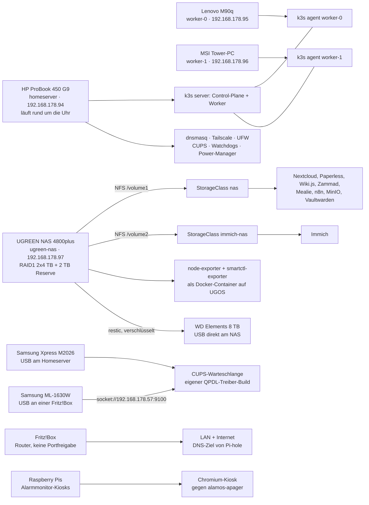
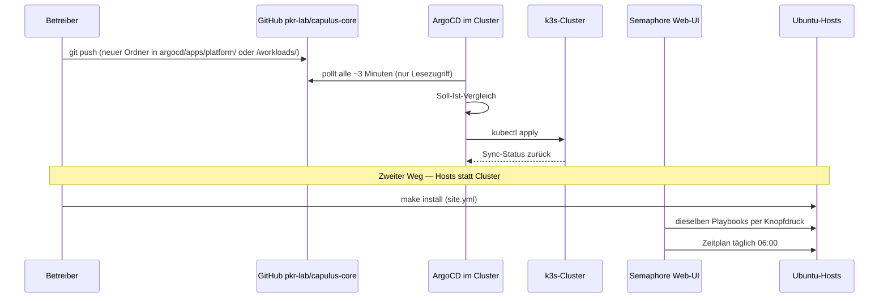
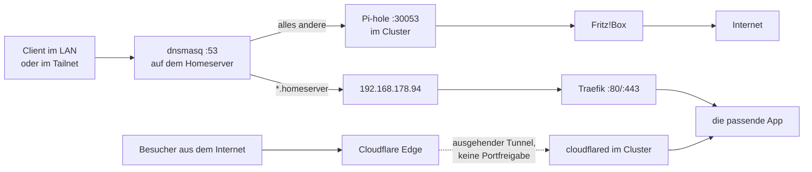

# capulus-core — Home-Server-Architektur

**Von der Hardware bis zur App: was auf was aufbaut.**
GitOps-gesteuert, ein Ansible-Lauf, keine offenen Ports ins Internet.

Repo: `pkr-lab/capulus-core` · 3-Node-k3s-Cluster · 36 GitOps-Apps · Stand August 2026

---

## Lesehilfe

| Kürzel | Bedeutung |
|---|---|
| **A** | Anmeldung über Authentik (SSO per OIDC oder Traefik-ForwardAuth) |
| **S** | braucht ein Sealed Secret aus Git |
| **N** | Daten auf dem NAS, StorageClass `nas` (`/volume1`, NFS) |
| **I** | Daten auf dem NAS, StorageClass `immich-nas` (`/volume2`, NFS) |
| **L** | Daten lokal auf der Knoten-SSD, StorageClass `local-path` |
| **C** | öffentlich erreichbar über den Cloudflare Tunnel |
| **D** | bringt eine eigene Datenbank mit (PostgreSQL / Redis / Elasticsearch) |

Pfeile bedeuten durchgehend **„baut auf / braucht"**: Jede Schicht funktioniert nur,
wenn die Schicht darunter läuft. Schicht 0 ist echte Hardware, Schicht 1–4 ist Software.
Namen in `Schreibmaschinenschrift` sind Verzeichnisse bzw. Ansible-Rollen im Repo.

---

## 1. Gesamtbild: die fünf Schichten

```mermaid
flowchart TB
    subgraph ACC["WER GREIFT ZU"]
        direction LR
        A1["Gerät im Heim-LAN<br/>192.168.178.0/24"]
        A2["Tailscale-VPN<br/>unterwegs, 100.x"]
        A3["Öffentliches Internet<br/>über Cloudflare Tunnel"]
        A4["Git-Push<br/>Betreiber"]
    end

    subgraph ENT["EINTRITTSPUNKTE AUF DEM HOMESERVER"]
        direction LR
        E1["dnsmasq :53<br/>Split-DNS *.homeserver"]
        E2["Traefik :80/:443<br/>Ingress"]
        E3["k3s-API :6443"]
        E4["ArgoCD :30443"]
        E5["CUPS :631<br/>IPP / AirPrint"]
    end

    subgraph L4["SCHICHT 4 — ANWENDUNGEN (argocd/apps/workloads/)"]
        direction LR
        P1["Nextcloud · Immich · Paperless-NGX<br/>Wiki.js · Zammad · Vaultwarden"]
        P2["Mealie · n8n · Uptime Kuma<br/>MediaMTX · TinyTeller"]
        P3["alamos-apager · github-release-watcher<br/>wiki-docs-sync · example-whoami · xibosignage"]
    end

    subgraph L3["SCHICHT 3 — PLATTFORMDIENSTE (argocd/apps/platform/)"]
        direction LR
        S2["sealed-secrets<br/>kubeseal-webgui"]
        S3["monitoring<br/>VictoriaMetrics + Grafana"]
        S4["gotify · ntfy<br/>+ Alert-Brücken"]
        S5["cloudflared · pihole<br/>coredns-custom"]
        S6["nas-storage<br/>immich-storage"]
        S7["minio · argo-workflows<br/>semaphore · headlamp"]
    end

    subgraph L2["SCHICHT 2 — CLUSTER-PLATTFORM"]
        direction LR
        K1["k3s server @ homeserver<br/>Traefik · CoreDNS · Flannel<br/>local-path · metrics-server"]
        K2["k3s agent @ worker-0 / worker-1<br/>Join-Token, Flannel VXLAN 8472/UDP"]
        K3["ArgoCD + ApplicationSet<br/>ein Ordner = eine App"]
        K4["StorageClasses<br/>local-path · nas · immich-nas"]
    end

    subgraph L1["SCHICHT 1 — BETRIEBSSYSTEM & ANSIBLE"]
        direction LR
        O1["Ubuntu Server 26.04 LTS<br/>UFW · chrony · Swap aus"]
        O2["UGOS auf dem NAS<br/>bewusst kein Ansible"]
        O3["Raspberry Pi OS<br/>Chromium-Kiosk"]
        O4["Ansible-Rollen<br/>make install / worker-0 / worker-1"]
    end

    subgraph L0["SCHICHT 0 — HARDWARE"]
        direction LR
        H1["HP ProBook 450 G9<br/>homeserver · .94 · 24/7"]
        H2["Lenovo M90q<br/>worker-0 · .95 · WoL"]
        H3["MSI Tower-PC<br/>worker-1 · .96 · WoL"]
        H4["UGREEN NAS 4800plus<br/>ugreen-nas · .97 · RAID1"]
        H5["WD Elements 8 TB<br/>USB am NAS · restic"]
        H6["Samsung Xpress M2026<br/>USB am Homeserver"]
        H7["Samsung ML-1630W<br/>USB an Fritz!Box · :9100"]
    end

    ACC -->|"nutzt"| ENT
    ENT -->|"erreicht"| L4
    L4 -->|"läuft auf / benötigt"| L3
    L3 -->|"läuft in"| L2
    L2 -->|"installiert durch"| L1
    L1 -->|"läuft auf"| L0
```



---

## 2. Hardware → Software: welches Gerät trägt was



**Kernpunkt:** Der Homeserver ist der einzige Dauerläufer. Beide Worker sind
austauschbare Rechenknoten ohne eigene Datenhaltung — der persistente Speicher
liegt zentral auf dem NAS. Deshalb darf der Scheduler Pods frei verteilen, und
deshalb hängt bei einem NAS-Ausfall ein Großteil der Apps.

---

## 3. GitOps-Kreislauf und der zweite Weg über Ansible



**Zwei getrennte Auslieferungswege, die sich nicht überschneiden:**

| Weg | Was er verändert | Auslöser |
|---|---|---|
| ArgoCD | alles *im* Cluster (Apps, Plattformdienste) | Git-Push, dann automatisch |
| Ansible | alles *unter* dem Cluster (OS, k3s, dnsmasq, Tailscale, Drucker, Watchdogs) | `make install`, Semaphore-Knopf, täglich 06:00 |

---

## 4. App-Abhängigkeiten quer durch den Stack

```mermaid
flowchart TB
    SS["sealed-secrets<br/>muss zuerst laufen"]
    AK["authentik<br/>+ eigenes PostgreSQL/Redis"]
    NASSC["StorageClass nas"]
    IMSC["StorageClass immich-nas"]
    LP["StorageClass local-path"]
    CF["cloudflared<br/>Cloudflare Tunnel"]
    MIN["minio"]
    GO["gotify"]
    NT["ntfy"]
    TR["Traefik"]

    SS --> AK
    SS --> MON["monitoring"]
    SS --> MIN
    SS --> AW["argo-workflows"]
    SS --> CF
    SS --> IMMICH["immich"]
    SS --> WIKI["wikijs"]
    SS --> ZAM["zammad"]
    SS --> NC["nextcloud"]
    SS --> PL["paperless-ngx"]
    SS --> VW["vaultwarden"]
    SS --> PH["pihole"]
    SS --> ALA["alamos-apager"]

    AK -->|"OIDC"| HL["headlamp"]
    AK -->|"OIDC"| AW
    AK -->|"OIDC"| MIN
    AK -->|"OIDC"| MON
    AK -->|"ForwardAuth"| SEM["semaphore"]
    AK -->|"ForwardAuth"| GO
    AK -->|"ForwardAuth"| VW
    AK -->|"ForwardAuth"| N8N["n8n"]

    NASSC --> NC
    NASSC --> PL
    NASSC --> WIKI
    NASSC --> ZAM
    NASSC --> VW
    NASSC --> MEA["mealie"]
    NASSC --> N8N
    NASSC --> MIN
    NASSC --> XIBO["xibosignage"]
    IMSC --> IMMICH
    LP --> MON
    LP --> AK
    LP --> GO
    LP --> NT
    LP --> PH
    LP --> UK["uptime-kuma"]
    LP --> SEM

    MIN -->|"S3-Artefakte"| AW
    GO --> GB["gotify-bridge<br/>Alertmanager-Webhook"]
    NT --> NB["ntfy-bridge<br/>Alertmanager-Webhook"]
    MON --> GB
    MON --> NB
    NT --> ALA
    WIKI --> WDS["wiki-docs-sync<br/>CronJob alle 15 Min."]
    ZAM --> GRW["github-release-watcher<br/>CronJob alle 2 h"]
    TR --> ALLE["alle *.homeserver-Adressen"]
    CF --> OEFF["wiki · ntfy · support · grafana · authentik<br/>stream · paperless · n8n · mealie<br/>vault · nextcloud .pke-lab.de"]
```



---

## 5. App-Matrix (Schicht 3 und 4)

Seit [docs/49-argocd-projects.md](49-argocd-projects.md) ist diese
Schicht-3/Schicht-4-Trennung nicht mehr nur konzeptionell, sondern auch die
tatsächliche Git-Ordnerstruktur (`argocd/apps/platform/…` bzw.
`argocd/apps/workloads/…`) und das zugewiesene ArgoCD-AppProject
(`platform` bzw. `workloads`).

### Schicht 3 — Plattformdienste (`argocd/apps/platform/…`, AppProject `platform`)

| App | Aufgabe | Kürzel |
|---|---|---|
| `authentik` | zentrale Anmeldung, Identity Provider | A · L · S · D |
| `sealed-secrets` | entschlüsselt SealedSecrets im Cluster | — |
| `kubeseal-webgui` | Weboberfläche zum Verschlüsseln von Secrets | — |
| `monitoring` | VictoriaMetrics, vmagent, vmalert, Alertmanager, Grafana | A · L · S · C |
| `logging` | Log-Aggregation (VictoriaLogs) | L · S |
| `gotify` / `gotify-bridge` | Push an Android, Brücke von Alertmanager | A · L · S |
| `ntfy` / `ntfy-bridge` | Push an iOS + Android, Brücke von Alertmanager | L · C |
| `cloudflared` | Cloudflare Tunnel, ausgehende Verbindung nach außen | S |
| `pihole` | Werbe- und Trackerfilter im DNS, NodePort 30053 | L · S |
| `coredns-custom` | zusätzliche DNS-Zonen im Cluster | — |
| `nas-storage` | NFS-Provisioner → StorageClass `nas` | — |
| `immich-storage` | NFS-Provisioner → StorageClass `immich-nas` | — |
| `minio` | S3-Speicher für Build-Artefakte | A · N · S |
| `argo-workflows` | interne CI/CD-Pipelines, braucht MinIO | A · S |
| `semaphore` | Weboberfläche, die Ansible-Playbooks startet | A · L |
| `headlamp` | Kubernetes-Dashboard im Browser | A · S |
| `traefik-config` | Traefik-Zusatzkonfiguration (HelmChartConfig, Metrics-Scrape) | — |

### Schicht 4 — Anwendungen (`argocd/apps/workloads/…`, AppProject `workloads`)

| App | Aufgabe | Kürzel | Adresse |
|---|---|---|---|
| `nextcloud` | Dateien, Kalender, Kontakte | N · L · S · D | `nextcloud.homeserver` |
| `immich` | Fotoarchiv mit KI-Suche | I · S · D | `immich.homeserver` |
| `paperless-ngx` | papierlose Dokumentenverwaltung | N · S · D · C | `paperless.homeserver` |
| `wikijs` | Wiki, auch öffentlich | N · S · D · C | `wiki.homeserver` |
| `zammad` | Ticketsystem / Helpdesk | N · L · S · D · C | `zammad.homeserver` |
| `vaultwarden` | Passwort-Manager (Bitwarden-kompatibel) | A · N · L · S · C | `vault.homeserver` |
| `mealie` | Rezepte und Essensplanung | N · C | `mealie.homeserver` |
| `n8n` | Automatisierungen ohne Code | A · N · C | `n8n.homeserver` |
| `uptime-kuma` | Erreichbarkeits-Überwachung | L | `uptime-kuma.homeserver` |
| `mediamtx` | Live-Video: RTSP / RTMP / WebRTC / HLS | C | `stream.homeserver` |
| `tinyteller` | kleine Diktier- und Story-App | — | `tinyteller.homeserver` |
| `alamos-apager` | Alarmmonitor-Steuerung (ALAMOS AMweb) | S | `alamos-apager.homeserver` |
| `xibosignage` | Xibo CMS: Medien-/Asset-Verwaltung für die Raspberry-Pi-Bilder-Slideshow | N · S · D | `xibo.homeserver` |
| `github-release-watcher` | neue Releases → Ticket in Zammad | S | — (CronJob) |
| `wiki-docs-sync` | `docs/` aus Git → Wiki.js, alle 15 Min. | S | — (CronJob) |
| `example-whoami` | Demo-App, belegt dass GitOps läuft | — | `whoami.homeserver` |
| `carplay-api` | Homeserver-Dashboard-API für die iOS-App | S | `carplay-api.homeserver` |

---

## 6. Hardware im Detail

| Gerät | Rolle | Adresse | Trägt / liefert |
|---|---|---|---|
| HP ProBook 450 G9 | Control-Plane + Worker, 24/7 | `192.168.178.94` | k3s server, Traefik, ArgoCD, dnsmasq, Tailscale, CUPS, Watchdogs, Power-Manager |
| Lenovo M90q | reiner Rechenknoten | `192.168.178.95` | k3s agent, per Wake-on-LAN geweckt (MAC `98:fa:9b:28:b0:22`) |
| MSI Tower-PC | reiner Rechenknoten, zweite Reserve | `192.168.178.96` | k3s agent, per Wake-on-LAN geweckt (MAC `b8:97:5a:ea:a4:fa`) |
| UGREEN NAS 4800plus | zentraler Speicher | `192.168.178.97` | 10 TB roh: 2×4 TB als RAID1 (≈ 4 TB nutzbar, eine Platte darf ausfallen) + 2 TB Reserve; NFS `/volume1` → `nas`, `/volume2` → `immich-nas`; node- und smartctl-Exporter als Docker-Container |
| WD Elements 8 TB | Sicherung | USB am NAS | restic-Backup von `/volume1` + `/volume2`, inkrementell, dedupliziert, verschlüsselt, per UGOS-Aufgabenplaner |
| Samsung Xpress M2026 | Drucker | USB am Homeserver | CUPS-Freigabe per IPP/AirPrint; braucht einen eigenen QPDL-Treiber-Build, weil splix und hplip die M2020-Serie nicht abdecken |
| Samsung ML-1630W | Drucker | `192.168.178.57:9100` | hängt per USB an einer Fritz!Box, spricht SPL2 → `printer-driver-splix` genügt; zweite Warteschlange in CUPS |
| Fritz!Box | Router | `192.168.178.1` | LAN und Internet, DNS-Ziel von Pi-hole, keine Portfreigabe nach außen |
| Raspberry Pis | Alarmmonitor-Kiosks | frei | Chromium im Vollbild gegen `alamos-apager`, per Ansible verwaltet, mit Lebenszeichen-Meldung |
| Raspberry Pi 3 B+ | xibosignage-Bilder-Slideshow | frei | Chromium im Vollbild gegen einen NFS-gemounteten Bilder-Ordner, kein offizieller Xibo-Player (siehe [`44-xibosignage.md`](44-xibosignage.md)) |

---

## 7. Ansible-Rollen und ihr Wirkungsbereich

| Rolle | Läuft gegen | Zweck |
|---|---|---|
| `common` | homeserver | Basis-OS, UFW, Pakete, sysctl, chrony, Swap aus, optional statische IP |
| `dnsmasq` | homeserver | Split-DNS `*.homeserver`, Weiterleitung an Pi-hole |
| `tailscale` | homeserver, xibosignage-Displays | WireGuard-Mesh-VPN, Auth-Key aus Ansible Vault; auf Displays reiner Client ohne Subnetz-Advertising |
| `k3s` | homeserver | Kubernetes-Control-Plane + Helm |
| `k3s_agent` | worker-0, worker-1 | Cluster-Beitritt per Join-Token vom Control-Plane |
| `argocd` | homeserver | ArgoCD per Helm + Bootstrap-ApplicationSet |
| `semaphore_secrets` | homeserver | Bootstrap-Secret für den Semaphore-Pod |
| `semaphore_targets` | alle verwalteten Hosts | SSH-Pubkey von Semaphore in `authorized_keys` |
| `semaphore_bootstrap` | homeserver | Projekte, Inventories, Templates, Zeitpläne per REST-API |
| `thermal_watchdog` | alle Knoten + Kiosks | Selbst-Abschaltung bei Übertemperatur |
| `resource_watchdog` | alle Knoten + Kiosks | Selbst-Abschaltung bei Dauerlast |
| `cluster_power_manager` | homeserver | weckt Worker per WoL, fährt sie per SSH wieder herunter |
| `cluster_power_manager_target` | worker-0, worker-1 | autorisiert den Shutdown-Schlüssel, beschränkt auf `poweroff` |
| `wake_on_lan` | worker-0, worker-1 | `ethtool wol g` bei jedem Boot |
| `cups_print_server` | homeserver | Druckserver, QPDL-Treiber-Build, zweite Warteschlange |
| `alamos_kiosk` | Raspberry Pis | Chromium-Kiosk + Heartbeat-Timer |
| `xibo_kiosk` | Raspberry Pis (xibosignage-Displays) | NFS-Mount `xibosignage-display`, Manifest-Timer, Chromium-Slideshow-Kiosk (kein offizieller Xibo-Player, siehe [`44-xibosignage.md`](44-xibosignage.md)) |

**Reihenfolge beim ersten Rollout:**

```
make install        # site.yml gegen homeserver  →  erzeugt Join-Token + Shutdown-Key
make worker-0       # erst danach möglich
make worker-1
make alarm-kiosks   # optional, nur manuell
make xibo-kiosks    # optional, nur manuell
```

---

## 8. Netz, Ports, Namen



| Port | Protokoll | Komponente | Bereich |
|---|---|---|---|
| 22 | TCP | SSH | LAN + Tailnet |
| 53 | UDP/TCP | dnsmasq Split-DNS | LAN + Tailnet |
| 80 / 443 | TCP | Traefik Ingress | LAN + Tailnet |
| 631 | TCP | CUPS (IPP/AirPrint) | LAN + Tailnet |
| 6443 | TCP | k3s-API, Agent-Join | LAN + Tailnet |
| 8472 | UDP | Flannel VXLAN | nur zwischen den Knoten |
| 10250 | TCP | kubelet-API | nur zwischen den Knoten |
| 30053 | TCP/UDP | Pi-hole NodePort | LAN |
| 30443 | TCP | ArgoCD-Weboberfläche (HTTPS) | LAN + Tailnet |
| 41641 | UDP | Tailscale/WireGuard | **ausgehend** ins Internet |

| Netz | CIDR |
|---|---|
| Heim-LAN | `192.168.178.0/24` |
| Tailscale-Overlay | `100.64.0.0/10` |
| k3s-Pod-Netz | `10.42.0.0/16` |
| k3s-Service-Netz | `10.43.0.0/16` |

---

## 9. Abhängigkeitsketten im Klartext

**Speicher**
- UGREEN NAS (RAID1) → NFS `/volume1` → `nas-storage` → StorageClass `nas` → Nextcloud, Paperless, Wiki.js, Zammad, Mealie, n8n, MinIO, Vaultwarden
- UGREEN NAS → `/volume2` → `immich-storage` → `immich-nas` → Immich, bewusst getrennt vom übrigen Cluster-Speicher
- Steht das NAS, starten diese Apps nicht mehr. Apps auf `local-path` (Grafana, Gotify, ntfy, Pi-hole, Uptime Kuma, Authentik, Semaphore) laufen weiter.
- Sicherung: NAS → restic → WD Elements 8 TB. Ohne diese Platte existiert keine Kopie der Nutzdaten. Das restic-Passwort ist der einzige Schlüssel — ohne es ist auch das Backup wertlos.

**Anmeldung und Geheimnisse**
- Authentik (mit eigenem PostgreSQL/Redis) → OIDC bzw. Traefik-ForwardAuth → Headlamp, Argo Workflows, MinIO, Semaphore, Gotify, Vaultwarden, n8n
- Grafana meldet sich bewusst nicht über Authentik an, sondern über den eingebauten Grafana-Login — läuft auch bei Authentik-Ausfall weiter.
- Fällt Authentik aus, kann sich an diesen Oberflächen niemand mehr anmelden; die Dienste selbst laufen weiter.
- `sealed-secrets` muss vor allen Apps laufen, die ein SealedSecret mitbringen — sonst bleiben deren Pods ohne Zugangsdaten.
- Ansible Vault schützt die Host-Geheimnisse (Tailscale-Key, sudo-Passwörter, SMB-Passwort); Sealed Secrets schützt die Cluster-Geheimnisse. Zwei getrennte Mechanismen, beide im Git-Repo.

**Netz und Namen**
- Anfrage → dnsmasq: `*.homeserver` löst dnsmasq selbst auf, alles andere geht gefiltert über Pi-hole an die Fritz!Box.
- Danach übernimmt Traefik das Routing zur App. Ohne Traefik ist keine `*.homeserver`-Adresse erreichbar.
- Pi-hole läuft im Cluster, dnsmasq auf dem Host: fällt der Cluster aus, fällt auch die Namensauflösung für Nicht-`*.homeserver`-Namen für alle Geräte aus, die dnsmasq als DNS nutzen. Deshalb ist der Homeserver bewusst **nicht** als LAN-weiter DNS-Server gesetzt.
- Von außen: `cloudflared` → Service im Cluster. Ohne cloudflared bleiben nur LAN und Tailscale.

**Rechenleistung und Reihenfolge**
- Erst `make install` auf dem Homeserver (erzeugt Join-Token und Shutdown-Schlüssel), dann `make worker-0` / `make worker-1` — sonst können die Worker nicht beitreten.
- Wake-on-LAN braucht zusätzlich die BIOS-Einstellung auf den Workern und die richtige MAC-Adresse in `ansible/host_vars/`.
- Argo Workflows braucht MinIO als Artefaktspeicher; die Alarm-Brücken brauchen Gotify bzw. ntfy; `wiki-docs-sync` braucht Wiki.js; `github-release-watcher` braucht Zammad.
- `cluster_power_manager` misst absichtlich ohne Prometheus: er liest `/proc/stat` und `/proc/meminfo` direkt, damit die Entscheidung auch dann funktioniert, wenn der Monitoring-Stack selbst unter Last steht.

---

## 10. Sicherheitsmodell in einem Absatz

Kein eingehender Port aus dem Internet. Fernzugriff läuft über Tailscale, öffentliche
Dienste ausschließlich über ausgehende Cloudflare-Verbindungen. UFW erlaubt 22, 53, 80,
443, 631, 6443 und 30443 nur im LAN und im Tailnet, nach außen nur 41641/UDP.
ArgoCD hat ausschließlich Leserechte auf das Git-Repo. Innerhalb von ArgoCD trennen
zwei AppProjects (`platform` / `workloads`, siehe
[docs/49-argocd-projects.md](49-argocd-projects.md)) Infrastruktur-Apps von
Anwendungen mit echtem Nutzerkreis — jede App darf nur in ihren eigenen,
namentlich erlaubten Namespace deployen. Der Shutdown-SSH-Key des
Power-Managers ist per `command=`-Option fest auf `poweroff` beschränkt. Secrets liegen
verschlüsselt in Git — Host-Werte per Ansible Vault, Cluster-Werte als SealedSecret, das
nur der Controller im Cluster öffnen kann. CrowdSec beobachtet SSH- und Traefik-Logs
und sperrt auffällige IPs per Firewall-Bouncer (siehe [docs/46-crowdsec.md](46-crowdsec.md)).

---

## ASCII-Kurzfassung (für Text-Umgebungen ohne Mermaid)

```
ZUGRIFF     LAN-Gerät      Tailscale-VPN      Internet (Cloudflare)      git push
               |                 |                     |                    |
               v                 v                     v                    v
EINTRITT   dnsmasq:53      Traefik:80/443      k3s-API:6443      ArgoCD:30443   CUPS:631
                                   |
                                   v
SCHICHT 4  Nextcloud  Immich  Paperless  Wiki.js  Zammad  Vaultwarden  Mealie
           n8n  Uptime-Kuma  MediaMTX  TinyTeller  alamos-apager  xibosignage  + 2 CronJobs
                                   |  braucht
                                   v
SCHICHT 3  authentik(SSO)  sealed-secrets  monitoring  gotify/ntfy  cloudflared
           pihole  nas-storage  immich-storage  minio  argo-workflows  semaphore  headlamp
                                   |  läuft in
                                   v
SCHICHT 2  k3s server (homeserver) + 2x k3s agent  |  ArgoCD + ApplicationSet
           StorageClasses: local-path (SSD)  nas (NFS /volume1)  immich-nas (NFS /volume2)
                                   |  eingerichtet durch
                                   v
SCHICHT 1  Ubuntu 26.04 LTS (3 Hosts)   UGOS (NAS, manuell)   Raspberry Pi OS (Kiosk)
           Ansible: common dnsmasq tailscale k3s k3s_agent argocd semaphore_*
                    thermal/resource_watchdog cluster_power_manager wake_on_lan
                    cups_print_server alamos_kiosk xibo_kiosk
                                   |  läuft auf
                                   v
SCHICHT 0  HP ProBook 450 G9 (.94, 24/7)   Lenovo M90q (.95, WoL)   MSI Tower (.96, WoL)
           UGREEN NAS 4800plus (.97, RAID1 2x4TB + 2TB Reserve)
              +-- NFS --> StorageClasses nas / immich-nas
              +-- restic --> WD Elements 8 TB (USB am NAS)
           Samsung Xpress M2026 (USB am Homeserver, CUPS)
           Samsung ML-1630W (USB an Fritz!Box, socket://192.168.178.57:9100)
```

---

*Erzeugt aus dem Repo-Stand `main`, Juli 2026. capulus-core · Ubuntu 26.04 LTS · k3s ·
ArgoCD · Tailscale · Ansible · MIT-Lizenz.*