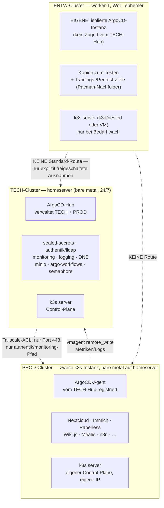
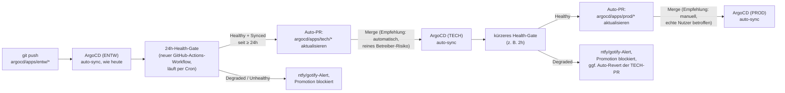

# Multi-Cluster-Migration — ENTW / PROD / TECH

Architektur- und Rollout-Plan für den Umbau des bestehenden **einen**
3-Node-k3s-Clusters in **drei getrennte Cluster** (ENTW, PROD, TECH) inkl.
Aufteilung der bestehenden ArgoCD-Struktur. Noch **nicht umgesetzt** —
dieses Doc beantwortet zunächst die vom Nutzer gestellten Kernfragen
(Machbarkeit, ArgoCD-Modell, Cluster-zu-Cluster-Kommunikation, Hardware,
Nutzen, Kubernetes-Aktualität) und hält danach den daraus abgeleiteten,
gestaffelten Plan fest — analog zur Konvention aus
[40070-authentik-sso-iac.md](40070-authentik-sso-iac.md).

---

## Ausgangslage (live verifiziert)

Aktuell **ein** Cluster, drei physische Bare-Metal-Nodes, kein Hypervisor
(siehe [40030-gitlab-hosting-proxmox-pruefung.md](40030-gitlab-hosting-proxmox-pruefung.md) Teil 2 —
Proxmox wurde dort bereits geprüft und **abgelehnt**, siehe
[Bezug zu 40030](#bezug-zu-40030-warum-jetzt-anders) unten).

| Node | Rolle | vCPU | RAM (Capacity) | Live-Status beim Schreiben |
|---|---|---|---|---|
| `homeserver` (.94) | Control-Plane + Worker, 24/7 | 12 | ~61 GiB | `Ready`, 7 % CPU / 38 % RAM belegt (~38 GiB frei) |
| `worker-0` (.95) | reiner Agent, WoL | 4 | ~7,3 GiB | `NotReady` (schläft, WoL-gesteuert — normal) |
| `worker-1` (.96) | reiner Agent, WoL | 4 | ~15 GiB | `NotReady` (schläft, WoL-gesteuert — normal) |
| `ugreen-nas` (.97) | NFS-Storage, kein k8s-Node | — | — | separat, UGOS, kein Ansible |

**RAM-Update gegenüber 40030:** Der Prüfdoc von damals rechnete noch mit
32 GB auf `homeserver` — laut Live-Abfrage (`kubectl get nodes -o json`)
sind es inzwischen ~61 GiB (RAM-Aufstockung im Zuge der Homeserver-Härtung
nach dem Ausfall vom 02.09.2026). Das verschiebt die
Proxmox-Kosten-/Nutzen-Rechnung aus Teil 2.2 von 40030 spürbar (siehe
unten).

**Software-Stand:**

| Komponente | Live-Version | Aktuell? |
|---|---|---|
| k3s (alle 3 Nodes) | `v1.36.4+k3s1` | **Ja, für den konfigurierten Kanal.** `k3s_channel: stable`, `k3s_version: ""` (`ansible/group_vars/all.yml`) → jeder Ansible-Lauf installiert automatisch die neueste `stable`-Kanal-Version. `v1.36.4+k3s1` ist laut k3s-Release-Feed genau diese neueste `stable`-Version (Stand 13.09.2026). Upstream-Kubernetes ist mit `v1.37.0` ("Garhwal", 26.08.2026) bereits eine Minor-Version weiter — k3s hat dafür noch keinen `stable`-Build veröffentlicht, das ist normale, beabsichtigte Verzögerung des `stable`-Kanals (der `latest`-Kanal wäre näher dran, aber bewusst nicht gewählt für ein Produktivsystem). |
| ArgoCD | `v3.5.3` (Helm-Chart `argo-cd-10.9.1`) | **Ja, praktisch aktuell** (neueste zum Zeitpunkt der Recherche gefundene Version war `v3.5.2`) |

**ArgoCD-Ist-Zustand — wichtige Korrektur der Ausgangsfrage:** Es existiert
aktuell **eine einzige** ArgoCD-Installation (`helm list -n argocd` zeigt
genau einen Release), die **zwei separate `ApplicationSet`-Ressourcen**
betreibt (`home-server-apps-platform`, `home-server-apps-workloads`, siehe
[docs/b-kubernetes-gitops/b0020-argocd-projects.md](../b-kubernetes-gitops/b0020-argocd-projects.md)) —
**nicht** zwei ArgoCD-Server. Beide erzeugen `Applications`, die
ausschließlich `destination.server: https://kubernetes.default.svc`
verwenden (In-Cluster-only) — es gibt aktuell **keine**
Multi-Cluster-Registrierung (`argocd cluster add`, Cluster-Secrets o. Ä.).

**Annahme für diesen Plan:** "die bereits zwei vorhandenen Argo" bezieht
sich auf genau diese zwei `ApplicationSet`s/`AppProject`s
(`platform`/`workloads`) — nicht auf zwei separate ArgoCD-Server
irgendwo außerhalb dieses Repos. Falls das nicht stimmt, bitte
korrigieren, bevor Baustein 1 unten umgesetzt wird — es ändert das
Zielbild spürbar.

Aktuelle App-Zuordnung (`ansible/roles/argocd/defaults/main.yml`, Stand
dieses Docs — 19 Platform-Apps, 21 Workloads-Apps, 40 Applications
gesamt plus 2 seit den Docs neu hinzugekommene: `authentik`, `lldap`,
`alamos-relay`, `demo-app`, `ollama`, `pacman` sind bereits live, aber
noch nicht überall in `docs/a-betriebssystem/a0010-overview.md`
nachgezogen — Doc-Drift, keine Auswirkung auf diesen Plan).

**Bezug zu 40030 — warum jetzt anders:** 40030 nennt in Teil 2.4 explizit
vier Trigger, ab denen sich Proxmox/mehrere Cluster lohnen würden. Trigger 1
lautete wörtlich: *"Echter Bedarf an einem zweiten, isolierten Cluster —
z. B. eine Trainings-/Unterrichts-Umgebung für die IT-Klasse, die nichts
mit dem Produktiv-Cluster teilen darf"* — mit ausdrücklichem Verweis auf das
Pacman-Muster
([docs/3-apps-workloads/300f0-pacman-visitor-tracking.md](../3-apps-workloads/300f0-pacman-visitor-tracking.md),
öffentlicher Betrieb **und** Unterrichtsobjekt in **einer** App). Mit dieser
Anfrage ist genau dieser Trigger jetzt real gestellt. Trigger 3 (RAM-Upgrade
auf `homeserver` auf ≥ 64 GB) ist ebenfalls praktisch erfüllt (~61 GiB
Capacity). Die 40030-Ablehnung von Proxmox gilt also **nicht mehr
unverändert** — sie bleibt aber in einem Punkt richtig: eine komplette
Hypervisor-Umstellung aller drei Nodes ist immer noch ein größerer,
schwer reversibler Eingriff in ein Ein-Personen-Homelab ohne Redundanz.
Der Plan unten löst das deshalb gestaffelt statt mit einem Rundumschlag.

---

## Die gestellten Fragen — Machbarkeits-Analyse

| Frage | Antwort | Begründung |
|---|---|---|
| Ein ArgoCD für mehrere Cluster, oder pro Cluster eins? | **Technisch reicht eines** — ArgoCD unterstützt natives Multi-Cluster-Management (`argocd cluster add` legt pro Ziel-Cluster ein `Secret` vom Typ `cluster` mit API-Server-URL + Credentials in der `argocd`-Namespace des Hub-Clusters an; `Application`/`ApplicationSet` referenzieren den Ziel-Cluster dann über `destination.server`/`.name` statt immer `https://kubernetes.default.svc`). **Empfehlung für dieses Setup: trotzdem zwei Instanzen, nicht eine für alle drei** — Begründung siehe [Baustein 1](#1-argocd-modell-ein-hub-für-tech--prod-entw-bekommt-eine-eigene-instanz) unten, kurz: ENTW ist als Trainings-/Experimentierumgebung vorgesehen (Bezug zu 40030 Trigger 1) und darf keine Zugangsdaten tragen, die im Erfolgsfall eines Angriffs auf PROD zeigen. |
| Können die Cluster eingeschränkt untereinander kommunizieren (Beispiel Immich-Server → Immich)? | **Ja, aber nicht über Kubernetes-Bordmittel** — jeder Cluster hat sein eigenes Pod-/Service-Netz (`10.42.0.0/16`/`10.43.0.0/16` sind pro Cluster unabhängig, keine gemeinsame Route). Cross-Cluster-Zugriff muss über die bestehende Traefik-Ingress-Ebene + Tailscale laufen, genau wie heute schon jeder LAN/Tailnet-Client auf `*.homeserver` zugreift — nur eben Cluster-zu-Cluster statt Client-zu-Cluster. Einschränkung auf **genau** die gewünschte Verbindung (z. B. nur Immich-Namespace in PROD darf einen bestimmten Port bei TECH erreichen) über drei kombinierte, bereits im Repo etablierte Mechanismen: Tailscale-ACL-Tags pro Cluster (`tag:entw-node`/`tag:prod-node`/`tag:tech-node`, siehe [docs/c-netzwerk-dns/c0010-tailscale.md](../c-netzwerk-dns/c0010-tailscale.md#acl-konfiguration), aktuell nur dokumentiert, nicht restriktiv konfiguriert), UFW-Regel auf dem Ziel-Node nur für die konkrete Quell-IP/-Tag+Port, und eine Kubernetes-`NetworkPolicy`/Ingress-Regel im Ziel-Namespace, die nur die Absender-Cluster-Gateway-IP zulässt — dieselbe Allow-List-Philosophie wie bei `argocd_network_policy_refined_namespaces` heute schon, nur eine Ebene höher angewendet. Ein echter Cluster-übergreifender Service-Mesh (Cilium ClusterMesh, Istio Multi-Cluster, Submariner) wäre die "richtige" Lösung für viele solcher Verbindungen, ist aber für eine Handvoll benannter Ausnahmen bei drei Nodes klarer Overkill — passt nicht zum sonstigen "kein Tool mehr als nötig"-Muster des Repos (vgl. Ablehnung des Bitnami-Postgres-Subcharts in 40070, Ablehnung von Proxmox in 40030). |
| Gibt die aktuelle Hardware das her? | **Für drei komplett unabhängige, jeweils hochverfügbare physische Cluster: nein.** Es gibt nur **eine** 24/7-Maschine (`homeserver`). `worker-0`/`worker-1` sind bewusst nur bei Bedarf per WoL an — für einen Cluster, der wie PROD jederzeit für Familie/Verein erreichbar sein muss, ungeeignet als alleinige Nodes. Für das gestaffelte Zielbild (siehe Zielarchitektur unten) reicht die Hardware aber gut: TECH und PROD laufen beide bare metal auf `homeserver` (zweite k3s-Instanz, eigene IP, ~38 GiB RAM sind dort frei), ENTW läuft nested/VM auf `worker-1`. |
| Welche Vorteile bringt das Setup? | Siehe [Vorteile](#vorteile-des-ziel-setups) unten — kurz: echte Blast-Radius-Trennung für die Trainingsumgebung, gefahrloses Testen von Cluster-weiten Änderungen (k3s-Upgrades, ArgoCD-Upgrades, CRD-Änderungen) vor PROD, klarere Sicherheitsgrenze zwischen Infrastruktur (TECH) und Nutzer-Apps (PROD). |
| Ist die neueste Kubernetes-Version installiert? | **Ja, für den konfigurierten Update-Kanal** (`stable`) — siehe Tabelle oben. Wer bewusst näher an der absoluten Kubernetes-Spitze (`v1.37`) sein will, müsste auf `k3s_channel: latest` wechseln — das ist eine bewusste Stabilität-vs.-Aktualität-Entscheidung, kein Versäumnis. |

---

## Vorteile des Ziel-Setups

- **Blast-Radius-Trennung für die IT-Klasse (Haupttreiber):** Ein
  kompromittierter oder absichtlich verwundbarer ENTW-Cluster kann PROD
  (Familien-/Vereinsdaten: Nextcloud, Immich, Vaultwarden) und TECH
  (Secrets, DNS, Identity) nicht erreichen, wenn die Netz- und
  ArgoCD-Grenzen wie unten beschrieben gezogen werden.
- **Gefahrloses Testen struktureller Änderungen.** k3s-Minor-Upgrades,
  ArgoCD-Upgrades, neue CRDs, ApplicationSet-Umbauten (vgl. die zwei
  bereits dokumentierten, verworfenen Ansätze in
  [b0020-argocd-projects.md](../b-kubernetes-gitops/b0020-argocd-projects.md)) zuerst gegen ENTW
  fahren, bevor sie PROD/TECH anfassen — aktuell gibt es dafür keinen
  Cluster, nur denselben Cluster mit Vorsicht.
- **Klarere Betriebsgrenze.** TECH bündelt alles, was heute schon
  konzeptionell "Plattform" ist (`platform`-AppProject,
  `security-tier=platform`-Label) — die Grenze existiert in ArgoCD/Docs
  bereits (`platform`/`workloads`, `tech`/`prod`-DNS-Tiers seit
  [c0040-domain-tiers.md](../c-netzwerk-dns/c0040-domain-tiers.md)), wird aber nur
  logisch, nicht physisch durchgesetzt. Multi-Cluster macht sie technisch
  hart statt nur konventionell.
- **`dev`-Tier ist bereits reserviert.** `c0040-domain-tiers.md` legt die
  Namenskonvention `<app>.dev.homeserver` seit der letzten DNS-Migration
  bewusst als "noch keine App, aber die Konvention steht" an — ENTW ist
  exakt die praktische Einlösung dieser Reservierung, keine neue
  Namenskonvention nötig.
- **Kein Kompromiss beim Familien-/Vereinsbetrieb.** PROD bleibt so
  konservativ wie heute (Autelia/Authentik-Login, wenig Änderungsrisiko),
  während Experimentelles komplett woanders läuft.

**Ehrliche Kehrseite (damit sie nicht erst live auffällt):** Drei Cluster
heißt drei Sätze an Plattform-Grundzutaten, die pro Cluster **einzeln**
existieren müssen (siehe [Baustein 4](#4-was-pro-cluster-existieren-muss-vs-was-zentral-bleibt)) —
mehr Betriebsaufwand als heute, nicht weniger. Das NAS bleibt außerdem
eine **gemeinsame** Abhängigkeit aller drei Cluster (ein Ausfall trifft
alle) — echte Speicher-Isolation für ENTW bräuchte eine zweite,
unabhängige Storage-Quelle, was hier bewusst **nicht** vorgesehen ist
(Kostenaufwand vs. Nutzen für eine Trainingsumgebung unverhältnismäßig).

---

## Zielarchitektur



**Kernentscheidung: kein symmetrisches Hub-Modell.** TECH und PROD
vertrauen sich gegenseitig (ein Hub verwaltet beide, Monitoring/DNS/Login
sind zentral in TECH). ENTW ist bewusst **nicht** Teil dieses
Vertrauensraums — eigene ArgoCD-Instanz, eigene SealedSecrets-Schlüssel,
keine Standard-Netzroute zu TECH/PROD. Das ist genau die
Blast-Radius-Eigenschaft, die 40030 Trigger 1 gefordert hat.

**Daraus folgt auch: TECH und PROD brauchen keine VM-Grenze
zueinander.** Der einzige Grund für eine separate Maschine/VM wäre eine
Sicherheitsgrenze — die besteht hier per Design nicht (ein Hub verwaltet
beide, siehe oben). Der eigentliche Zweck von PROD als **eigenem
Cluster** ist nicht Isolation von TECH, sondern zwei unabhängige
Control-Planes für gefahrloses Testen struktureller Änderungen und eine
klare Betriebsgrenze (Baustein 5 unten) — das lässt sich mit zwei
bare-metal k3s-Instanzen auf demselben Host genauso erreichen wie mit
einer VM, nur ohne Hypervisor-Overhead.

---

## Bausteine

### 1. ArgoCD-Modell: ein Hub für TECH + PROD, ENTW bekommt eine eigene Instanz

| Cluster | ArgoCD | Registrierung |
|---|---|---|
| TECH | **Hub-Instanz** (heutige ArgoCD, bleibt hier) | verwaltet sich selbst (`https://kubernetes.default.svc`, wie heute) |
| PROD | kein eigenes ArgoCD nötig | als externer Cluster im TECH-Hub registriert (`argocd cluster add` bzw. äquivalentes `Secret` vom Typ `cluster` mit PROD-Kubeconfig) |
| ENTW | **eigene, separate ArgoCD-Instanz**, im ENTW-Cluster selbst installiert | keine Registrierung im TECH-Hub — bewusst kein gemeinsamer Credential-Speicher |

Technische Umsetzung des Hub-Modells (TECH → PROD) — Erweiterung des
bestehenden ApplicationSet-Musters um einen `matrix`-Generator
(Cluster-Liste × Verzeichnis-Generator), analog zur bereits bewiesenen
Zwei-ApplicationSet-Struktur aus
[b0020-argocd-projects.md](../b-kubernetes-gitops/b0020-argocd-projects.md):

```yaml
# Skizze — argocd/bootstrap/root-applicationset.yaml, neuer Abschnitt
generators:
  - matrix:
      generators:
        - clusters:
            selector:
              matchLabels: { cluster-tier: prod }
        - git:
            repoURL: "https://github.com/pkr-lab/capulus-core.git"
            revision: "main"
            directories:
              - path: "argocd/apps/prod/*"
template:
  spec:
    project: prod
    destination:
      server: "{{.server}}"          # aus dem Cluster-Generator
      namespace: "{{.path.basename}}"
```

Ordnerstruktur wandert dafür von `argocd/apps/{platform,workloads}/` zu
`argocd/apps/{tech,prod}/` (ENTW bekommt ein eigenes Repo oder einen
eigenen Ordner mit eigenem, nicht vom Hub gelesenem ApplicationSet — noch
zu entscheiden, siehe [Checkliste](#checkliste-fehlender-komponenten)).

**Warum nicht ein einziges Argo für alle drei:** Technisch ginge das
(ArgoCD kennt keine Obergrenze an registrierten Clustern) — der Grund
dagegen ist ausschließlich der Trainings-/Pentest-Zweck von ENTW: Das
`cluster`-Secret, das ArgoCD für einen registrierten Cluster hält, trägt
volle Kubeconfig-Credentials für diesen Cluster. Ein Angreifer, der im
Rahmen der IT-Klassen-Übung ENTW kompromittiert, hätte damit potenziell
einen Pfad zum ArgoCD-Server selbst — und darüber zu **allen** anderen
registrierten Clustern (PROD!). Eine strikt getrennte ArgoCD-Instanz nur
für ENTW verhindert genau das, ohne die Bequemlichkeit für TECH/PROD zu
verlieren, wo dieses Risiko nicht besteht.

### 2. Cluster-zu-Cluster-Kommunikation — Immich-Beispiel konkret

Aktuell läuft Immich als **eine** App in **einem** Namespace
(`argocd/apps/workloads/immich`, siehe
[docs/3-apps-workloads/300c0-immich.md](../3-apps-workloads/300c0-immich.md)) — es gibt heute
keinen Cluster-übergreifenden Immich-Verkehr. Das Beispiel aus der Anfrage
ist als **Muster für eine künftige, benannte Ausnahme** zu verstehen, nicht
als bestehende Abhängigkeit. Empfohlenes Muster, sobald eine solche
Ausnahme wirklich gebraucht wird:

1. Zielapp bekommt einen normalen Ingress-Host im Ziel-Cluster (z. B.
   `immich.prod.homeserver`), wie jede App heute schon.
2. Tailscale-ACL-Regel, die **nur** das anfragende Gerät/Tag (z. B.
   `tag:entw-node`) auf **genau** diesen Host/Port zulässt — nicht
   all-to-all wie der aktuelle Tailscale-Default.
3. `NetworkPolicy` im Ziel-Namespace, die eingehenden Verkehr zusätzlich
   auf die bekannte Absender-IP (Tailscale-IP des Quell-Cluster-Gateways)
   einschränkt — zweite Verteidigungslinie, falls die ACL-Regel je zu
   weit gefasst wird.
4. Kein DNS-Sonderfall nötig — `*.prod.homeserver` löst bereits heute
   clusterweit auf (dnsmasq/CoreDNS-custom decken alle Sub-Ebenen der
   `homeserver`-Zone ab, siehe
   [c0040-domain-tiers.md](../c-netzwerk-dns/c0040-domain-tiers.md)) — nur die IP, auf die
   `*.prod.homeserver` zeigt, ändert sich (siehe Baustein 3).

### 3. DNS: Tier-Konvention existiert schon, IPs müssen jetzt auseinanderfallen

`c0040-domain-tiers.md` definiert `tech`/`prod`/`dev` bereits — heute
zeigen aber alle drei rein namensmäßig auf dieselbe `homeserver`-IP
(`.94`), weil es nur einen Cluster gibt. Mit drei Clustern brauchen
`*.tech.homeserver`, `*.prod.homeserver`, `*.dev.homeserver` **drei
verschiedene Ziel-IPs** (je der Traefik-Ingress-IP des jeweiligen
Clusters). Nötige Änderung: dnsmasq-Konfiguration auf `homeserver` von
einem pauschalen `address=/homeserver/<ip>` auf drei tier-spezifische
Einträge umstellen (`address=/tech.homeserver/<tech-ip>`,
`.../prod.homeserver/<prod-ip>`, `.../dev.homeserver/<entw-ip>`) — die
allgemeine `homeserver`-Zone bleibt als Fallback für noch nicht
migrierte/tier-lose Namen bestehen.

### 4. Was pro Cluster existieren muss vs. was zentral bleibt

| Zutat | Pro Cluster nötig? | Warum |
|---|---|---|
| `sealed-secrets` | **Ja, in allen drei** | Verschlüsselungs-Schlüssel ist an den Controller-Instanz-Key gebunden — ein Secret, das für TECH versiegelt wurde, lässt sich in PROD/ENTW nicht entschlüsseln. Jede in Git liegende App muss künftig **pro Ziel-Cluster neu versiegelt** werden (Vorlage: `kubeseal --context <cluster>`), das ist der größte einmalige Migrationsaufwand. |
| Traefik, CoreDNS, Flannel | **Ja, in allen drei** | kommt mit jedem k3s-Server automatisch, kein Zusatzaufwand |
| `nas-storage`/`immich-storage` (NFS-Provisioner) | **In TECH und PROD** (nicht ENTW, s. u.) | folgt den PVC-Konsumenten, nicht der `platform/workloads`-Ordnerstruktur — Vaultwarden/Zammad sind laut [c0040](../c-netzwerk-dns/c0040-domain-tiers.md) `tech`-Tier, brauchen aber `nas`-StorageClass, also muss der Provisioner **auch** in TECH laufen, nicht nur in PROD |
| Interne CA / cert-manager ([d0040-internal-tls.md](../d-sicherheit/d0040-internal-tls.md)) | Empfehlung: **eine gemeinsame Root-CA**, pro Cluster ein eigenes `cert-manager`-Issuer-Zertifikat daraus | Drei komplett getrennte CAs würden bedeuten, dass Cross-Cluster-HTTPS-Aufrufe (Baustein 2) den fremden CA-Store nicht kennen — vermeidbarer Reibungspunkt |
| Monitoring/Logging | **Zentral in TECH**, PROD/ENTW schicken nur `vmagent remote_write` dorthin | identisches Muster wie heute schon für die Banana-Pis (`ansible/group_vars/banana_pis.yml`, vmagent → `vm-write`) — kein neues Konzept, nur eine weitere Quelle |
| Identity (Authentik/lldap) | **Zentral in TECH**, PROD-Apps als OIDC-Clients gegen TECH | ein Login für alle drei Cluster ist der eigentliche Nutzen eines zentralen IdP — ENTW bewusst **ausgenommen** (Trainingsumgebung darf eigene, wegwerfbare Accounts haben, keine Brücke zu echten Zugangsdaten) |
| Gotify/ntfy | **Zentral in TECH** | ein Alert-Kanal für den Betreiber reicht, keine drei getrennten Push-Ziele nötig |
| `minio`/`argo-workflows`/`semaphore`/`headlamp` | **Zentral in TECH** | reine Betriebs-/Admin-Tools, kein Grund zur Vervielfachung; Headlamp unterstützt selbst native Multi-Cluster-Ansicht (mehrere Kubeconfig-Kontexte in einer Instanz) — genau wie ArgoCD, nur mit demselben Vertrauensgrenzen-Vorbehalt für ENTW |

### 5. Hardware-Umsetzung — gestaffelt, kein Hypervisor-Rundumschlag

| Phase | Was | Wo | Risiko |
|---|---|---|---|
| 1 | ENTW als leichtgewichtiger, ephemer Cluster (k3d/Nested-k3s-in-Docker **oder** eine schlanke KVM/libvirt-VM — hier **ist** eine VM/Container-Grenze sinnvoll, s. u.) | `worker-1` (mehr RAM als `worker-0`, ~15 GiB — passt besser zu einem Nested-Cluster mit mehreren Test-Apps gleichzeitig), weiterhin per WoL geweckt, `cluster_power_manager`-Rolle um einen expliziten "ENTW-Session"-Trigger erweitert statt nur lastbasiert | gering — reversibel, keine bestehende Infrastruktur angefasst |
| 2 | TECH/PROD-Split | `homeserver` bleibt TECH bare metal wie heute; PROD als **zweite, unabhängige k3s-Instanz direkt auf `homeserver`** (kein Hypervisor) — Details unten | mittel/hoch — betrifft laufende Familien-/Vereins-Apps, braucht Wartungsfenster + Rollback-Plan |

**Kein Proxmox, keine VM für PROD** — Begründung siehe
["Kernentscheidung" oben](#zielarchitektur): TECH/PROD brauchen keine
Sicherheitsgrenze zueinander, also lohnt sich der Hypervisor-Overhead aus
40030 Punkt 2.2 hier nicht. Stattdessen ein zweiter k3s-Server-Prozess
direkt auf demselben Ubuntu-Host wie TECH — dieselbe Bare-Metal-Philosophie
wie heute schon ("ein Ansible-Lauf, keine offenen Ports",
[a0010-overview.md](../a-betriebssystem/a0010-overview.md)), nur zweimal
parametrisiert statt einmal.

**Praktisch nötig, damit sich die zwei Instanzen nicht in die Quere
kommen:**

- **Eigene zweite IP für PROD auf `homeserver`** (z. B. `192.168.178.98`
  als sekundäre Adresse auf demselben NIC, per Ansible/`ip addr add`
  verwaltet) — dann kann PROD-Traefik ganz normal auf Port 80/443 dieser
  IP binden, ohne mit TECH-Traefik auf `.94:80/443` zu kollidieren. Ohne
  zweite IP müssten stattdessen alle Standardports manuell auseinander
  gezogen werden (API-Server `6443`→`6444`, kubelet `10250`→`10251`, …) —
  deutlich fehleranfälliger als eine zusätzliche IP.
- **Getrennte `--data-dir` je k3s-Instanz** (`/var/lib/rancher/k3s-tech`,
  `/var/lib/rancher/k3s-prod`) — Standard-k3s-Flag, kein Sonderbau nötig.
- **`ansible/roles/k3s` parametrisierbar machen** (Instanzname, Ziel-IP,
  Ziel-Ports, Ziel-Data-Dir als Variablen) statt eine zweite,
  eigenständige Rolle zu schreiben — spiegelt den bestehenden
  `k3s`/`k3s_agent`-Rollenzuschnitt.
- **Ressourcengrenzen weiterhin über cgroups/systemd**
  (`MemoryMax`/`CPUQuota` auf dem PROD-k3s-`systemd`-Unit) statt über
  VM-Grenzen — weicher als eine VM, aber ausreichend, um zu verhindern,
  dass ein PROD-Lastspitze TECH verdrängt.

**Ehrlich benannter Rest-Unterschied zu einer VM:** Beide Instanzen teilen
sich denselben Kernel — kein Hardware-Isolationslevel. Für die
TECH/PROD-Trennung ist das im Rahmen dieses Plans akzeptiert (siehe
Kernentscheidung oben); falls sich das je ändert (z. B. PROD wird
irgendwann selbst als nicht mehr vertrauenswürdig genug für einen
gemeinsamen Kernel mit TECH eingestuft), ist der Umstieg auf eine VM ein
klar abgegrenzter Nachrüstschritt, kein Rewrite.

**Empfehlung zur Node-Zuordnung:**

```
homeserver (12 vCPU / 61 GiB, 24/7)
 ├─ TECH   — bare metal, wie heute, IP .94
 └─ PROD   — zweite k3s-Instanz, bare metal, eigene IP .98
              (Ressourcengrenze per systemd-cgroup, z. B. auf
              6 vCPU / 24 GiB gedeckelt, Rest bleibt TECH-Puffer)

worker-1 (4 vCPU / 15 GiB, WoL)   → ENTW, nested/VM, nur bei Bedarf wach
                                     (hier lohnt sich die zusätzliche
                                     VM/Container-Grenze, da ENTW als
                                     einziger Cluster eine echte
                                     Sicherheitsgrenze braucht; mehr RAM
                                     als worker-0, passt besser zu
                                     mehreren gleichzeitigen Test-Apps)
worker-0 (4 vCPU / 7,3 GiB, WoL)  → weiterhin freie Zusatzkapazität
                                     (z. B. zweiter ENTW-Node für
                                     Multi-Node-Trainingsszenarien,
                                     oder PROD-Skalierungsreserve)
```

### 6. CI/CD-Pipeline: automatisierte Promotion ENTW → TECH → PROD

**Gewünschtes Verhalten:** Jede neue Software-Version landet automatisch
zuerst auf ENTW, läuft dort einen definierten Zeitraum (Vorschlag: 24 h)
gesund, und wird erst danach automatisiert Richtung TECH/PROD
weitergereicht — kein manuelles "jetzt auf drei Cluster gleichzeitig
deployen" mehr.

**Reihenfolge bewusst linear, nicht als Fan-Out ENTW → {TECH, PROD}
gleichzeitig:** TECH trägt Identity/DNS/Monitoring, von denen PROD laut
[Baustein 4](#4-was-pro-cluster-existieren-muss-vs-was-zentral-bleibt)
abhängt. Eine fehlerhafte TECH-Änderung, die zeitgleich mit einer
PROD-Änderung durchläuft, könnte PROD indirekt mit reißen, ohne dass die
Promotion-Pipeline das als PROD-Fehler erkennt. Reihenfolge deshalb
**ENTW → TECH → PROD**, mit eigenem (kürzerem) Beobachtungsfenster
zwischen TECH und PROD.



**Konkrete Bausteine dafür, eingepasst in das, was schon existiert:**

| Baustein | Umsetzung | Warum so |
|---|---|---|
| Neuer GitHub-Actions-Workflow `promote.yml` | Cron (z. B. stündlich) + `workflow_dispatch`, Stil wie `release.yml`/`build-images.yml` (`concurrency`-Gruppe, `permissions: contents write, pull-requests write`) | passt sich in die bestehenden vier Workflows (`build-images.yml`, `mirror-gitlab.yml`, `release.yml`, `renovate.yml`) ein, kein neues CI-System |
| ArgoCD-API-Zugriff aus der Cloud-Runner heraus | `tailscale/github-action`-Step, der den GitHub-Actions-Runner temporär ins Tailnet holt, dann `argocd app get <app> -o json` gegen die interne ArgoCD-URL | ArgoCD ist bewusst nicht öffentlich erreichbar (nur LAN/Tailnet, `docs/c-netzwerk-dns/c0010-tailscale.md`) — Tailscale-GitHub-Action ist der Standardweg, ohne einen offenen Port aufzumachen, passt zum "keine offenen Ports"-Grundsatz aus `a0010-overview.md` |
| "seit ≥ 24h gesund"-Kriterium | Health-Status aus ArgoCD **plus** Alter des letzten Commits unter `argocd/apps/entw/<app>/` (`git log -1 --format=%ct -- <pfad>`) — beides muss stimmen | ArgoCD zeigt nur den aktuellen Zustand, nicht seit wann er stabil ist — Commit-Alter ist der einfachste verlässliche Zeitanker, ohne einen zusätzlichen Zustandsspeicher einzuführen |
| Promotion-PR-Inhalt | Kopiert nur `image.tag`/Chart-Version-Felder aus `argocd/apps/entw/<app>/values.yaml` nach `argocd/apps/tech/<app>/` bzw. `.../prod/<app>/` — kein Full-Diff-Merge | gleiches Prinzip wie Renovates bestehendes Feld-Update, minimiert das Risiko einer versehentlichen Konfigurationsänderung beim Promoten |
| Merge-Gate TECH vs. PROD | TECH-Promotion-PRs: Auto-Merge nach grünem CI (nur Betreiber betroffen). PROD-Promotion-PRs: **manuelles Review** verlangt (Branch-Protection-Rule), auch wenn ENTW+TECH schon grün sind | Familie/Verein sind echte Nutzer auf PROD — ein Mensch bestätigt den letzten Schritt, alles davor ist voll automatisiert |
| Alerting | Promotion-Start/-Erfolg/-Block über die bereits vorhandenen `gotify-bridge`/`ntfy-bridge` (dieselbe Alertmanager-Route wie heute) | kein neuer Notification-Kanal nötig |
| Auto-Rollback (optional, Phase 2) | Wird eine frisch promotete App innerhalb eines kurzen Nachbeobachtungsfensters `Degraded`, öffnet derselbe Workflow automatisch einen Revert-PR | verhindert, dass ein automatisiert promotetes, aber doch fehlerhaftes Update unbemerkt auf PROD hängen bleibt |

**Weitere sinnvolle Pipeline-Ergänzungen** (unabhängig von der
Promotion-Kette, schließen echte Lücken im aktuellen Setup):

| Vorschlag | Lücke, die es schließt |
|---|---|
| **`ci.yml`: `make lint` auf jedem PR** | `make lint` (yamllint, ansible-lint, `helm lint` je Chart) existiert bereits lokal, läuft aber aktuell in **keinem** der vier GitHub-Actions-Workflows — ein kaputtes Manifest fällt erst beim ArgoCD-Sync auf, nicht beim PR |
| **Manifest-Validierung vor dem Merge** (`helm template \| kubeconform`) | geht über `helm lint` hinaus — prüft gegen echte Kubernetes-API-Schemas, hätte z. B. das `spec.generators[0].template`-Problem aus [b0020-argocd-projects.md](../b-kubernetes-gitops/b0020-argocd-projects.md) schon vor dem `kubectl apply` gegen den Live-Cluster gefunden |
| **Secret-Scanning auf jedem PR** (`gitleaks`) | defense-in-depth zusätzlich zu SealedSecrets/Ansible Vault — verhindert, dass ein Plaintext-Secret versehentlich in einer PR landet, bevor es überhaupt zum Versiegeln kommt |
| **Renovate zuerst nur gegen `argocd/apps/entw/*`** | `renovate.json` ist aktuell pfadmäßig undifferenziert (`argocd/apps/**`) — Image-/Chart-Bumps sollten künftig zuerst in ENTW landen (ggf. mit Automerge, da ENTW ohnehin wegwerfbar ist) und von dort über die neue Promotion-Pipeline weiterlaufen, statt direkt in `tech`/`prod` einzuschlagen |
| **Smoke-Tests als Teil des Health-Gates** | "Pod läuft" ist kein Beweis, dass die App funktioniert — ein einfacher `curl`-Check gegen `https://<app>.dev.homeserver` (über denselben Tailscale-Runner) als Zusatzbedingung fürs 24h-Gate fängt Fälle, in denen der Pod zwar `Running`, die App aber kaputt ist |
| **Chaos-/Upgrade-Proben ausschließlich gegen ENTW** | k3s-Minor-Upgrades, ArgoCD-Upgrades, gezielte Pod-Kills — bisher nirgends geprobt, weil es nur einen Cluster gibt. Mit ENTW als Wegwerf-Ziel lässt sich das gefahrlos automatisieren (z. B. wöchentlicher Workflow, der ein Upgrade zuerst nur gegen ENTW fährt) |
| **Dependency Dashboard als Sichtbarkeits-Fläche** | Renovate hat `:dependencyDashboard` bereits aktiviert (`renovate.json`) — als zentrale Übersicht nutzen, welche Updates aktuell auf ENTW "einlaufen" und welche schon promotet wurden, statt eine zusätzliche Status-Seite zu bauen |

### 7. Nutzer-/Daten-Inventar für Immich & Vaultwarden

**Anforderung:** Die Nutzer unter Immich und Vaultwarden sollen im Repo
zu den Daten hinterlegt werden, die ihnen gehören — damit bei einem
Rebuild (hier konkret: der PROD-Rebuild aus Baustein 5 Phase 2) weder
Daten verloren gehen noch der Überblick fehlt, wer welche Daten hat.

**Erst mal die gute Nachricht — technisch ist der Rebuild bereits
abgesichert, unabhängig von diesem Plan:**

| App | Wo die Nutzerdaten liegen | Backup-Abdeckung (live geprüft) |
|---|---|---|
| Immich | Postgres-PVC (`postgresql.persistence.storageClassName: immich-nas`, `argocd/apps/workloads/immich/values.yaml:201`) — enthält Accounts, Alben, Freigaben, Gesichtserkennung | Läuft auf `immich-nas` (NFS `/volume2`) → wird vom bestehenden restic-Backup auf die externe USB-Platte mit erfasst, genau wie die Fotobibliothek selbst ([20010-nas-backup.md](../2-betrieb-hardware/20010-nas-backup.md)) — **kein zusätzlicher Schritt nötig** |
| Vaultwarden | Haupt-PVC bewusst auf `local-path` (SQLite, NFS-Locking-Probleme vermieden, siehe [300a0-vaultwarden.md](../3-apps-workloads/300a0-vaultwarden.md#7-warum-kein-nas-storage-für-die-haupt-pvc)), aber ein **eigener nächtlicher `backup`-CronJob** kopiert per `sqlite3 .backup` auf eine zweite, NAS-gestützte PVC | Über dieselbe restic-Kette abgedeckt **plus** ein bereits fertiger, getesteter Restore-Weg: `make vaultwarden-restore FORCE_RESTORE=true` (Ansible-Rolle `vaultwarden_restore`). Laut Doc selbst: *"Vaultwarden kennt keinen 'User per API/Ansible anlegen'-Mechanismus, der über die SQLite-DB hinausgeht — ein separater Schritt, um den Nutzer neu anzulegen, ist nicht nötig"* — die Nutzer kommen mit der DB zurück |

**Was trotzdem fehlt und hier ergänzt wird — nicht Daten**sicherung**,
sondern Daten**dokumentation**:** Aktuell steht "wer hat einen Account
und was gehört ihm" nirgends lesbar im Repo, sondern ausschließlich
verborgen in einem Postgres-/SQLite-Blob. Für den PROD-Rebuild (Baustein
5 Phase 2) und generell als Diagnose-/Auditier-Hilfe kommt ein neues,
**verschlüsseltes** Inventar dazu — verschlüsselt, weil es echte Namen/
E-Mail-Adressen von Familie/Verein enthält, nicht weil es technisch für
den Restore selbst gebraucht wird:

- Neue Ansible-Vault-Datei, z. B. `ansible/group_vars/user_inventory_vault.yml`,
  editierbar über einen neuen `make user-inventory-edit`-Target (analog zu
  `make vault-edit`) — **kein Passwort** darin (das bleibt beim jeweiligen
  Nutzer/in der App-DB), sondern nur: Name/E-Mail, App (`immich`/
  `vaultwarden`), Rolle (Admin/Mitglied), und bei Immich zusätzlich der
  Name der zugehörigen Library/des Albums, falls nicht 1:1 pro Person.
- Referenziert von einem neuen, kurzen Abschnitt in
  [300c0-immich.md](../3-apps-workloads/300c0-immich.md) und
  [300a0-vaultwarden.md](../3-apps-workloads/300a0-vaultwarden.md) ("Nutzer-Inventar
  siehe `ansible/group_vars/user_inventory_vault.yml`, `make
  user-inventory-edit`"), statt das Inventar nur an dieser
  Migrationsseite hängen zu lassen — sonst findet es niemand mehr, sobald
  dieser Plan als historischer Kontext gilt (Konvention wie in
  [40070](40070-authentik-sso-iac.md)).
- **Vor dem PROD-Rebuild** (Baustein 5 Phase 2) einmal gegen den
  tatsächlichen Live-Stand beider Apps abgeglichen (`/admin`-Oberfläche
  Immich bzw. Vaultwarden) — danach bei jeder Account-Änderung
  (neues Familienmitglied, neues Vereinsmitglied) mitgepflegt, nicht nur
  einmalig angelegt und vergessen.

**Bewusst nicht vorgesehen:** ein automatisierter Abgleich/Sync
zwischen diesem Inventar und den echten App-Datenbanken (z. B. ein
CronJob, der bei Abweichung Alarm schlägt) — für zwei Apps mit
gelegentlichen, von Menschen ausgelösten Account-Änderungen ist das
Overkill; das Inventar ist eine Dokumentations-Hilfe, keine
Quelle der Wahrheit (die bleibt die App-DB selbst).

---

## App-Zuordnung (erster Entwurf, Stand `argocd_platform_apps`/`argocd_workloads_apps`)

| App | Heute | Ziel-Cluster | Anmerkung |
|---|---|---|---|
| `sealed-secrets`, `kubeseal-webgui`, `authentik`, `lldap`, `monitoring`, `logging`, `gotify(-bridge)`, `ntfy(-bridge)`, `coredns-custom`, `minio`, `argo-workflows`, `semaphore`, `headlamp`, `traefik-config` | platform | **TECH** | reine Infrastruktur, wie in [Baustein 4](#4-was-pro-cluster-existieren-muss-vs-was-zentral-bleibt) begründet |
| `cloudflared`, `pihole` | platform | **TECH + PROD** (je eine Instanz) | folgt den extern erreichbaren Apps — die meisten `-pke-lab.de`-Hosts sind PROD-Apps (Nextcloud, Immich, Wiki.js, …), ein paar TECH (Grafana, ntfy, Vaultwarden/Zammad, s. u.) |
| `nas-storage`, `immich-storage` | platform | **TECH + PROD** (je eine Instanz) | folgt den PVC-Konsumenten, nicht der bisherigen Ordnerzuordnung |
| `vaultwarden`, `zammad` | workloads (Ordner), aber `tech`-Tier laut [c0040](../c-netzwerk-dns/c0040-domain-tiers.md) | **TECH** | Ausnahme bereits heute dokumentiert und begründet, wandert 1:1 mit |
| `nextcloud`, `immich`, `paperless-ngx`, `wikijs`, `mealie`, `n8n`, `uptime-kuma`, `mediamtx`, `tinyteller`, `alamos-apager`, `alamos-relay`, `xibosignage`, `carplay-api`, `github-release-watcher`, `wiki-docs-sync`, `example-whoami` | workloads | **PROD** | echter Nutzerkreis, wie heute |
| `demo-app`, `ollama` | workloads | **ENTW** (Empfehlung) | keine Endnutzer-Bindung, gute Testkandidaten ohne Rückwirkung auf PROD |
| `pacman` | workloads, aktuell **gleichzeitig** öffentlich-produktiv **und** IT-Unterrichtsobjekt (eine App, ein Flag) | **Offene Entscheidung — nicht Teil dieses Plans** | 40030 nennt genau diesen Fall als Proxmox-Trigger-Beispiel ("Fortführung des Pacman-Musters, aber als komplett getrenntes Cluster statt einer Flag innerhalb derselben App"). Pacmans Doppelrolle (siehe [Pacman-Memory-Kontext](../3-apps-workloads/300f0-pacman-visitor-tracking.md)) bedeutet: der öffentliche Produktivbetrieb muss so oder so in PROD bleiben, ein etwaiger Trainings-/Pentest-Zwilling in ENTW wäre ein **eigenes** Vorhaben nach dieser Migration, nicht automatisch mitgezogen. |

---

## Schritt-für-Schritt-Rollout

Kein Big-Bang — TECH läuft während der gesamten Migration auf demselben
physischen Node weiter, PROD bleibt bis zum bestätigten Cutover auf dem
heutigen Cluster erreichbar.

1. **Vorbereitung (kein Risiko für laufenden Betrieb):**
   Namenskonflikt mit dem Nutzer klären (siehe
   [Annahme oben](#ausgangslage-live-verifiziert) — ein oder zwei ArgoCD
   gemeint?), Ordnerstruktur `argocd/apps/{tech,prod}/` vs.
   `{platform,workloads}` entscheiden, Root-CA-Strategie für Baustein 4
   festlegen.
2. **ENTW aufsetzen** (Phase 1 aus Baustein 5) — k3d/nested-k3s auf
   `worker-1`, eigene ArgoCD-Instanz, eigenes `sealed-secrets`. Damit das
   riskanteste unbekannte Terrain (Multi-Cluster-ArgoCD-Mechanik,
   eingeschränkte Cross-Cluster-Kommunikation) zuerst an einem
   Wegwerf-Cluster ohne echte Nutzer verifizieren.
3. **DNS-Tier-Auflösung umstellen** (Baustein 3) — `*.dev.homeserver` auf
   die neue ENTW-IP, `*.tech.homeserver`/`*.prod.homeserver` bleiben
   vorerst auf `.94` (noch ein Cluster).
4. **Ausgewählte Apps testweise nach ENTW spiegeln** (`demo-app`,
   `example-whoami`) — Applications im ENTW-ApplicationSet, Sync
   verifizieren, Rollback-fähig löschen.
5. **Erst danach TECH/PROD-Split angehen** (Phase 2 aus Baustein 5) —
   eigener Freigabeschritt mit dem Nutzer, da produktiv wirksam
   (Nextcloud/Immich/Vaultwarden-Downtime-Fenster nötig).
6. **ArgoCD-Hub-Registrierung PROD** — `argocd cluster add`, neuer
   `matrix`-Generator-Abschnitt im Bootstrap-ApplicationSet (Baustein 1),
   Apps aus der [App-Zuordnung](#app-zuordnung-erster-entwurf-stand-argocd_platform_apps-argocd_workloads_apps)
   Tabelle schrittweise umziehen, nicht alle 21 Workloads-Apps auf
   einmal.
7. **Alte In-Cluster-Applications erst nach vollständiger Verifikation
   des neuen Ziels entfernen** — analog zum Vorgehen in
   [b0020-argocd-projects.md](../b-kubernetes-gitops/b0020-argocd-projects.md#rollout-hinweis).
8. **`ci.yml` (Lint-Gate) zuerst, unabhängig vom Rest** — kann schon vor
   Schritt 2 umgesetzt werden, hat keine Abhängigkeit zum Multi-Cluster-Umbau.
9. **`promote.yml` (Baustein 6) erst, wenn Schritt 6 abgeschlossen ist** —
   die Promotion-Pipeline braucht alle drei Cluster inkl. funktionierender
   Tailscale-Anbindung des GitHub-Actions-Runners; zuerst manuell/mit
   festem Wartezeit-Merge testen, bevor der 24h-Health-Gate-Workflow
   automatisiert PRs öffnet.

---

## Checkliste fehlender Komponenten

- [ ] **Nutzer-Bestätigung der Annahme** zu "zwei vorhandene Argo" (siehe
      oben) — ändert Baustein 1, falls falsch.
- [ ] **Entscheidung Pacman-Doppelrolle** — bleibt vorerst unverändert in
      PROD, oder wird die Trainingsseite explizit nach ENTW ausgelagert
      (eigenes Folgevorhaben, nicht Teil dieser Migration)?
- [ ] **Root-CA-Strategie** für Cross-Cluster-TLS (eine gemeinsame CA vs.
      drei getrennte) vor Baustein 4 festlegen.
- [ ] **Tailscale-ACL-Policy** von aktuell "all-to-all" auf tag-basierte
      Einschränkung umstellen, bevor TECH/PROD-Split live geht — sonst
      ist die Cluster-Trennung nur k8s-intern, nicht netzwerkseitig
      wirksam.
- [ ] **`cluster_power_manager`-Erweiterung** um einen expliziten
      ENTW-Wach-Trigger (aktuell nur lastbasiert für `worker-0`/`worker-1`
      als Kapazitätsreserve desselben Clusters gedacht, nicht als
      "wecke einen kompletten Fremd-Cluster").
- [ ] **Re-Sealing-Plan** für alle SealedSecrets, die nach TECH **und**
      PROD wandern (zwei neue Schlüsselkontexte).
- [ ] **Wartungsfenster-Kommunikation** an Familie/Verein vor dem
      PROD-Cutover (Nextcloud/Immich/Vaultwarden-Downtime).
- [ ] **Zweite IP für PROD auf `homeserver`** festlegen und in
      `ansible/host_vars`/`group_vars` eintragen, bevor Baustein 5 Phase 2
      umgesetzt wird.
- [ ] **`ansible/roles/k3s` parametrisieren** (Instanzname, IP, Ports,
      Data-Dir), damit dieselbe Rolle TECH **und** PROD bedienen kann,
      statt einer zweiten, dupliziert gepflegten Rolle.
- [ ] **`ci.yml`-Lint-Workflow** anlegen (`make lint` auf jedem PR) —
      Lücke besteht unabhängig vom Multi-Cluster-Umbau, aber Voraussetzung
      für ein vertrauenswürdiges Promotion-Gate.
- [ ] **Tailscale-Anbindung des GitHub-Actions-Runners** (`tailscale/github-action`)
      einrichten, bevor `promote.yml` gebaut wird — ohne Tailnet-Zugriff
      kann der Cloud-Runner die interne ArgoCD-API nicht erreichen.
- [ ] **Entscheidung Merge-Gate PROD** — manuelles Review pflicht wie
      empfohlen, oder ebenfalls Automerge nach X Stunden grünem TECH-Status?
- [ ] **`argocd/apps/entw/*`-Pfad in `renovate.json` ergänzen**, sobald
      die Ordnerstruktur aus Schritt 1 steht, damit Renovate-PRs zuerst
      dort statt direkt in `tech`/`prod` landen.
- [ ] **Manifest-Validierung** (`helm template | kubeconform`) als
      Pflichtschritt in `ci.yml` ergänzen.
- [ ] **Secret-Scanning** (`gitleaks`) als Pflichtschritt in `ci.yml`
      ergänzen.
- [ ] **Smoke-Test-Schritt** im `promote.yml`-Health-Gate ergänzen
      (`curl` gegen `https://<app>.dev.homeserver` über denselben
      Tailscale-Runner, nicht nur ArgoCD-Health abfragen).
- [ ] **Wöchentlicher Chaos-/Upgrade-Proben-Workflow** gegen ENTW
      anlegen (k3s-/ArgoCD-Upgrade-Rehearsal, gezielte Pod-Kills) —
      niedrige Priorität, nach der Promotion-Pipeline.
- [ ] **Nutzer-/Daten-Inventar Immich & Vaultwarden** (siehe
      [Baustein 7](#7-nutzer--daten-inventar-für-immich--vaultwarden))
      vor dem PROD-Rebuild in Baustein 5 Phase 2 anlegen und mit dem
      tatsächlichen Nutzerstand beider Apps abgleichen.

---

## Verifikation

- `argocd cluster list` auf dem TECH-Hub zeigt PROD registriert, **nicht**
  ENTW.
- `kubectl --context entw get secrets -n argocd` enthält kein
  Cluster-Secret mit Bezug auf TECH/PROD-API-Server.
- `curl -I https://<app>.prod.homeserver` von einem ENTW-Node aus schlägt
  fehl (Timeout/Connection refused durch Tailscale-ACL), außer für
  explizit freigegebene Ausnahmen aus Baustein 2.
- `curl -I https://<app>.prod.homeserver` von einem TECH-Node aus
  funktioniert weiterhin normal.
- Pro Cluster: `kubectl get pods -n kube-system` zeigt eigenen
  Traefik/CoreDNS/Flannel — keine geteilten Netz-Komponenten.
- vmagent-Targets in Grafana (TECH) zeigen Metriken aus allen drei
  Clustern, mit Cluster-Label unterscheidbar.
- Sealed-Secrets-Test: ein für TECH versiegeltes Secret lässt sich
  **nicht** im PROD- oder ENTW-Cluster entschlüsseln (`kubectl apply`
  bleibt im `Pending`/Fehler-Status hängen) — bestätigt echte
  Schlüsseltrennung.
- Nach dem PROD-Rebuild: `make vaultwarden-restore FORCE_RESTORE=true`
  liefert alle bisherigen Vaultwarden-Accounts zurück, Immich-Login
  funktioniert für alle im Inventar gelisteten Personen — beides gegen
  `ansible/group_vars/user_inventory_vault.yml` abgeglichen, keine
  fehlenden/verwaisten Accounts.
