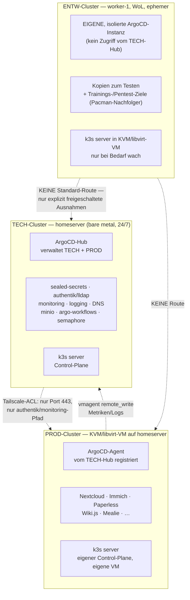
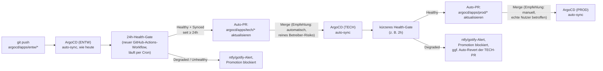
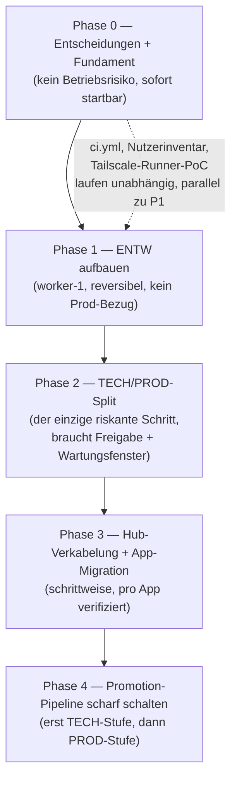

# Multi-Cluster-Migration — ENTW / PROD / TECH

Architektur- und Rollout-Plan für den Umbau des bestehenden **einen**
3-Node-k3s-Clusters in **drei getrennte Cluster** (ENTW, PROD, TECH) inkl.
Aufteilung der bestehenden ArgoCD-Struktur. Noch **nicht umgesetzt** —
dieses Doc beantwortet zunächst die vom Nutzer gestellten Kernfragen
(Machbarkeit, ArgoCD-Modell, Cluster-zu-Cluster-Kommunikation, Hardware,
Nutzen, Kubernetes-Aktualität) und hält danach den daraus abgeleiteten,
gestaffelten Plan fest — analog zur Konvention aus
[40070-authentik-sso-iac.md](40070-authentik-sso-iac.md).

---

## Ausgangslage (live verifiziert)

Aktuell **ein** Cluster, drei physische Bare-Metal-Nodes, kein Hypervisor
(siehe [40030-gitlab-hosting-proxmox-pruefung.md](40030-gitlab-hosting-proxmox-pruefung.md) Teil 2 —
Proxmox wurde dort bereits geprüft und **abgelehnt**, siehe
[Bezug zu 40030](#bezug-zu-40030-warum-jetzt-anders) unten).

| Node | Rolle | vCPU | RAM (Capacity) | Live-Status beim Schreiben |
|---|---|---|---|---|
| `homeserver` (.94) | Control-Plane + Worker, 24/7 | 12 | ~61 GiB | `Ready`, 7 % CPU / 38 % RAM belegt (~38 GiB frei) |
| `worker-0` (.95) | reiner Agent, WoL | 4 | ~7,3 GiB | `NotReady` (schläft, WoL-gesteuert — normal) |
| `worker-1` (.96) | reiner Agent, WoL | 4 | ~15 GiB | `NotReady` (schläft, WoL-gesteuert — normal) |
| `ugreen-nas` (.97) | NFS-Storage, kein k8s-Node | — | — | separat, UGOS, kein Ansible |

**RAM-Update gegenüber 40030:** Der Prüfdoc von damals rechnete noch mit
32 GB auf `homeserver` — laut Live-Abfrage (`kubectl get nodes -o json`)
sind es inzwischen ~61 GiB (RAM-Aufstockung im Zuge der Homeserver-Härtung
nach dem Ausfall vom 02.09.2026). Das verschiebt die
Proxmox-Kosten-/Nutzen-Rechnung aus Teil 2.2 von 40030 spürbar (siehe
unten).

**Software-Stand:**

| Komponente | Live-Version | Aktuell? |
|---|---|---|
| k3s (alle 3 Nodes) | `v1.36.4+k3s1` | **Ja, für den konfigurierten Kanal.** `k3s_channel: stable`, `k3s_version: ""` (`ansible/group_vars/all.yml`) → jeder Ansible-Lauf installiert automatisch die neueste `stable`-Kanal-Version. `v1.36.4+k3s1` ist laut k3s-Release-Feed genau diese neueste `stable`-Version (Stand 13.09.2026). Upstream-Kubernetes ist mit `v1.37.0` ("Garhwal", 26.08.2026) bereits eine Minor-Version weiter — k3s hat dafür noch keinen `stable`-Build veröffentlicht, das ist normale, beabsichtigte Verzögerung des `stable`-Kanals (der `latest`-Kanal wäre näher dran, aber bewusst nicht gewählt für ein Produktivsystem). |
| ArgoCD | `v3.5.3` (Helm-Chart `argo-cd-10.9.1`) | **Ja, praktisch aktuell** (neueste zum Zeitpunkt der Recherche gefundene Version war `v3.5.2`) |

**ArgoCD-Ist-Zustand — wichtige Korrektur der Ausgangsfrage:** Es existiert
aktuell **eine einzige** ArgoCD-Installation (`helm list -n argocd` zeigt
genau einen Release), die **zwei separate `ApplicationSet`-Ressourcen**
betreibt (`home-server-apps-platform`, `home-server-apps-workloads`, siehe
[docs/b-kubernetes-gitops/b0020-argocd-projects.md](../b-kubernetes-gitops/b0020-argocd-projects.md)) —
**nicht** zwei ArgoCD-Server. Beide erzeugen `Applications`, die
ausschließlich `destination.server: https://kubernetes.default.svc`
verwenden (In-Cluster-only) — es gibt aktuell **keine**
Multi-Cluster-Registrierung (`argocd cluster add`, Cluster-Secrets o. Ä.).

**Bestätigt (2026-09-18):** "die bereits zwei vorhandenen Argo" bezog
sich auf genau diese zwei `ApplicationSet`s/`AppProject`s
(`platform`/`workloads`) — nicht auf zwei separate ArgoCD-Server. Es
existiert **ein** ArgoCD-Server, Baustein 1 (Hub für TECH+PROD, eigene
Instanz für ENTW) steht damit wie geplant.

Aktuelle App-Zuordnung (`ansible/roles/argocd/defaults/main.yml`, Stand
dieses Docs — 19 Platform-Apps, 21 Workloads-Apps, 40 Applications
gesamt plus 2 seit den Docs neu hinzugekommene: `authentik`, `lldap`,
`alamos-relay`, `demo-app`, `ollama`, `pacman` sind bereits live, aber
noch nicht überall in `docs/a-betriebssystem/a0010-overview.md`
nachgezogen — Doc-Drift, keine Auswirkung auf diesen Plan).

**Bezug zu 40030 — warum jetzt anders:** 40030 nennt in Teil 2.4 explizit
vier Trigger, ab denen sich Proxmox/mehrere Cluster lohnen würden. Trigger 1
lautete wörtlich: *"Echter Bedarf an einem zweiten, isolierten Cluster —
z. B. eine Trainings-/Unterrichts-Umgebung für die IT-Klasse, die nichts
mit dem Produktiv-Cluster teilen darf"* — mit ausdrücklichem Verweis auf das
Pacman-Muster
([docs/3-apps-workloads/300f0-pacman-visitor-tracking.md](../3-apps-workloads/300f0-pacman-visitor-tracking.md),
öffentlicher Betrieb **und** Unterrichtsobjekt in **einer** App). Mit dieser
Anfrage ist genau dieser Trigger jetzt real gestellt. Trigger 3 (RAM-Upgrade
auf `homeserver` auf ≥ 64 GB) ist ebenfalls praktisch erfüllt (~61 GiB
Capacity). Die 40030-Ablehnung von Proxmox gilt also **nicht mehr
unverändert** — sie bleibt aber in einem Punkt richtig: eine komplette
Hypervisor-Umstellung aller drei Nodes ist immer noch ein größerer,
schwer reversibler Eingriff in ein Ein-Personen-Homelab ohne Redundanz.
Der Plan unten löst das deshalb gestaffelt statt mit einem Rundumschlag.

---

## Die gestellten Fragen — Machbarkeits-Analyse

| Frage | Antwort | Begründung |
|---|---|---|
| Ein ArgoCD für mehrere Cluster, oder pro Cluster eins? | **Technisch reicht eines** — ArgoCD unterstützt natives Multi-Cluster-Management (`argocd cluster add` legt pro Ziel-Cluster ein `Secret` vom Typ `cluster` mit API-Server-URL + Credentials in der `argocd`-Namespace des Hub-Clusters an; `Application`/`ApplicationSet` referenzieren den Ziel-Cluster dann über `destination.server`/`.name` statt immer `https://kubernetes.default.svc`). **Empfehlung für dieses Setup: trotzdem zwei Instanzen, nicht eine für alle drei** — Begründung siehe [Baustein 1](#1-argocd-modell-ein-hub-für-tech--prod-entw-bekommt-eine-eigene-instanz) unten, kurz: ENTW ist als Trainings-/Experimentierumgebung vorgesehen (Bezug zu 40030 Trigger 1) und darf keine Zugangsdaten tragen, die im Erfolgsfall eines Angriffs auf PROD zeigen. |
| Können die Cluster eingeschränkt untereinander kommunizieren (Beispiel Immich-Server → Immich)? | **Ja, aber nicht über Kubernetes-Bordmittel** — jeder Cluster hat sein eigenes Pod-/Service-Netz (`10.42.0.0/16`/`10.43.0.0/16` sind pro Cluster unabhängig, keine gemeinsame Route). Cross-Cluster-Zugriff muss über die bestehende Traefik-Ingress-Ebene + Tailscale laufen, genau wie heute schon jeder LAN/Tailnet-Client auf `*.homeserver` zugreift — nur eben Cluster-zu-Cluster statt Client-zu-Cluster. Einschränkung auf **genau** die gewünschte Verbindung (z. B. nur Immich-Namespace in PROD darf einen bestimmten Port bei TECH erreichen) über drei kombinierte, bereits im Repo etablierte Mechanismen: Tailscale-ACL-Tags pro Cluster (`tag:entw-node`/`tag:prod-node`/`tag:tech-node`, siehe [docs/c-netzwerk-dns/c0010-tailscale.md](../c-netzwerk-dns/c0010-tailscale.md#acl-konfiguration), aktuell nur dokumentiert, nicht restriktiv konfiguriert), UFW-Regel auf dem Ziel-Node nur für die konkrete Quell-IP/-Tag+Port, und eine Kubernetes-`NetworkPolicy`/Ingress-Regel im Ziel-Namespace, die nur die Absender-Cluster-Gateway-IP zulässt — dieselbe Allow-List-Philosophie wie bei `argocd_network_policy_refined_namespaces` heute schon, nur eine Ebene höher angewendet. Ein echter Cluster-übergreifender Service-Mesh (Cilium ClusterMesh, Istio Multi-Cluster, Submariner) wäre die "richtige" Lösung für viele solcher Verbindungen, ist aber für eine Handvoll benannter Ausnahmen bei drei Nodes klarer Overkill — passt nicht zum sonstigen "kein Tool mehr als nötig"-Muster des Repos (vgl. Ablehnung des Bitnami-Postgres-Subcharts in 40070, Ablehnung von Proxmox in 40030). |
| Gibt die aktuelle Hardware das her? | **Für drei komplett unabhängige, jeweils hochverfügbare physische Cluster: nein.** Es gibt nur **eine** 24/7-Maschine (`homeserver`). `worker-0`/`worker-1` sind bewusst nur bei Bedarf per WoL an — für einen Cluster, der wie PROD jederzeit für Familie/Verein erreichbar sein muss, ungeeignet als alleinige Nodes. Für das gestaffelte Zielbild (siehe Zielarchitektur unten) reicht die Hardware aber gut: TECH bleibt bare metal auf `homeserver` als vertrauenswürdiger Hypervisor-Host, PROD läuft dort in einer KVM/libvirt-VM (~38 GiB frei, VM bekommt z. B. 6 vCPU / 24 GiB), ENTW läuft in einer eigenen KVM/libvirt-VM auf `worker-1` (~15 GiB verfügbar). Beide VMs sind aus Ressourcensicht unkritisch, siehe Baustein 5. |
| Welche Vorteile bringt das Setup? | Siehe [Vorteile](#vorteile-des-ziel-setups) unten — kurz: echte Blast-Radius-Trennung für die Trainingsumgebung, gefahrloses Testen von Cluster-weiten Änderungen (k3s-Upgrades, ArgoCD-Upgrades, CRD-Änderungen) vor PROD, klarere Sicherheitsgrenze zwischen Infrastruktur (TECH) und Nutzer-Apps (PROD). |
| Ist die neueste Kubernetes-Version installiert? | **Ja, für den konfigurierten Update-Kanal** (`stable`) — siehe Tabelle oben. Wer bewusst näher an der absoluten Kubernetes-Spitze (`v1.37`) sein will, müsste auf `k3s_channel: latest` wechseln — das ist eine bewusste Stabilität-vs.-Aktualität-Entscheidung, kein Versäumnis. |

---

## Vorteile des Ziel-Setups

- **Blast-Radius-Trennung für die IT-Klasse (Haupttreiber):** Ein
  kompromittierter oder absichtlich verwundbarer ENTW-Cluster kann PROD
  (Familien-/Vereinsdaten: Nextcloud, Immich, Vaultwarden) und TECH
  (Secrets, DNS, Identity) nicht erreichen, wenn die Netz- und
  ArgoCD-Grenzen wie unten beschrieben gezogen werden.
- **Gefahrloses Testen struktureller Änderungen.** k3s-Minor-Upgrades,
  ArgoCD-Upgrades, neue CRDs, ApplicationSet-Umbauten (vgl. die zwei
  bereits dokumentierten, verworfenen Ansätze in
  [b0020-argocd-projects.md](../b-kubernetes-gitops/b0020-argocd-projects.md)) zuerst gegen ENTW
  fahren, bevor sie PROD/TECH anfassen — aktuell gibt es dafür keinen
  Cluster, nur denselben Cluster mit Vorsicht.
- **Klarere Betriebsgrenze.** TECH bündelt alles, was heute schon
  konzeptionell "Plattform" ist (`platform`-AppProject,
  `security-tier=platform`-Label) — die Grenze existiert in ArgoCD/Docs
  bereits (`platform`/`workloads`, `tech`/`prod`-DNS-Tiers seit
  [c0040-domain-tiers.md](../c-netzwerk-dns/c0040-domain-tiers.md)), wird aber nur
  logisch, nicht physisch durchgesetzt. Multi-Cluster macht sie technisch
  hart statt nur konventionell.
- **`dev`-Tier ist bereits reserviert.** `c0040-domain-tiers.md` legt die
  Namenskonvention `<app>.dev.homeserver` seit der letzten DNS-Migration
  bewusst als "noch keine App, aber die Konvention steht" an — ENTW ist
  exakt die praktische Einlösung dieser Reservierung, keine neue
  Namenskonvention nötig.
- **Kein Kompromiss beim Familien-/Vereinsbetrieb.** PROD bleibt so
  konservativ wie heute (Autelia/Authentik-Login, wenig Änderungsrisiko),
  während Experimentelles komplett woanders läuft.

**Ehrliche Kehrseite (damit sie nicht erst live auffällt):** Drei Cluster
heißt drei Sätze an Plattform-Grundzutaten, die pro Cluster **einzeln**
existieren müssen (siehe [Baustein 4](#4-was-pro-cluster-existieren-muss-vs-was-zentral-bleibt)) —
mehr Betriebsaufwand als heute, nicht weniger. Das NAS bleibt außerdem
eine **gemeinsame** Abhängigkeit aller drei Cluster (ein Ausfall trifft
alle) — echte Speicher-Isolation für ENTW bräuchte eine zweite,
unabhängige Storage-Quelle, was hier bewusst **nicht** vorgesehen ist
(Kostenaufwand vs. Nutzen für eine Trainingsumgebung unverhältnismäßig).

---

## Zielarchitektur



**Kernentscheidung: kein symmetrisches Hub-Modell.** TECH und PROD
vertrauen sich gegenseitig (ein Hub verwaltet beide, Monitoring/DNS/Login
sind zentral in TECH). ENTW ist bewusst **nicht** Teil dieses
Vertrauensraums — eigene ArgoCD-Instanz, eigene SealedSecrets-Schlüssel,
keine Standard-Netzroute zu TECH/PROD. Das ist genau die
Blast-Radius-Eigenschaft, die 40030 Trigger 1 gefordert hat.

**Revidierte Position zu TECH/PROD auf `homeserver`: PROD läuft doch in
einer VM, nicht bare metal.** Eine frühere Version dieses Plans empfahl
hier zwei bare-metal-k3s-Instanzen nebeneinander, mit der Begründung "TECH
und PROD vertrauen sich ohnehin, da ein Hub beide verwaltet". Diese
Begründung stimmt für die **GitOps-Vertrauensebene** (wer darf was
deployen — das ist reine Betreiber-Entscheidung), verwechselt das aber mit
der **Blast-Radius-Frage bei einem externen Angriff**, und die ist
asymmetrisch:

- **PROD ist der einzige Cluster mit echter Internet-Exposition** — mehrere
  Apps hängen über den Cloudflare Tunnel am offenen Internet
  (`nextcloud-prod.pke-lab.de`, `immich-prod.pke-lab.de`, `pacman`
  öffentlich-unauthentifiziert, …). Ein RCE in einer dieser Apps ist ein
  realistisches Angriffsszenario, kein theoretisches.
- **TECH hält die wertvollsten Assets**: Authentik/lldap (Identity für
  alles), Semaphore (SSH-Zugriff auf **alle** verwalteten Hosts), ArgoCD
  selbst (Deploy-Kontrolle). Kein direkter Internet-Zugriff, aber der
  lohnendste Sekundärschritt für einen Angreifer, der zuerst PROD
  kompromittiert.
- **Ohne VM-Grenze teilen sich beide k3s-Instanzen denselben Kernel.**
  Ein Node-/Root-Level-Kompromiss auf der PROD-Instanz (z. B. über einen
  Pod-Escape nach einem App-RCE) ist auf bare metal praktisch ein
  Root-Kompromiss von `homeserver` selbst — von dort sind TECHs
  Prozesse/Dateien direkt erreichbar, auch wenn sie in einer eigenen
  k3s-Instanz laufen. Eine KVM/libvirt-VM macht daraus zwei Schritte statt
  einen: erst Node-Kompromiss *innerhalb* der PROD-VM, dann zusätzlich
  einen VM-Escape, um überhaupt an TECH heranzukommen — eine deutlich
  seltenere, aufwändigere Angriffsklasse.

Der Ressourcen-Einwand von früher trägt nicht mehr: wie schon bei ENTW
gezeigt, liegt der KVM/libvirt-Overhead bei grob ~0,5–1 GB RAM +
< 5–10 % CPU-Tax — auf `homeserver` (12 vCPU / 61 GiB, ~38 GiB aktuell
frei) für eine z. B. 6 vCPU / 24 GiB dimensionierte PROD-VM unkritisch.
**`homeserver` bleibt bare metal als vertrauenswürdiger Hypervisor-Host
für TECH** (kein direkter Internet-Zugriff, keine deliberate
Angriffsfläche wie ENTW) — nur PROD zieht in eine VM, weil PROD die
einzige der drei Rollen ist, die routinemäßig echtem Internet-Traffic
ausgesetzt ist.

---

## Bausteine

### 1. ArgoCD-Modell: ein Hub für TECH + PROD, ENTW bekommt eine eigene Instanz

| Cluster | ArgoCD | Registrierung |
|---|---|---|
| TECH | **Hub-Instanz** (heutige ArgoCD, bleibt hier) | verwaltet sich selbst (`https://kubernetes.default.svc`, wie heute) |
| PROD | kein eigenes ArgoCD nötig | als externer Cluster im TECH-Hub registriert (`argocd cluster add` bzw. äquivalentes `Secret` vom Typ `cluster` mit PROD-Kubeconfig) |
| ENTW | **eigene, separate ArgoCD-Instanz**, im ENTW-Cluster selbst installiert | keine Registrierung im TECH-Hub — bewusst kein gemeinsamer Credential-Speicher |

Technische Umsetzung des Hub-Modells (TECH → PROD) — Erweiterung des
bestehenden ApplicationSet-Musters um einen `matrix`-Generator
(Cluster-Liste × Verzeichnis-Generator), analog zur bereits bewiesenen
Zwei-ApplicationSet-Struktur aus
[b0020-argocd-projects.md](../b-kubernetes-gitops/b0020-argocd-projects.md):

```yaml
# Skizze — argocd/bootstrap/root-applicationset.yaml, neuer Abschnitt
generators:
  - matrix:
      generators:
        - clusters:
            selector:
              matchLabels: { cluster-tier: prod }
        - git:
            repoURL: "https://github.com/pkr-lab/capulus-core.git"
            revision: "main"
            directories:
              - path: "argocd/apps/prod/*"
template:
  spec:
    project: prod
    destination:
      server: "{{.server}}"          # aus dem Cluster-Generator
      namespace: "{{.path.basename}}"
```

Ordnerstruktur wandert dafür von `argocd/apps/{platform,workloads}/` zu
`argocd/apps/{tech,prod}/` (ENTW bekommt ein eigenes Repo oder einen
eigenen Ordner mit eigenem, nicht vom Hub gelesenem ApplicationSet — noch
zu entscheiden, siehe [Checkliste](#checkliste-fehlender-komponenten)).

**Warum nicht ein einziges Argo für alle drei:** Technisch ginge das
(ArgoCD kennt keine Obergrenze an registrierten Clustern) — der Grund
dagegen ist ausschließlich der Trainings-/Pentest-Zweck von ENTW: Das
`cluster`-Secret, das ArgoCD für einen registrierten Cluster hält, trägt
volle Kubeconfig-Credentials für diesen Cluster. Ein Angreifer, der im
Rahmen der IT-Klassen-Übung ENTW kompromittiert, hätte damit potenziell
einen Pfad zum ArgoCD-Server selbst — und darüber zu **allen** anderen
registrierten Clustern (PROD!). Eine strikt getrennte ArgoCD-Instanz nur
für ENTW verhindert genau das, ohne die Bequemlichkeit für TECH/PROD zu
verlieren, wo dieses Risiko nicht besteht.

### 2. Cluster-zu-Cluster-Kommunikation — Immich-Beispiel konkret

Aktuell läuft Immich als **eine** App in **einem** Namespace
(`argocd/apps/workloads/immich`, siehe
[docs/3-apps-workloads/300c0-immich.md](../3-apps-workloads/300c0-immich.md)) — es gibt heute
keinen Cluster-übergreifenden Immich-Verkehr. Das Beispiel aus der Anfrage
ist als **Muster für eine künftige, benannte Ausnahme** zu verstehen, nicht
als bestehende Abhängigkeit. Empfohlenes Muster, sobald eine solche
Ausnahme wirklich gebraucht wird:

1. Zielapp bekommt einen normalen Ingress-Host im Ziel-Cluster (z. B.
   `immich.prod.homeserver`), wie jede App heute schon.
2. Tailscale-ACL-Regel, die **nur** das anfragende Gerät/Tag (z. B.
   `tag:entw-node`) auf **genau** diesen Host/Port zulässt — nicht
   all-to-all wie der aktuelle Tailscale-Default.
3. `NetworkPolicy` im Ziel-Namespace, die eingehenden Verkehr zusätzlich
   auf die bekannte Absender-IP (Tailscale-IP des Quell-Cluster-Gateways)
   einschränkt — zweite Verteidigungslinie, falls die ACL-Regel je zu
   weit gefasst wird.
4. Kein DNS-Sonderfall nötig — `*.prod.homeserver` löst bereits heute
   clusterweit auf (dnsmasq/CoreDNS-custom decken alle Sub-Ebenen der
   `homeserver`-Zone ab, siehe
   [c0040-domain-tiers.md](../c-netzwerk-dns/c0040-domain-tiers.md)) — nur die IP, auf die
   `*.prod.homeserver` zeigt, ändert sich (siehe Baustein 3).

**ACL-Policy — Stand 2026-09-18:**

- **Geräte-Tags gesetzt** (über Tailscale-Admin-Panel → Machines → Edit
  ACL tags, ohne CLI-Befehl auf den Geräten selbst): `homeserver` trägt
  **beide** `tag:tech-node` **und** `tag:prod-node` (TECH/PROD sind
  physisch noch derselbe Node, bis Baustein 5 Phase 2 die PROD-VM
  aufsetzt — kein Widerspruch, die Regeln greifen dann einfach doppelt
  auf denselben Node), `worker-1` trägt `tag:entw-node`.
- **Policy-Format korrigiert:** Das Tailnet nutzt bereits das neuere
  `"grants"`-Format (nicht das ältere `"acls"`/`"action"/"src"/"dst"`
  aus meinem ersten Entwurf) — unten die an das tatsächliche Tailnet-
  Template angepasste Version, inkl. einer Ergänzung gegenüber dem
  ersten Entwurf: **alle Tailnet-Mitglieder** (Familie/Verein-Geräte wie
  `iphone-ruth`, `pk-handy-1`) brauchen weiterhin App-Zugriff auf Port
  443 zu TECH/PROD, sonst bricht der bestehende Nextcloud-/Immich-/
  Vaultwarden-Zugriff über Tailscale weg.
- **Verifiziert nach dem Taggen:** `kubectl get nodes` und `ssh
  homeserver` funktionieren weiterhin einwandfrei — Tagging allein hat
  nichts kaputt gemacht (die Policy war zu dem Zeitpunkt noch der
  Tailscale-Default mit offenem `{"src": ["*"], "dst": ["*"], "ip":
  ["*"]}`-Grant).
- **Offen:** ob die Policy unten inzwischen im Panel gespeichert wurde,
  ist von hier aus nicht prüfbar (kein Tailscale-API-Zugriff) — nach dem
  Speichern bitte nochmal `ssh homeserver`/`kubectl get nodes`/ArgoCD im
  Browser testen.

```json
{
	"ssh": [
		{
			"action": "check",
			"src":    ["autogroup:member"],
			"dst":    ["autogroup:self"],
			"users":  ["autogroup:nonroot", "root"],
		},
	],

	"tagOwners": {
		"tag:tech-node": ["autogroup:admin"],
		"tag:prod-node": ["autogroup:admin"],
		"tag:entw-node": ["autogroup:admin"],
	},

	"grants": [
		// Admin: voller Zugriff auf alle drei Cluster-Tags (SSH, k3s-API,
		// ArgoCD, Traefik, ...) - wie heute, nur jetzt explizit.
		{
			"src": ["autogroup:admin"],
			"dst": ["tag:tech-node", "tag:prod-node", "tag:entw-node"],
			"ip":  ["*"],
		},

		// Alle Tailnet-Mitglieder (Familie/Verein): App-Zugriff auf TECH+PROD
		// ueber Traefik (Port 443) bleibt wie bisher moeglich. Bewusst OHNE
		// entw-node - Trainings-/Pentest-Cluster ist kein Endnutzer-Ziel.
		{
			"src": ["autogroup:member"],
			"dst": ["tag:tech-node", "tag:prod-node"],
			"ip":  ["tcp:443"],
		},

		// PROD -> TECH: nur Port 443 (vmagent remote_write, siehe Baustein 4).
		{
			"src": ["tag:prod-node"],
			"dst": ["tag:tech-node"],
			"ip":  ["tcp:443"],
		},

		// TECH -> PROD: nur Port 443 (z. B. Authentik-ForwardAuth-Callback).
		{
			"src": ["tag:tech-node"],
			"dst": ["tag:prod-node"],
			"ip":  ["tcp:443"],
		},

		// ENTW bewusst OHNE eigene Regel zu TECH/PROD - grants sind implizit
		// deny, sobald grants existieren. Jede kuenftige, benannte Ausnahme
		// (siehe Immich-Beispiel oben) kommt als eigene, eng gefasste Regel
		// dazu - nicht vorab.
	],
}
```

### 3. DNS: Tier-Konvention existiert schon, IPs müssen jetzt auseinanderfallen

`c0040-domain-tiers.md` definiert `tech`/`prod`/`dev` bereits — heute
zeigen aber alle drei rein namensmäßig auf dieselbe `homeserver`-IP
(`.94`), weil es nur einen Cluster gibt. Mit drei Clustern brauchen
`*.tech.homeserver`, `*.prod.homeserver`, `*.dev.homeserver` **drei
verschiedene Ziel-IPs** (je der Traefik-Ingress-IP des jeweiligen
Clusters). Nötige Änderung: dnsmasq-Konfiguration auf `homeserver` von
einem pauschalen `address=/homeserver/<ip>` auf drei tier-spezifische
Einträge umstellen (`address=/tech.homeserver/<tech-ip>`,
`.../prod.homeserver/<prod-ip>`, `.../dev.homeserver/<entw-ip>`) — die
allgemeine `homeserver`-Zone bleibt als Fallback für noch nicht
migrierte/tier-lose Namen bestehen.

### 4. Was pro Cluster existieren muss vs. was zentral bleibt

| Zutat | Pro Cluster nötig? | Warum |
|---|---|---|
| `sealed-secrets` | **Ja, in allen drei** | Verschlüsselungs-Schlüssel ist an den Controller-Instanz-Key gebunden — ein Secret, das für TECH versiegelt wurde, lässt sich in PROD/ENTW nicht entschlüsseln. Jede in Git liegende App muss künftig **pro Ziel-Cluster neu versiegelt** werden (Vorlage: `kubeseal --context <cluster>`), das ist der größte einmalige Migrationsaufwand. |
| Traefik, CoreDNS, Flannel | **Ja, in allen drei** | kommt mit jedem k3s-Server automatisch, kein Zusatzaufwand |
| `nas-storage`/`immich-storage` (NFS-Provisioner) | **In TECH und PROD** (nicht ENTW, s. u.) | folgt den PVC-Konsumenten, nicht der `platform/workloads`-Ordnerstruktur — Vaultwarden/Zammad sind laut [c0040](../c-netzwerk-dns/c0040-domain-tiers.md) `tech`-Tier, brauchen aber `nas`-StorageClass, also muss der Provisioner **auch** in TECH laufen, nicht nur in PROD |
| Interne CA / cert-manager ([d0040-internal-tls.md](../d-sicherheit/d0040-internal-tls.md)) | Empfehlung: **eine gemeinsame Root-CA**, pro Cluster ein eigenes `cert-manager`-Issuer-Zertifikat daraus | Drei komplett getrennte CAs würden bedeuten, dass Cross-Cluster-HTTPS-Aufrufe (Baustein 2) den fremden CA-Store nicht kennen — vermeidbarer Reibungspunkt |
| Monitoring/Logging | **Zentral in TECH**, PROD/ENTW schicken nur `vmagent remote_write` dorthin | identisches Muster wie heute schon für die Banana-Pis (`ansible/group_vars/banana_pis.yml`, vmagent → `vm-write`) — kein neues Konzept, nur eine weitere Quelle |
| Identity (Authentik/lldap) | **Zentral in TECH**, PROD-Apps als OIDC-Clients gegen TECH | ein Login für alle drei Cluster ist der eigentliche Nutzen eines zentralen IdP — ENTW bewusst **ausgenommen** (Trainingsumgebung darf eigene, wegwerfbare Accounts haben, keine Brücke zu echten Zugangsdaten) |
| Gotify/ntfy | **Zentral in TECH** | ein Alert-Kanal für den Betreiber reicht, keine drei getrennten Push-Ziele nötig |
| `minio`/`argo-workflows`/`semaphore`/`headlamp` | **Zentral in TECH** | reine Betriebs-/Admin-Tools, kein Grund zur Vervielfachung; Headlamp unterstützt selbst native Multi-Cluster-Ansicht (mehrere Kubeconfig-Kontexte in einer Instanz) — genau wie ArgoCD, nur mit demselben Vertrauensgrenzen-Vorbehalt für ENTW |

### 5. Hardware-Umsetzung — gestaffelt, kein Hypervisor-Rundumschlag

| Phase | Was | Wo | Risiko |
|---|---|---|---|
| 1 | ENTW als leichtgewichtiger, ephemer Cluster **in einer KVM/libvirt-VM** (bewusst **nicht** k3d/Nested-k3s-in-Docker — Begründung unten) | `worker-1` (mehr RAM als `worker-0`, ~15 GiB — passt gut zu einer VM mit mehreren Test-Apps gleichzeitig), weiterhin per WoL geweckt, `cluster_power_manager`-Rolle um einen expliziten "ENTW-Session"-Trigger erweitert statt nur lastbasiert | gering — reversibel, keine bestehende Infrastruktur angefasst |

**Warum VM statt k3d für ENTW — anders als bei TECH/PROD:** Bei TECH/PROD
fiel die Entscheidung gegen eine VM, weil sich beide ohnehin vertrauen
(Kernentscheidung oben). ENTW ist der einzige Cluster in diesem Plan mit
einem **echten** Sicherheitsgrenzen-Bedarf — laut 40030 Trigger 1 explizit
als Trainings-/Pentest-Umgebung vorgesehen, die absichtlich verwundbar
sein darf. k3d/Nested-k3s-in-Docker teilt sich den Kernel des Hosts —
ein Container-Escape ist in einem Schulungskontext eine reale,
geübte Angriffsklasse. Eine KVM/libvirt-VM (Hardware-Isolation über
Intel VT-x/AMD-V, eigener Gast-Kernel) macht daraus eine deutlich
seltenere, aufwändigere Angriffsklasse. Der Ressourcen-Mehrbedarf ist
dabei gering (grobe Hausnummer: ~0,5–1 GB RAM Gast-Overhead, < 5–10 %
CPU-Virtualisierungstax) und auf `worker-1` (4 vCPU / ~15 GiB, ohnehin
nur per WoL aktiv) problemlos verkraftbar — kein Grund, an dieser Stelle
am Overhead zu sparen.
| 2 | TECH/PROD-Split | `homeserver` bleibt TECH bare metal wie heute (Hypervisor-Host); PROD als **KVM/libvirt-VM auf `homeserver`** — Details unten | mittel/hoch — betrifft laufende Familien-/Vereins-Apps, braucht Wartungsfenster + Rollback-Plan |

**Weiterhin kein Proxmox, aber jetzt doch eine VM für PROD** —
Begründung siehe die revidierte ["Kernentscheidung" oben](#zielarchitektur):
PROD ist die einzige der drei Rollen mit echter Internet-Exposition
(Cloudflare Tunnel), TECH hält die wertvollsten Assets (Identity,
Semaphore-SSH-Zugriff auf alle Hosts, ArgoCD-Deploy-Kontrolle) — eine
VM-Grenze macht aus einem PROD-Node-Kompromiss keinen automatischen
TECH-Kompromiss mehr. Bewusst weiterhin **kein** volles Proxmox
(40030 Punkt 2.2: Migrationsrisiko für alle drei Nodes, mächtigerer
Proxmox-API-Zugriff statt des minimalen `poweroff`-SSH-Keys) — stattdessen
schlankes KVM/libvirt **auf** dem bestehenden Ubuntu Server, nur für
diese eine VM.

**Praktisch nötig:**

- **libvirt/QEMU auf `homeserver` installieren**, per neuer Ansible-Rolle
  (`libvirt_host`), Bridge-Netzwerk (`br0`) statt NAT, damit die
  PROD-VM eine eigene, im LAN direkt erreichbare IP bekommt
  (`192.168.178.99` — **korrigiert 2026-09-18**: `.98` ist bereits
  `infotafel`/Xibo-Display, siehe `ansible/inventory/hosts.yml`) — kein
  manuelles Port-Splitting nötig, die VM hat über die Bridge ihren
  eigenen vollständigen Netzwerkstack, PROD-Traefik
  bindet ganz normal auf Port 80/443 dieser IP.
- **VM-Sizing**: Start bei z. B. 6 vCPU / 24 GiB fest zugewiesen (lässt
  ~6 vCPU / ~35 GiB Puffer für TECH + Hypervisor-Overhead auf 12 vCPU /
  61 GiB) — Anpassung nach den ersten Betriebswochen anhand von
  `virsh dommemstat`/`kubectl top nodes` in der VM.
- **Ubuntu Server 26.04 LTS als Gast-OS**, identisches Ansible-Playbook
  wie für die bare-metal-Nodes (`common`-Rolle, `k3s`-Rolle unverändert,
  **kein** Parametrisieren auf mehrere Instanzen nötig — die VM ist aus
  Ansible-Sicht einfach ein weiterer Host in `hosts.yml`, wie `worker-0`/
  `worker-1` heute schon) — deutlich weniger Sonderbau als die vorher
  geplante Bare-Metal-Parametrisierung.
- **Snapshot vor riskanten Änderungen** (z. B. k3s-Minor-Upgrade auf PROD)
  ist jetzt ein `virsh snapshot-create` statt gar keiner Option — ein
  Nebenvorteil gegenüber bare metal, den 40030 Punkt 2.4 explizit als
  Proxmox-Trigger 4 nannte, hier aber ohne vollen Hypervisor-Wechsel
  mitgenommen wird.

**Empfehlung zur Node-Zuordnung:**

```
homeserver (12 vCPU / 61 GiB, 24/7)
 ├─ TECH   — bare metal, wie heute, IP .94 (Hypervisor-Host, vertrauenswürdig)
 └─ PROD   — KVM/libvirt-VM, 6 vCPU / 24 GiB, eigene Bridge-IP .99
              (VM-Grenze zu TECH — Begründung s. o.)

worker-1 (4 vCPU / 15 GiB, WoL)   → ENTW, KVM/libvirt-VM, nur bei Bedarf wach
                                     (hier lohnt sich die zusätzliche
                                     VM/Container-Grenze, da ENTW als
                                     einziger Cluster eine echte
                                     Sicherheitsgrenze braucht; mehr RAM
                                     als worker-0, passt besser zu
                                     mehreren gleichzeitigen Test-Apps)
worker-0 (4 vCPU / 7,3 GiB, WoL)  → weiterhin freie Zusatzkapazität
                                     (z. B. zweiter ENTW-Node für
                                     Multi-Node-Trainingsszenarien,
                                     oder PROD-Skalierungsreserve)
```

### 6. CI/CD-Pipeline: automatisierte Promotion ENTW → TECH → PROD

> **Stand (2026-09-19):** Umgesetzt sind die „weiteren Pipeline-Ergänzungen“
> `ci.yml`, kubeconform und gitleaks ([f0070](../f-cicd-automatisierung/f0070-ci-lint.md)),
> dazu PR-Pflicht für `main` ([f0090](../f-cicd-automatisierung/f0090-branch-schutz-main.md))
> und eine **vereinfachte Promotion** `entw` → PR an `main` nach grüner CI
> ([f0080](../f-cicd-automatisierung/f0080-entw-promotion.md)). Anders als unten
> skizziert läuft sie als Cron auf `main` (nicht auf Push), nutzt die CI statt
> eines ArgoCD-Health-Gates und mergt nie automatisch. Die zweistufige Kette mit
> 24-h-Gate bleibt Ziel für Phase 4.

**Gewünschtes Verhalten:** Jede neue Software-Version landet automatisch
zuerst auf ENTW, läuft dort einen definierten Zeitraum (Vorschlag: 24 h)
gesund, und wird erst danach automatisiert Richtung TECH/PROD
weitergereicht — kein manuelles "jetzt auf drei Cluster gleichzeitig
deployen" mehr.

**Reihenfolge bewusst linear, nicht als Fan-Out ENTW → {TECH, PROD}
gleichzeitig:** TECH trägt Identity/DNS/Monitoring, von denen PROD laut
[Baustein 4](#4-was-pro-cluster-existieren-muss-vs-was-zentral-bleibt)
abhängt. Eine fehlerhafte TECH-Änderung, die zeitgleich mit einer
PROD-Änderung durchläuft, könnte PROD indirekt mit reißen, ohne dass die
Promotion-Pipeline das als PROD-Fehler erkennt. Reihenfolge deshalb
**ENTW → TECH → PROD**, mit eigenem (kürzerem) Beobachtungsfenster
zwischen TECH und PROD.



**Konkrete Bausteine dafür, eingepasst in das, was schon existiert:**

| Baustein | Umsetzung | Warum so |
|---|---|---|
| Neuer GitHub-Actions-Workflow `promote.yml` | Cron (z. B. stündlich) + `workflow_dispatch`, Stil wie `release.yml`/`build-images.yml` (`concurrency`-Gruppe, `permissions: contents write, pull-requests write`) | passt sich in die bestehenden vier Workflows (`build-images.yml`, `mirror-gitlab.yml`, `release.yml`, `renovate.yml`) ein, kein neues CI-System |
| ArgoCD-API-Zugriff aus der Cloud-Runner heraus | `tailscale/github-action`-Step, der den GitHub-Actions-Runner temporär ins Tailnet holt, dann `argocd app get <app> -o json` gegen die interne ArgoCD-URL | ArgoCD ist bewusst nicht öffentlich erreichbar (nur LAN/Tailnet, `docs/c-netzwerk-dns/c0010-tailscale.md`) — Tailscale-GitHub-Action ist der Standardweg, ohne einen offenen Port aufzumachen, passt zum "keine offenen Ports"-Grundsatz aus `a0010-overview.md` |
| "seit ≥ 24h gesund"-Kriterium | Health-Status aus ArgoCD **plus** Alter des letzten Commits unter `argocd/apps/entw/<app>/` (`git log -1 --format=%ct -- <pfad>`) — beides muss stimmen | ArgoCD zeigt nur den aktuellen Zustand, nicht seit wann er stabil ist — Commit-Alter ist der einfachste verlässliche Zeitanker, ohne einen zusätzlichen Zustandsspeicher einzuführen |
| Promotion-PR-Inhalt | Kopiert nur `image.tag`/Chart-Version-Felder aus `argocd/apps/entw/<app>/values.yaml` nach `argocd/apps/tech/<app>/` bzw. `.../prod/<app>/` — kein Full-Diff-Merge | gleiches Prinzip wie Renovates bestehendes Feld-Update, minimiert das Risiko einer versehentlichen Konfigurationsänderung beim Promoten |
| Merge-Gate TECH vs. PROD | TECH-Promotion-PRs: Auto-Merge nach grünem CI (nur Betreiber betroffen). PROD-Promotion-PRs: **manuelles Review** verlangt (Branch-Protection-Rule), auch wenn ENTW+TECH schon grün sind | Familie/Verein sind echte Nutzer auf PROD — ein Mensch bestätigt den letzten Schritt, alles davor ist voll automatisiert |
| Alerting | Promotion-Start/-Erfolg/-Block über die bereits vorhandenen `gotify-bridge`/`ntfy-bridge` (dieselbe Alertmanager-Route wie heute) | kein neuer Notification-Kanal nötig |
| Auto-Rollback (optional, Phase 2) | Wird eine frisch promotete App innerhalb eines kurzen Nachbeobachtungsfensters `Degraded`, öffnet derselbe Workflow automatisch einen Revert-PR | verhindert, dass ein automatisiert promotetes, aber doch fehlerhaftes Update unbemerkt auf PROD hängen bleibt |

**Weitere sinnvolle Pipeline-Ergänzungen** (unabhängig von der
Promotion-Kette, schließen echte Lücken im aktuellen Setup):

| Vorschlag | Lücke, die es schließt |
|---|---|
| **`ci.yml`: `make lint` auf jedem PR** | `make lint` (yamllint, ansible-lint, `helm lint` je Chart) existiert bereits lokal, läuft aber aktuell in **keinem** der vier GitHub-Actions-Workflows — ein kaputtes Manifest fällt erst beim ArgoCD-Sync auf, nicht beim PR |
| **Manifest-Validierung vor dem Merge** (`helm template \| kubeconform`) | geht über `helm lint` hinaus — prüft gegen echte Kubernetes-API-Schemas, hätte z. B. das `spec.generators[0].template`-Problem aus [b0020-argocd-projects.md](../b-kubernetes-gitops/b0020-argocd-projects.md) schon vor dem `kubectl apply` gegen den Live-Cluster gefunden |
| **Secret-Scanning auf jedem PR** (`gitleaks`) | defense-in-depth zusätzlich zu SealedSecrets/Ansible Vault — verhindert, dass ein Plaintext-Secret versehentlich in einer PR landet, bevor es überhaupt zum Versiegeln kommt |
| **Renovate zuerst nur gegen `argocd/apps/entw/*`** | `renovate.json` ist aktuell pfadmäßig undifferenziert (`argocd/apps/**`) — Image-/Chart-Bumps sollten künftig zuerst in ENTW landen (ggf. mit Automerge, da ENTW ohnehin wegwerfbar ist) und von dort über die neue Promotion-Pipeline weiterlaufen, statt direkt in `tech`/`prod` einzuschlagen |
| **Smoke-Tests als Teil des Health-Gates** | "Pod läuft" ist kein Beweis, dass die App funktioniert — ein einfacher `curl`-Check gegen `https://<app>.dev.homeserver` (über denselben Tailscale-Runner) als Zusatzbedingung fürs 24h-Gate fängt Fälle, in denen der Pod zwar `Running`, die App aber kaputt ist |
| **Chaos-/Upgrade-Proben ausschließlich gegen ENTW** | k3s-Minor-Upgrades, ArgoCD-Upgrades, gezielte Pod-Kills — bisher nirgends geprobt, weil es nur einen Cluster gibt. Mit ENTW als Wegwerf-Ziel lässt sich das gefahrlos automatisieren (z. B. wöchentlicher Workflow, der ein Upgrade zuerst nur gegen ENTW fährt) |
| **Dependency Dashboard als Sichtbarkeits-Fläche** | Renovate hat `:dependencyDashboard` bereits aktiviert (`renovate.json`) — als zentrale Übersicht nutzen, welche Updates aktuell auf ENTW "einlaufen" und welche schon promotet wurden, statt eine zusätzliche Status-Seite zu bauen |

### 7. Nutzer-/Daten-Inventar für Immich & Vaultwarden

**Anforderung:** Die Nutzer unter Immich und Vaultwarden sollen im Repo
zu den Daten hinterlegt werden, die ihnen gehören — damit bei einem
Rebuild (hier konkret: der PROD-Rebuild aus Baustein 5 Phase 2) weder
Daten verloren gehen noch der Überblick fehlt, wer welche Daten hat.

**Erst mal die gute Nachricht — technisch ist der Rebuild bereits
abgesichert, unabhängig von diesem Plan:**

| App | Wo die Nutzerdaten liegen | Backup-Abdeckung (live geprüft) |
|---|---|---|
| Immich | Postgres-PVC (`postgresql.persistence.storageClassName: immich-nas`, `argocd/apps/workloads/immich/values.yaml:201`) — enthält Accounts, Alben, Freigaben, Gesichtserkennung | Läuft auf `immich-nas` (NFS `/volume2`) → wird vom bestehenden restic-Backup auf die externe USB-Platte mit erfasst, genau wie die Fotobibliothek selbst ([20010-nas-backup.md](../2-betrieb-hardware/20010-nas-backup.md)) — **kein zusätzlicher Schritt nötig** |
| Vaultwarden | Haupt-PVC bewusst auf `local-path` (SQLite, NFS-Locking-Probleme vermieden, siehe [300a0-vaultwarden.md](../3-apps-workloads/300a0-vaultwarden.md#7-warum-kein-nas-storage-für-die-haupt-pvc)), aber ein **eigener nächtlicher `backup`-CronJob** kopiert per `sqlite3 .backup` auf eine zweite, NAS-gestützte PVC | Über dieselbe restic-Kette abgedeckt **plus** ein bereits fertiger, getesteter Restore-Weg: `make vaultwarden-restore FORCE_RESTORE=true` (Ansible-Rolle `vaultwarden_restore`). Laut Doc selbst: *"Vaultwarden kennt keinen 'User per API/Ansible anlegen'-Mechanismus, der über die SQLite-DB hinausgeht — ein separater Schritt, um den Nutzer neu anzulegen, ist nicht nötig"* — die Nutzer kommen mit der DB zurück |

**Update 2026-09-18 — zwei echte Befunde beim ersten Backup-Anstoß vor
Migrationsbeginn:**

1. **Authentiks `pg_dump`-CronJob war seit mindestens 12 Tagen kaputt**
   (alle Dumps 0 Byte, `Connection refused`) — nicht durch diese Migration
   verursacht, aber genau hier aufgefallen, weil "einmal alles frisch
   sichern" der erste praktische Schritt war. Sofortmaßnahme: manueller
   Dump direkt aus dem Postgres-Pod gezogen und auf die NAS-PVC gelegt.
2. **Root Cause gefunden und behoben:** frisch gestartete Pods können in
   diesem Cluster die ersten Sekunden nach dem Start noch keine
   Cross-Pod-Service-Verbindung aufbauen (Netzwerk-Startup-Race,
   reproduzierbar getestet: 1. Versuch sofort nach Pod-Start scheitert,
   2. Versuch 10s später im selben Pod klappt sofort). Betraf nicht nur
   Authentik, sondern reproduzierbar auch Immich. Fix: `pg_isready`-Warte-
   schleife (bis 30s) vor dem eigentlichen `pg_dump`, jetzt in
   `argocd/apps/platform/authentik/templates/postgres-backup-cronjob.yaml`
   ergänzt. **Immich hatte bisher gar keinen `pg_dump`-CronJob** (nur das
   Datei-Level-restic-Backup, siehe Tabelle oben) — analog zu Authentik
   neu angelegt, inkl. desselben Fixes von Anfang an
   (`argocd/apps/workloads/immich/templates/postgres-backup-{cronjob,pvc}.yaml`,
   täglich 01:50 Uhr, siehe [300c0-immich.md → Postgres-Backup](../3-apps-workloads/300c0-immich.md#postgres-backup)).
3. **Offen:** derselbe Netzwerk-Startup-Race könnte auch andere,
   zeitkritische CronJobs/Init-Container im Cluster treffen
   (`github-release-watcher`, `wiki-docs-sync`, `zammad-cronjob-reindex`,
   künftige Promotion-Pipeline-Health-Checks aus Baustein 6) — noch nicht
   systematisch geprüft, siehe Checkliste.

**Was trotzdem fehlt und hier ergänzt wird — nicht Daten**sicherung**,
sondern Daten**dokumentation**:** Aktuell steht "wer hat einen Account
und was gehört ihm" nirgends lesbar im Repo, sondern ausschließlich
verborgen in einem Postgres-/SQLite-Blob. Für den PROD-Rebuild (Baustein
5 Phase 2) und generell als Diagnose-/Auditier-Hilfe kommt ein neues,
**verschlüsseltes** Inventar dazu — verschlüsselt, weil es echte Namen/
E-Mail-Adressen von Familie/Verein enthält, nicht weil es technisch für
den Restore selbst gebraucht wird:

- **Mechanismus fertig (2026-09-18):** `make user-inventory-edit`
  (`ansible-vault edit ansible/group_vars/user_inventory_vault.yml`) ist
  im Makefile angelegt. **Bewusst nicht** wie `make vault-edit` auf
  `group_vars/all.yml` gezielt — diese Datei mischt Klartext-Config mit
  einzelnen inline `!vault`-verschlüsselten Werten
  (`ansible-vault encrypt_string`), `ansible-vault edit` funktioniert
  aber nur auf Dateien, die **komplett** ein Vault-Blob sind. Deshalb
  eine neue, eigene, **vollständig** verschlüsselte Datei.
  **Offen (braucht das Vault-Passwort, das hier nicht vorliegt):**
  Vorlage ist als Klartext-Datei bereits angelegt
  (`ansible/group_vars/user_inventory_vault.yml`) — einmalig
  `ansible-vault encrypt ansible/group_vars/user_inventory_vault.yml`
  ausführen (**nicht** `create`, die Datei existiert schon), dann
  `make user-inventory-edit` zum weiteren Befüllen. Inhalt:
  **kein Passwort** (das bleibt beim jeweiligen Nutzer/in der App-DB),
  sondern nur Name/E-Mail, App (`immich`/`vaultwarden`), Rolle
  (Admin/Mitglied), bei Immich zusätzlich der Name der zugehörigen
  Library/des Albums, falls nicht 1:1 pro Person.
- Referenziert von einem neuen, kurzen Abschnitt in
  [300c0-immich.md](../3-apps-workloads/300c0-immich.md) und
  [300a0-vaultwarden.md](../3-apps-workloads/300a0-vaultwarden.md) ("Nutzer-Inventar
  siehe `ansible/group_vars/user_inventory_vault.yml`, `make
  user-inventory-edit`"), statt das Inventar nur an dieser
  Migrationsseite hängen zu lassen — sonst findet es niemand mehr, sobald
  dieser Plan als historischer Kontext gilt (Konvention wie in
  [40070](40070-authentik-sso-iac.md)).
- **Vor dem PROD-Rebuild** (Baustein 5 Phase 2) einmal gegen den
  tatsächlichen Live-Stand beider Apps abgeglichen (`/admin`-Oberfläche
  Immich bzw. Vaultwarden) — danach bei jeder Account-Änderung
  (neues Familienmitglied, neues Vereinsmitglied) mitgepflegt, nicht nur
  einmalig angelegt und vergessen.

**Bewusst nicht vorgesehen:** ein automatisierter Abgleich/Sync
zwischen diesem Inventar und den echten App-Datenbanken (z. B. ein
CronJob, der bei Abweichung Alarm schlägt) — für zwei Apps mit
gelegentlichen, von Menschen ausgelösten Account-Änderungen ist das
Overkill; das Inventar ist eine Dokumentations-Hilfe, keine
Quelle der Wahrheit (die bleibt die App-DB selbst).

---

## App-Zuordnung (erster Entwurf, Stand `argocd_platform_apps`/`argocd_workloads_apps`)

| App | Heute | Ziel-Cluster | Anmerkung |
|---|---|---|---|
| `sealed-secrets`, `kubeseal-webgui`, `authentik`, `lldap`, `monitoring`, `logging`, `gotify(-bridge)`, `ntfy(-bridge)`, `coredns-custom`, `minio`, `argo-workflows`, `semaphore`, `headlamp`, `traefik-config` | platform | **TECH** | reine Infrastruktur, wie in [Baustein 4](#4-was-pro-cluster-existieren-muss-vs-was-zentral-bleibt) begründet |
| `cloudflared`, `pihole` | platform | **TECH + PROD** (je eine Instanz) | folgt den extern erreichbaren Apps — die meisten `-pke-lab.de`-Hosts sind PROD-Apps (Nextcloud, Immich, Wiki.js, …), ein paar TECH (Grafana, ntfy, Vaultwarden/Zammad, s. u.) |
| `nas-storage`, `immich-storage` | platform | **TECH + PROD** (je eine Instanz) | folgt den PVC-Konsumenten, nicht der bisherigen Ordnerzuordnung |
| `vaultwarden`, `zammad` | workloads (Ordner), aber `tech`-Tier laut [c0040](../c-netzwerk-dns/c0040-domain-tiers.md) | **TECH** | Ausnahme bereits heute dokumentiert und begründet, wandert 1:1 mit |
| `n8n` | workloads | **TECH** (Entscheidung 2026-09-19, ändert den ersten Entwurf) | n8n ist die Automatisierungs-Drehscheibe für TECH-Dienste: seine Workflows sprechen Zammad, VictoriaMetrics, ntfy, den Kubernetes-API des eigenen Clusters (skaliert `ollama`), das Xibo-CMS und die Wake-on-LAN-Steuerung an. Ein n8n in PROD bräuchte Zugangsdaten zu all diesen TECH-Diensten, genau das soll die TECH/PROD-Trennung verhindern. Der öffentliche Webhook-Host bleibt über den TECH-Tunnel erreichbar wie bisher |
| `nextcloud`, `immich`, `paperless-ngx`, `wikijs`, `mealie`, `uptime-kuma`, `mediamtx`, `tinyteller`, `alamos-apager`, `alamos-relay`, `xibosignage`, `carplay-api`, `github-release-watcher`, `wiki-docs-sync`, `example-whoami` | workloads | **PROD** | echter Nutzerkreis, wie heute |
| `demo-app`, `ollama` | workloads | **ENTW** (Empfehlung) | keine Endnutzer-Bindung, gute Testkandidaten ohne Rückwirkung auf PROD |
| `pacman` | workloads, aktuell **gleichzeitig** öffentlich-produktiv **und** IT-Unterrichtsobjekt (eine App, ein Flag) | **Offene Entscheidung — nicht Teil dieses Plans** | 40030 nennt genau diesen Fall als Proxmox-Trigger-Beispiel ("Fortführung des Pacman-Musters, aber als komplett getrenntes Cluster statt einer Flag innerhalb derselben App"). Pacmans Doppelrolle (siehe [Pacman-Memory-Kontext](../3-apps-workloads/300f0-pacman-visitor-tracking.md)) bedeutet: der öffentliche Produktivbetrieb muss so oder so in PROD bleiben, ein etwaiger Trainings-/Pentest-Zwilling in ENTW wäre ein **eigenes** Vorhaben nach dieser Migration, nicht automatisch mitgezogen. |

**✅ `xibosignage` umgezogen (2026-09-19):** Daten per Job kopiert (MySQL `mysql-data-v26` 1,0 GB, CMS-Bibliothek 13,2 MB, State 11,7 MB, beidseitig gleich; in PROD-DB: 2 Benutzer, 8 Medien, 1 Playlist), MySQL 26.7 startete sauber. Die TECH-`NetworkPolicy` `allow-n8n-ingress` entfällt in der PROD-Kopie (in PROD gibt es keine Standard-Policy, sie hätte das CMS auf einen nicht vorhandenen `n8n`-Namespace isoliert). DNS `xibo.prod.homeserver` → `.99`, öffentlicher Host `xibo-prod.pke-lab.de` per Tunnel-Route auf PROD. **n8n (TECH) angepasst:** OAuth-Zugangsdaten `Xibo CMS (OAuth2 Client Credentials)` und Workflow `Playlist -> Display (infotafel)` (aktiv, 3 URLs) rufen jetzt `http://xibo.prod.homeserver` statt `…svc.cluster.local` auf — HTTP genügt, weil der PROD-Traefik (anders als TECH) nicht global auf HTTPS umleitet, n8n braucht so kein CA-Vertrauen; Workflow-Sicherung `~/capulus-migration-backups/n8n-workflow-xibo-playlist-tech-*.json`, danach n8n neu gestartet. Der Workflow `Inbox -> Display` ist inaktiv und hatte die alte URL in n8n schon nicht mehr. **Beobachtung (vorbestehend):** der Workflow `MoveMails` (`rHucNOLuLjFOLG9W`) ist aktiv markiert, hat aber keinen Eigentümer-Eintrag (`SharedWorkflow`) in der n8n-Datenbank und lässt sich beim Start nicht aktivieren. TECH-Ordner `argocd/apps/workloads/xibosignage/` entfernt (NAS-Verzeichnisse bleiben, `Retain`). **Ordnerstruktur umgesetzt (2026-09-19):** `argocd/apps/platform/` heißt jetzt `argocd/apps/tech/`, `argocd/apps/workloads/` ist aufgelöst (alle TECH-Apps liegen unter `tech/`, die PROD-Apps unter `prod/`). Der Hub hat ein AppProject `tech` und ein ApplicationSet `home-server-apps-tech` (Role-Variable `argocd_tech_layout`, Standard `false` für den ENTW-Cluster, dort bleibt das alte Layout `platform`/`workloads` auf dem Branch `entw`). Die NetworkPolicy-Stufen (`security-tier` platform/workload) hängen weiter an den Listen `argocd_platform_apps`/`argocd_workloads_apps` und wurden nicht zusammengelegt. **Sicherer Ablauf** (nach dem Vorfall unten): alte ApplicationSets mit `kubectl delete applicationset … --cascade=orphan` löschen (die Applications bleiben bestehen), AppProject `tech` anlegen, Ordner per Git verschieben, neues Set anwenden — es übernimmt die besitzlosen Applications (an einer Attrappe getestet). Ohne das räumt der Hub Apps, deren Ordner verschwindet, samt PVCs ab. Zusätzlich tragen jetzt alle `local-path`-PVCs die Annotation `argocd.argoproj.io/sync-options: Delete=false`. In Chart-Templates, Blueprints und `files/` wurden Pfade bewusst NICHT umgeschrieben (Kommentare landen in ConfigMaps, das ändert Checksummen und startet Pods neu, z. B. den Alarm-Watchdog).

**Vorfall 2026-09-19 (Datenverlust, Ursache: mein `git add -A`):** in den Commit `11d309d` (Immich in PROD) gerieten die uncommitteten Verschiebungen des Nutzers `workloads → platform` (alamos-apager, alamos-relay, carplay-api, ollama, pacman, uptime-kuma, vaultwarden, zammad). Der Hub räumte die Applications ab, der `local-path`-Provisioner (`reclaimPolicy: Delete`) löschte die Volumes von Vaultwarden und Uptime-Kuma von der Serverplatte (~10 Minuten Ausfall auch von Zammad und dem Alarm-Relay). Wiederhergestellt aus den NAS-Sicherungen: Vaultwarden vom 19.09. 01:30 (6 Benutzer, 192 Einträge, 2 Organisationen; Änderungen bis 20:42 fehlen), Uptime-Kuma nur vom 23.07. (9 Monitore; Änderungen seitdem fehlen). Nachgezogen: Vaultwarden lief mit `capabilities: drop [ALL]` und konnte die als uid 1000 wiederhergestellte Datenbank nicht beschreiben (`attempt to write a readonly database`, Login-Fehler `twofactor_incomplete`) — Besitzer auf root gesetzt. Lehren: nie `git add -A` in diesem Repo, vor jeder Ordner-/ApplicationSet-Änderung die Sets mit `--cascade=orphan` löschen, wiederhergestellte Daten auf den Besitzer des Containers bringen und Schreiben testen (nicht nur `alive`). 

**Ordnerstruktur (Entscheidung 2026-09-19):** `argocd/apps/platform/` wird zu `argocd/apps/tech/` umbenannt, die in TECH bleibenden Apps aus `argocd/apps/workloads/` (n8n, alamos-apager, alamos-relay, carplay-api, github-release-watcher, mediamtx, ollama, pacman, uptime-kuma, zammad) ziehen in denselben Ordner `tech/`; nur Apps, die noch nach PROD umziehen (`immich`, `xibosignage`, ggf. `vaultwarden`), gehen nach `argocd/apps/prod/`. Danach entfällt `workloads/`. Umsetzung erst am Ende, wenn keine Umzüge mehr laufen, und nur mit einem ApplicationSet, das während der Umstellung beide Pfade kennt (sonst räumt der Hub die Apps samt `local-path`-Daten ab, siehe 0.2). Die AppProject-Namen `platform`/`workloads` bleiben. **`xibosignage` nach PROD (Entscheidung des Nutzers):** n8n (TECH) muss das CMS dann über `https://xibo.prod.homeserver` statt im Cluster aufrufen (CA-Vertrauen in n8n, Workflow-URLs anpassen). **`vaultwarden` bleibt in TECH (Entscheidung des Nutzers, 2026-09-19)** — wie im Plan vorgesehen (Passwort-Tresor, dokumentierte Ausnahme aus c0040); es zieht in den Ordner `tech/` mit um. Damit gehen nur `immich` (läuft) und das schon erledigte `xibosignage` nach PROD.

**Folge der n8n-Entscheidung (2026-09-19):** Apps, die im Cluster fest an n8n oder an TECH-Dienste (ntfy, Monitoring, Zammad) gekoppelt sind, bleiben **vorerst in TECH** und werden nicht umgezogen: `xibosignage` (n8n ruft das CMS im Cluster auf, Displays lesen einen von n8n befüllten NAS-Ordner), `alamos-relay` (n8n-Webhook), `alamos-apager` (ntfy, Monitoring-Scrape, Fehlalarm-Risiko bei frischer Instanz), `carplay-api` und `github-release-watcher` (gekoppelt über die Update-Status-ConfigMap, dazu ntfy/`uptime-kuma`/Monitoring), `mediamtx` (Einspeisung über NodePorts auf `.94`). `uptime-kuma` bleibt vorerst wegen SSO (Authentik-Outpost in PROD fehlt) und `local-path`-Daten. In PROD liegen damit die Nutzer-Apps (Nextcloud, Immich, Paperless, Mealie, Wiki.js) und die Testapps; TECH behält Automatisierung und Betrieb.

---

## Umsetzungsreihenfolge — Gesamtplan über alle Bausteine

Fünf Phasen, streng nach Risiko sortiert: alles ohne Auswirkung auf den
laufenden Betrieb zuerst, der einzige wirklich riskante Schritt (TECH/PROD-
Split, Phase 2) erst, wenn alles davor steht und verifiziert ist. Kein
Big-Bang — TECH/der heutige Cluster läuft während der gesamten Migration
weiter, PROD bleibt bis zum bestätigten Cutover auf dem heutigen Cluster
erreichbar.



### Phase 0 — Entscheidungen + Fundament

Kein Eingriff in laufende Systeme, kann sofort beginnen, nichts davon
blockiert etwas anderes in dieser Phase.

| Schritt | Was | Blockiert später |
|---|---|---|
| 0.1 | ~~Argo-Annahme klären~~ **Entschieden (2026-09-18): ein ArgoCD-Server** — Annahme aus der Ausgangslage bestätigt, Baustein 1 (Hub für TECH+PROD, eigene Instanz für ENTW) steht wie geplant | ✅ erledigt |
| 0.2 | ~~Ordnerstruktur entscheiden~~ **Entschieden (2026-09-18): neue Struktur** `argocd/apps/{tech,prod,entw}/` statt Beibehaltung von `{platform,workloads}` — Umsetzung selbst folgt erst in Phase 1/3 (Baustein 1), nicht schon hier, sonst würde ArgoCD die alten Pfade als gelöscht werten und live prunen | ✅ erledigt |
| 0.3 | ~~Root-CA-Strategie~~ **✅ Bestätigt (2026-09-18): eine gemeinsame Root-CA** (siehe Baustein 4) | Phase 2 |
| 0.4 | ~~Merge-Gate PROD entscheiden~~ **✅ Bestätigt (2026-09-18): TECH-Promotion automatisch, PROD-Promotion manuelles Review** (siehe Baustein 6) | Phase 4 |
| 0.5 | **Pacman-Doppelrolle** — bewusst *nicht* in dieser Migration entscheiden, nur festhalten, dass sie offen bleibt (siehe [App-Zuordnung](#app-zuordnung-erster-entwurf-stand-argocd_platform_apps-argocd_workloads_apps)) | nichts — expliziter Nicht-Blocker |
| 0.6 | **Nutzer-/Daten-Inventar anlegen** (Baustein 7) — **Vorlage fertig** (`ansible/group_vars/user_inventory_vault.yml`, noch Klartext-Platzhalter), **Verschlüsseln + Befüllen offen** (braucht dein Vault-Passwort — Befehle wurden dir gegeben) | Phase 2 (Abgleich vor PROD-Rebuild) |
| 0.7 | ~~`ci.yml` bauen~~ **✅ Gebaut, erster Lauf schlug fehl + gefixt (2026-09-18)** — Lint + `helm template \| kubeconform` + `gitleaks`, siehe [f0070-ci-lint.md](../f-cicd-automatisierung/f0070-ci-lint.md). Erster echter Lauf deckte einen echten, vorher unbekannten `make lint`-Bug auf: `yamllint` parste gerenderte Helm-Templates als rohes YAML und scheiterte an der Go-Template-Syntax, ausnahmslos in allen Charts. `.yamllint` ignoriert `templates/`-Ordner jetzt. **Bestätigt grün (2026-09-19)**, seither erweitert um einen Go-Check, CRD-Schemas für kubeconform und PR-Pflicht ([f0070](../f-cicd-automatisierung/f0070-ci-lint.md), [f0090](../f-cicd-automatisierung/f0090-branch-schutz-main.md)) | Phase 4 (Voraussetzung für ein vertrauenswürdiges Promotion-Gate) |
| 0.8 | **Tailscale-Runner-Machbarkeit vorab beweisen** — Workflow [`tailscale-poc.yml`](../../.github/workflows/tailscale-poc.yml) angelegt (2026-09-18, `workflow_dispatch`, verbindet den Runner per `tailscale/github-action` und prüft `https://homeserver:30443`). **Offen:** `TAILSCALE_AUTHKEY`-Repo-Secret setzen (kein `gh`/Token in dieser Umgebung verfügbar, musste der Nutzer selbst tun) und den Workflow einmal manuell auslösen | Phase 4 |
| 0.9 | ~~Tailscale-ACL-Tag-Schema entwerfen~~ **✅ Geräte getaggt + finale Policy übergeben (2026-09-18)**, siehe [Baustein 2](#2-cluster-zu-cluster-kommunikation--immich-beispiel-konkret) — `homeserver`=tech+prod, `worker-1`=entw, Konnektivität nach dem Taggen verifiziert. **Offen:** Policy-Speichern im Panel von hier aus nicht prüfbar, danach nochmal testen | Phase 1 |

### Phase 1 — ENTW aufbauen (worker-1)

Geringes Risiko: `worker-1` trägt heute keine produktiven Daten, alles
hier ist reversibel.

| Schritt | Was | Voraussetzung |
|---|---|---|
| 1.1 | **Headroom-Check**: `worker-1` wird `cluster_power_manager`s
      lastbasiertem Reserve-Pool des heutigen Clusters entzogen — vorher
      verifizieren, dass `homeserver` + `worker-0` allein für den
      aktuellen Lastspitzenfall reichen | 0.6–0.9 nicht nötig |
| 1.2 | **ENTW-Cluster aufsetzen** (KVM/libvirt-VM auf `worker-1`, eigene
      ArgoCD-Instanz, eigenes `sealed-secrets`) — `libvirt_host`-Rolle
      **verallgemeinert und für `worker-1` fertig konfiguriert**
      (2026-09-18: Facts-basiert statt homeserver-spezifischer
      Variablen, `entw-vm`-Eintrag in
      `host_vars/worker-1/vars.yml`, bewusst separat von homeserver
      gegated). Disk geprüft (2026-09-18): Root-LV hatte nur 31 GiB frei,
      VG `ubuntu-vg-1` aber 58 GiB unbelegt — per `lvextend -r` auf 87 GiB
      vergrößert (58 GiB frei), VM-Disk bleibt bei 20 GiB (Copy-on-Write,
      bei Bedarf später vergrößerbar). `libvirt_host_enabled: true` +
      `libvirt_host_configure_bridge: true` gesetzt. Bridge + `entw-vm`
      (192.168.178.100, 3 vCPU / 12 GiB / 20 GiB) laufen. **Stolperfalle
      (2026-09-19):** `libvirt_host_bridge_interface` /
      `libvirt_host_static_ip` kommen standardmäßig aus den
      Default-Route-Facts. Bei einem Re-Run nach Teil-Setup lieferten sie
      `br0` bzw. die DHCP-Adresse (.67) → Netplan mit `br0` als eigenem
      Port, Bridge kam nie hoch, worker-1 war nur per DHCP erreichbar. Für
      worker-1 jetzt in `host_vars` auf `enp2s0` / `192.168.178.96`
      gepinnt, die Rolle bricht per `assert` ab, wenn Interface = Bridge.
      Recovery: Konsole/SSH auf die DHCP-IP, `/etc/netplan/99-libvirt-bridge.yaml`
      korrigieren, `sudo netplan try`. **k3s + ArgoCD
      in der VM:** `ansible/entw.yml` / `make entw` (Rollen `common`,
      `k3s`, `argocd`), Vars in `host_vars/entw-vm/vars.yml`: eigenständiger
      k3s-Server, eigene CIDRs `10.44.0.0/16` / `10.45.0.0/16`, ArgoCD folgt
      dem Branch `entw` und synchronisiert nur `sealed-secrets`, `demo-app`,
      `example-whoami` (neue Variable `argocd_apps_from_lists`, Default
      `false` = Hauptcluster unverändert). Die VM ist bewusst **nicht** im
      Tailnet (verwundbare Trainingsumgebung, kein Tailscale-Schlüssel in
      der VM); von außen erreichbar über den bestehenden Subnet-Router
      `homeserver` (192.168.178.0/24). **Erledigt (2026-09-19):** Branch `entw` gepusht, `make entw`
      lief durch — `entw-vm` ist `Ready`, `demo-app`, `example-whoami` und
      `sealed-secrets` sind `Synced`/`Healthy`. Die VM selbst löst
      `*.dev.homeserver` nicht auf (Resolver 1.1.1.1/8.8.8.8, kennt den
      dnsmasq nicht) — für Tests `curl --resolve` nutzen | 0.2 |
| 1.3 | **Tailscale-ACL scharf schalten** für `tag:entw-node` — keine
      Standardroute zu TECH/PROD, siehe Baustein 2 | 0.9, 1.2 |
| 1.4 | **DNS**: `*.dev.homeserver` → neue ENTW-IP (Baustein 3) — **umgesetzt (2026-09-18)**: `address=/dev.homeserver/{{ entw_vm_ip }}` in der dnsmasq-Rolle, `entw_vm_ip` in `group_vars/all.yml`. Ausrollen: `make dnsmasq`. Test: `dig +short whoami.dev.homeserver @192.168.178.94` → `192.168.178.100`. Die Ingress-Hosts der Apps auf dem Branch `entw` müssen dazu auf `*.dev.homeserver` umgestellt werden (Hauptbranch bleibt `*.prod.homeserver`). **Verifiziert (2026-09-19):** `dig` gegen `.94` liefert `.100`, Ingress-Hosts `demo.dev.homeserver` / `whoami.dev.homeserver` stehen, `curl --resolve` gegen `.100` liefert HTTP 200 über Traefik (Standardzertifikat, bis Phase 2 / 0.3) |1.2 |
| 1.5 | **`cluster_power_manager` um expliziten ENTW-Wach-Trigger
      erweitern** (statt nur lastbasiert) | 1.2 |
| 1.6 | **Testweise Apps spiegeln** (`demo-app`, `example-whoami`) — Sync
      verifizieren, danach wieder rückbaubar | 1.2–1.4 |

Damit ist das riskanteste *unbekannte* Terrain (Multi-Cluster-ArgoCD-
Mechanik, eingeschränkte Cross-Cluster-Kommunikation) an einem
Wegwerf-Cluster ohne echte Nutzer verifiziert, **bevor** Phase 2 anfängt.

### Phase 2 — TECH/PROD-Split (der riskante Kern)

**Eigener Freigabeschritt mit dem Nutzer nötig** — betrifft laufende
Familien-/Vereins-Apps. Erst starten, wenn Phase 0 + 1 vollständig
abgeschlossen und verifiziert sind.

| Schritt | Was | Voraussetzung |
|---|---|---|
| 2.1 | **Nutzer-/Daten-Inventar (0.6) gegen Live-Stand abgleichen** — letzter Check vor dem Rebuild | 0.6 |
| 2.2 | **Wartungsfenster kommunizieren** (Familie/Verein) | — |
| 2.3 | **libvirt/QEMU + Bridge-Netzwerk auf `homeserver` einrichten** (neue Ansible-Rolle) — **✅ erledigt (2026-09-19)**: `br0` trägt `.94`, `eno1` ohne IP, Default-Route über `br0`, `homeserver` `Ready`. Bridge-Interface/IP in `host_vars/homeserver` gepinnt (siehe Stolperfalle bei 1.2) | 0.3 |
| 2.4 | **PROD-VM anlegen** (6 vCPU / 24 GiB, Ubuntu Server 26.04, eigene Bridge-IP `.99`), Ansible-Host wie `worker-0`/`worker-1` in `hosts.yml` aufnehmen — **✅ erledigt (2026-09-19)**: `prod-vm` läuft (`virsh`, Autostart an, Ping `.99` ok), Gruppe `prod` in `hosts.yml` | 2.3 |
| 2.5 | **k3s in der PROD-VM installieren** — bestehende `k3s`-Rolle unverändert, kein Parametrisieren nötig (Baustein 5). **Stolperfalle (2026-09-19):** LAN → `prod-vm` lief bei TCP/22 ins Timeout, Ping ging. Ursache: UFW auf `homeserver` hat `deny (routed)`, und mit `br_netfilter` (k3s) laufen Bridge-Pakete durch die FORWARD-Kette. Fix: `ufw route allow in on br0 out on br0`, jetzt als Task in der `libvirt_host`-Rolle. **Vorbereitet (2026-09-19):** `ansible/prod.yml` (`common` + `k3s`, kein ArgoCD — der TECH-Hub registriert PROD in 3.1), `host_vars/prod-vm/vars.yml` mit eigenen CIDRs `10.46.0.0/16` / `10.47.0.0/16`, `make prod` / `make prod-check`. **Erledigt (2026-09-19):** `make prod` lief durch, `prod-vm` ist `Ready` (k3s v1.36.4, control-plane). Tailscale/CrowdSec in der VM sind bewusst noch nicht enthalten | 2.4 |
| 2.6 | **`nas-storage`/`immich-storage` in TECH *und* PROD-VM deployen** (Baustein 4) — **Vorbereitet (2026-09-19):** NFS von der PROD-VM aus erreichbar (`showmount -e 192.168.178.97`). Statt des Ordner-Umbaus auf `argocd/apps/{tech,prod}/` (würde alte Pfade prunen, siehe 0.2) ein **zusätzliches, handgeschriebenes ApplicationSet** `home-server-apps-prod` in `argocd/bootstrap-prod/` (liest nur `argocd/apps/prod/*`, Ziel-Cluster `prod`, Application-Namen `prod-<app>`), plus AppProject `prod`. Apps in `argocd/apps/prod/`: `sealed-secrets`, `nas-storage`, `immich-storage` (Kopien der TECH-Manifeste). Die bestehenden ApplicationSets bleiben unverändert. **Erledigt (2026-09-19):** Cluster `prod` im Hub registriert (Secret `cluster-prod`, zieht 3.1 vor), AppProject + ApplicationSet angewendet; `sealed-secrets`, `nas-storage` und `immich-storage` laufen in PROD (Provisioner-Pods `Running`). **Beim Anwenden beachten:** das ApplicationSet liest `main` — die Ordner `argocd/apps/prod/` müssen dort liegen, sonst entstehen keine Applications. Wurde zum Testen ein Feature-Branch eingesetzt, nach dem Merge die Originaldatei erneut anwenden | 2.5 |
| 2.7 | **Re-Sealing aller SealedSecrets** für TECH- und PROD-Kontext | 2.5 |
| 2.8 | **Interne CA/cert-manager gemäß 0.3 auf beide Cluster anwenden** — **Repo vorbereitet (2026-09-19):** `argocd/apps/prod/cert-manager/` (Issuer + `Certificate` nur für `*.prod.homeserver`) und `argocd/apps/prod/traefik-config/tlsstore.yaml`; AppProject `prod` um die Namespaces `cert-manager`, `traefik-config`, `kube-system` erweitert. PROD bekommt eine **eigene Intermediate-CA** aus der gemeinsamen Root-CA statt des Root-Keys (Blast-Radius). **Erledigt (2026-09-19):** Intermediate-CA ausgestellt (`openssl verify` gegen die Root-CA `OK`), als Secret `homeserver-ca-keypair` in PROD importiert (Anleitung in [d0040](../d-sicherheit/d0040-internal-tls.md#prod-cluster-phase-28-multi-cluster-plan)); `ClusterIssuer` `Ready` ("Signing CA verified"), `Certificate homeserver-wildcard-tls` `READY=True`. Stolperfalle: ein neu erweitertes AppProject `prod` muss im Hub neu angewendet werden, sonst bleiben neue Apps auf `InvalidSpecError`/`Unknown` (danach `argocd.argoproj.io/refresh=hard` auf die Applications). TECH bleibt unverändert (Root-CA direkt). **Damit ist Phase 2 abgeschlossen**, bis auf 2.7 (Re-Sealing, erst pro umziehender App) | 0.3, 2.5 |

### Phase 3 — Hub-Verkabelung + App-Migration

| Schritt | Was | Voraussetzung |
|---|---|---|
| 3.1 | **PROD im TECH-Hub registrieren** (`argocd cluster add`) | Phase 2 |
| 3.2 | **`matrix`-Generator im Bootstrap-ApplicationSet ergänzen** (Baustein 1) | 3.1 |
| 3.3 | **Vorbereitet (2026-09-19), Batch 1 = `demo-app`:** Kopie in `argocd/apps/prod/demo-app/` (nur interner Host `demo.prod.homeserver`; der öffentliche Host `demo-prod.pke-lab.de` entfällt, weil cloudflared `*.pke-lab.de` auf den TECH-Traefik routet), Namespace im AppProject `prod`, per-Host-DNS-Override `dnsmasq_prod_vm_hosts` (`address=/demo.prod.homeserver/192.168.178.99`, exakter Host gewinnt gegen `address=/homeserver/`). **Batch-Plan (2026-09-19):** Batch 2 `example-whoami`, `tinyteller` (zustandslos, keine Secrets, kein öffentlicher Host); Batch 3 `mediamtx`, `alamos-apager`, `alamos-relay`, `carplay-api`, `github-release-watcher`, `wiki-docs-sync` (zustandslos, aber Secrets → 2.7, teils Cloudflare-Tunnel); Batch 4 `mealie`, `paperless-ngx`, `wikijs`, `n8n`, `xibosignage`, `uptime-kuma` (Daten auf `nas`/`local-path` → Datenmigration); Batch 5 `nextcloud`, `immich`. `vaultwarden`/`zammad` bleiben in TECH, `pacman` ist offene Entscheidung. **Batch 3 — Abhängigkeitsprüfung (2026-09-19):** die geplante Aufteilung trägt nicht, weil mehrere Apps per In-Cluster-DNS (`*.svc.cluster.local`) auf Dienste zeigen, die woanders liegen: `alamos-apager`/`carplay-api` → `ntfy` (TECH), `carplay-api` → `uptime-kuma` (Batch 4) und `monitoring` (TECH), `alamos-relay` → `n8n` (Batch 4), `wiki-docs-sync` → `wikijs` (Batch 4), `github-release-watcher` → `zammad.tech.homeserver`. Diese Aufrufe brechen nach dem Umzug, solange die Ziele nicht mitziehen oder die URLs auf `*.tech.homeserver` umgestellt sind; dafür muss außerdem der PROD-Cluster `*.homeserver` auflösen können (Node-Resolver der VM ist aktuell 1.1.1.1, nicht dnsmasq `.94`). Realistisch als Batch 3: `mediamtx` (nur Cloudflare-Tunnel nötig) und `github-release-watcher` (nach DNS-Fix); die übrigen ziehen mit ihren Partnern (`wiki-docs-sync` mit `wikijs`, `alamos-relay` mit `n8n`, `carplay-api` mit `uptime-kuma`). **Werkzeuge:** `scripts/reseal-for-prod.sh <app>` versiegelt die Secrets einer App aus den laufenden TECH-Secrets neu für PROD (Klartext nur per Pipe); das PROD-ApplicationSet setzt `helm.releaseName` auf den Ordnernamen (statt `prod-<app>`), damit Secret-/PVC-Namen in PROD gleich TECH sind — wirkt erst nach erneutem `kubectl apply -f argocd/bootstrap-prod/applicationset.yaml` (Pods von `whoami`/`tinyteller`/`cert-manager` werden dabei einmal neu erzeugt). **Korrektur (2026-09-19):** `helm.releaseName` im ApplicationSet scheitert bei reinen Manifest-Ordnern (`nas-storage`, `immich-storage`, `traefik-config`: kein `Chart.yaml`) mit `ComparisonError`; außerdem ändert der neue Release-Name den Label `app.kubernetes.io/instance` und damit den unveränderlichen `spec.selector` von Deployments mit festem Namen (`demo-app`, `sealed-secrets-controller`) → `field is immutable`, die Deployments müssen einmal gelöscht werden. Deshalb jetzt **zwei ApplicationSets** (Manifest-Ordner explizit, Charts per `Chart.yaml` automatisch, siehe `argocd/bootstrap-prod/README.md`). Beim Wechsel der Set-Zugehörigkeit räumt der `resources-finalizer` die Workloads der betroffenen Apps ab und das andere Set legt sie neu an (in PROD noch keine Nutzerdaten). **Stand PROD-Voraussetzungen (2026-09-19):** (a) DNS der PROD-VM steht auf dnsmasq `.94` (verifiziert: `zammad.tech.homeserver` und `github.com` lösen aus einem PROD-Pod auf); (b) eigener Cloudflare-Tunnel `homeserver-prod` (ID `3faaf987-cda6-40f1-8bfe-7901b341f43e`) angelegt, Chart in `argocd/apps/prod/cloudflared/` mit versiegelten Credentials, Regel `*.pke-lab.de` → PROD-Traefik; es kommen nur Hosts an, deren DNS-Eintrag per `cloudflared tunnel route dns homeserver-prod <host>` auf diesen Tunnel zeigt. **`mediamtx` zieht nicht ohne Weiteres um:** die App öffnet zusätzlich zu HTTP zwei NodePorts für die Einspeisung (RTMP `31935`, RTSP `31554`, heute auf `.94`); nach einem Umzug müssten alle Streaming-Quellen auf `.99` umgestellt werden — offene Entscheidung, nicht Teil von Batch 3. **Batch 3, `github-release-watcher` vorbereitet (2026-09-19):** PROD-Kopie in `argocd/apps/prod/github-release-watcher/` (Secret per `scripts/reseal-for-prod.sh` aus dem laufenden TECH-Secret neu versiegelt), Namespace im AppProject. Zustand liegt in einer ConfigMap und startet in PROD leer — der erste Lauf setzt nur eine Baseline (`[INIT]`), es entstehen keine Tickets. **Umzug:** nach dem PROD-Test die TECH-Kopie (`argocd/apps/workloads/github-release-watcher/`) sofort entfernen, sonst melden bei einem neuen Release beide Instanzen und Zammad bekommt ein doppeltes Ticket. Aufruf von PROD nach `http://zammad.tech.homeserver` (DNS-Fix erledigt, LAN-Zugriff). **Zammad-Aufruf repariert (2026-09-19, TECH und PROD):** `url` stand auf `http://`, der TECH-Traefik leitet HTTP global per 308 auf HTTPS um und `urllib` folgt einer 308 bei POST nicht (Ticketanlage hätte bei einem neuen Release versagt). Jetzt `https://zammad.tech.homeserver` mit der internen Root-CA (`files/homeserver-root-ca.pem` im Chart, ConfigMap `…-ca`, Mount `/etc/homeserver-ca`, Kontext nur bei `https://`); TLS-Prüfung gegen Zammad getestet (HTTP 200). Die CA-Kopie im Chart muss bei einem Tausch der Root-CA mit `docs/assets/homeserver-root-ca.pem` aktualisiert werden. **Batch 4, `mealie` vorbereitet (2026-09-19), Datenweg = Kopie bei laufendem TECH:** PROD-Kopie in `argocd/apps/prod/mealie/` (zunächst `replicaCount: 0`), Kopier-Job und Runbook in `argocd/bootstrap-prod/migrations/` (Daten: 43 MB, SQLite, alter Pfad auf dem NAS bleibt als Rückfall). **Neue Voraussetzung für Apps hinter Authentik-SSO:** die ForwardAuth-Middleware `authentik-authentik@kubernetescrd` existiert nur in TECH; in PROD stellt `argocd/apps/prod/authentik/` eine gleichnamige Middleware bereit, die einen **Remote-Outpost in PROD** (Authentik-Proxy, Token-Anmeldung bei TECH) aufruft — die Ingresses der Apps bleiben unverändert. **✅ `mealie` umgezogen (2026-09-19):** Generalprobe auf Probekopie, dann TECH per Git gestoppt, Endkopie per Job (`mealie.db` 1568768 Byte auf beiden Seiten), PROD gestartet, DNS `mealie(-native).prod.homeserver` → `.99`, Login funktioniert (`isFirstLogin: false`, PROD-Zertifikat). Der öffentliche Host `mealie-prod.pke-lab.de` bleibt bewusst auf TECH (503, solange TECH-mealie gestoppt ist), bis SSO in PROD steht. **Offen:** TECH-Ordner `argocd/apps/workloads/mealie/` nach einigen Tagen Betrieb entfernen (PV bleibt wegen `Retain`). **Batch 4, `paperless-ngx` vorbereitet (2026-09-19):** SQLite (`db.sqlite3` + WAL), Daten ~175 MB (`data` 156 MB, `media` 17 MB, `consume`/`export` leer), vier `nas`-Volumes, Dateien uid 1000; Redis-Volume wird nicht kopiert (nur Task-Queue). PROD-Kopie mit `replicaCount: 0`, TECH auf `0`, Kopier-Job `migrations/paperless-ngx-data-copy-job.yaml`, nur interner Host (`paperless.prod.homeserver`), kein SSO, kein öffentlicher Host. **Auffälligkeit (nicht Teil des Umzugs, in TECH und PROD gleich):** `PAPERLESS_SECRET_KEY` steht als verschlüsselter Sealed-Secrets-Text (`Ag…`) direkt in den Values — der Wert wird als Klartext-Schlüssel benutzt und liegt damit öffentlich im Repo; sauber wäre ein echtes SealedSecret (Wechsel meldet alle Nutzer einmal ab). Reihenfolge der weiteren Apps: `wikijs` + `wiki-docs-sync`, `xibosignage`, `uptime-kuma` (SSO + `local-path`), `n8n` zuletzt (steuert Worker-Wake-Ups und Skalierung in TECH per Kubernetes-API). **✅ `paperless-ngx` umgezogen (2026-09-19):** vier Volumes per Job kopiert (`data` 151 MB inkl. `db.sqlite3`, `media` 16,5 MB; die WAL war beim sauberen Herunterfahren schon zurückgeschrieben), PROD gestartet, DNS `paperless.prod.homeserver` → `.99`, alle Dokumente vorhanden. **Stolperfalle:** ohne `PAPERLESS_URL` scheitert das Login hinter dem Traefik mit `CSRF verification failed / Origin checking failed` (Django sieht http, TLS endet im Traefik); Variable jetzt in TECH- und PROD-Chart gesetzt. Gilt für jede Django-App hinter dem Traefik. **Offen:** TECH-Ordner `argocd/apps/workloads/paperless-ngx/` nach einigen Tagen entfernen. **Batch 4, `wikijs` + `wiki-docs-sync` vorbereitet (2026-09-19):** Wiki.js mit eigenem PostgreSQL 18 (`pgdata_fixed_pg18`, ~1,8 GB; das alte `pgdata_fixed` = PG 16 ist nur Upgrade-Rückfall und wird nicht mitgenommen). Postgres läuft als uid 1000 mit `PGDATA`-Modus 0700, der Kopier-Job (`migrations/wikijs-postgres-copy-job.yaml`) läuft deshalb als uid 1000 und setzt 0700. Zum Stoppen per Git: Postgres-Replicas jetzt per Wert `postgresql.replicaCount` schaltbar (vorher fest `1`), das Wiki per `wikijs.autoscaling.enabled=false` + `wikijs.replicaCount=0` (der HPA überschreibt sonst die Replica-Zahl); `wiki-docs-sync` pausiert (`suspend: true`). Zwei Secrets müssen per `scripts/reseal-for-prod.sh` neu versiegelt werden (`wikijs`: DB-Passwort, `wiki-docs-sync`: Wiki-API-Token, beides bleibt inhaltlich gleich, weil es aus den laufenden TECH-Secrets kommt). Der öffentliche Host `wiki-prod.pke-lab.de` wird erst nach dem Test des internen Hosts auf den PROD-Tunnel gelegt. `wiki-docs-sync` ruft `wikijs.wikijs.svc.cluster.local` auf — der Name stimmt in PROD, weil Release-Name = Ordnername. **✅ `wikijs` + `wiki-docs-sync` umgezogen (2026-09-19):** Postgres-Verzeichnis `pgdata_fixed_pg18` per Job kopiert (`PG_VERSION 18`, Modus 0700, 1,8 GB beidseitig), Postgres startete ohne Crash-Recovery, Wiki lädt aus der Kopie (`Authentication Strategy Local: OK`, Seitenbaum neu aufgebaut), `wiki-docs-sync` legt Seiten über die API in PROD an (Token aus der kopierten DB gültig), DNS `wiki.prod.homeserver` → `.99`. **Öffentlicher Host `wiki-prod.pke-lab.de`:** der explizite Cloudflare-CNAME auf den PROD-Tunnel (`cloudflared tunnel route dns homeserver-prod …`) war schon versehentlich gesetzt worden (Beispielbefehl wörtlich ausgeführt) und wurde nicht zurückgenommen; die Adresse war deshalb von 18:13 bis ~19:25 Uhr ausgefallen (404, PROD noch ohne Wiki) und liefert seither aus PROD (`server: cloudflare`, `content-language: en`, TECH ohne Endpoints). Beabsichtigter Endzustand, daher so belassen. **Offen:** TECH-Ordner `argocd/apps/workloads/wikijs/` und `wiki-docs-sync/` nach einigen Tagen entfernen; altes `pgdata_fixed` (PG 16, Upgrade-Rückfall) bleibt bis dahin auf dem TECH-Volume. **Batch 5, `immich` vorbereitet (2026-09-19):** PG 16 mit VectorChord/pgvectors (`pgdata_fixed_pg16`, ~0,8 GB, uid 1000), Bibliothek ~74 GB (`library` 60 GB, `encoded-video` 8,9 GB, `thumbs`/`upload` je 2,3 GB) auf `immich-nas` (Export hat 1,5 TB frei), keine Querverweise, kein SSO. Ablauf in zwei Stufen mit `rsync`-Job (`migrations/immich-data-sync-job.yaml`): Vorlauf bei laufendem TECH (Nutzer merken nichts), dann TECH stoppen (`server`/`machineLearning` `autoscaling.enabled=false` + `replicaCount=0`, `postgresql.replicaCount=0`) und Endsync des Deltas; ML-Modell-Cache wird nicht kopiert; altes `pgdata_fixed` (PG 14) bleibt in TECH. **TECH-Aufräumen (2026-09-19, auf Wunsch wegen knapper Hardware-Ressourcen; TECH-Node bei 76 % Speicher):** die umgezogenen Apps `mealie`, `paperless-ngx`, `wikijs`, `wiki-docs-sync` und `nextcloud` sind aus `argocd/apps/workloads/` entfernt (der Hub räumt Deployments, Services, Ingresses und PVCs ab). Die NAS-Verzeichnisse der `nas`-PVs bleiben wegen `reclaimPolicy: Retain` als Rückfall erhalten (PVs gehen auf `Released`; erst nach Tagen mit ausdrücklichem Ja löschen, inkl. `pgdata_fixed`/PG-Altstände). Die Nextcloud-Datenbank lag auf `local-path` (`reclaimPolicy: Delete`) und wird mit dem PVC gelöscht; vorher als `~/capulus-migration-backups/nextcloud-tech-20260919-1959.sql.gz` gesichert (Rollen + Datenbank, 584 Zeilen `oc_filecache` geprüft). `github-release-watcher` bleibt in TECH (Kopplung an `carplay-api`), `immich` folgt nach der Endsynchronisation. Weiterer Hebel: die PROD-VM ist mit 24 GiB reserviert, nutzt aktiv aber nur ~3,4 GiB (Rest Datei-Cache, der auf dem Host RSS belegt) — Verkleinern (z. B. 12 GiB) wäre nach Abschluss der Umzüge möglich. **✅ `nextcloud` umgezogen (2026-09-19):** Dateien per Job (`html` 1,0 GB, `data` 10,7 GB, beidseitig gleich, `config.php` Modus 640), Datenbank per `pg_dumpall --globals-only` + `pg_dump --create --clean` von TECH nach PROD (Rollen `nextcloud`+`oc_admin`, 584 Einträge im Dateicache, 142 Tabellen, identisch); PROD-Postgres war zunächst nicht schedulbar, weil das Chart ihn per `nodeAffinity` auf den TECH-Node `homeserver` pinnt — in der PROD-Kopie entfernt. `status.php` in PROD: installiert, kein Wartungsmodus, Version 34.0.2. DNS `nextcloud.prod.homeserver` → `.99`, öffentlicher Host `nextcloud-prod.pke-lab.de` per `cloudflared tunnel route dns` auf den PROD-Tunnel (`HTTP 200` über Cloudflare). Beobachtung, identisch zu TECH: `/login` liefert 404 (`.htaccess` gehört uid 1000 mit Modus 700, Apache liest sie nicht), Nextcloud nutzt `index.php/login`. **Nicht getestet:** die eigentliche Anmeldung mit Passwort/2FA (braucht den Nutzer). **Offen:** TECH-Ordner `argocd/apps/workloads/nextcloud/` und die TECH-Volumes (Postgres auf `local-path`!) nach einigen Tagen entfernen. **Batch 5, `nextcloud` vorbereitet (2026-09-19):** Instanz klein (ein Nutzer `admin`, `data` 11 GB, `html` ~1 GB, Postgres 146 MB), kein LDAP/OIDC, nur `nextcloud-redis`/`nextcloud-postgresql` im selben Namespace. Dateien (`nas`) per Job (`migrations/nextcloud-data-copy-job.yaml`, uid 1000/gid 10), Datenbank auf `local-path` per Dump/Restore: `pg_dumpall --globals-only` (Nextcloud hat sich beim Installieren einen eigenen DB-Benutzer `oc_admin` erzeugt, `config.php` nutzt ihn) plus `pg_dump --create --clean`. Stoppen per Git: `nextcloud.autoscaling.enabled=false` + `nextcloud.replicaCount=0` (TECH-Postgres läuft für den Dump weiter); Postgres-Replicas jetzt per Wert schaltbar. Der PostSync-Reparatur-Job (`nextcloud-fix-config-job`) ist in der PROD-Kopie abschaltbar (`nextcloud.fixConfigJob.enabled`, Standard aus): `config.php` kommt aus TECH und ist korrekt. Öffentlicher Host `nextcloud-prod.pke-lab.de` hat in TECH kein SSO, also gleiche Schutzlage in PROD. **Doppelte Kopie entfernt (2026-09-19):** `argocd/apps/prod/github-release-watcher/` ist gelöscht — der Watcher lief nur in TECH (die PROD-Kopie war pausiert) und bleibt dort wegen der Kopplung an `carplay-api`. **✅ `immich` umgezogen (2026-09-19):** Postgres (`pgdata_fixed_pg16`, PG 16.10, sauber gestoppt 18:36 UTC) und Bibliothek (73,3 GB) per `rsync` in zwei Stufen (Vorlauf bei laufendem TECH ~36 min, Endsync 65 s), PROD gestartet (`isInitialized: true`), DNS `immich.prod.homeserver` → `.99`, öffentlicher Host `immich-prod.pke-lab.de` per Tunnel auf PROD (`HTTP 200` 10/10); TECH-Ordner entfernt (NAS-Volumes bleiben, `Retain`). **`github-release-watcher` in PROD pausiert (2026-09-19):** Test 2 lief sauber (alle Repos mit Baseline, kein `[ERR]`), aber der Watcher schreibt eine Update-Status-ConfigMap, die `carplay-api` per Kubernetes-API (Role-Binding auf `carplayApiServiceAccountName`) liest — beide müssen zusammen umziehen, sonst veraltet die Anzeige bzw. gibt es doppelte Zammad-Tickets. PROD-CronJob steht auf `suspend: true`, der TECH-Watcher läuft weiter. **Stand: SSO für den ersten Umzug zurückgestellt (2026-09-19):** die Authentik-Middleware ist aus `argocd/apps/prod/mealie/` ausgebaut und die Manifeste liegen geparkt in `argocd/bootstrap-prod/migrations/sso-outpost/` (nicht deployt); bis der Outpost steht, schützt nur Mealies eigene Anmeldung (Authentik-Policy `admins`/`mealie-user` entfällt). Der öffentliche Host wird erst umgelegt, wenn das akzeptiert ist oder SSO wieder steht. **Verworfen nach Test (2026-09-19):** die Middleware direkt gegen `https://authentik.tech.homeserver` laufen zu lassen, liefert `404`: der Traefik in TECH überschreibt `X-Forwarded-Host` für nicht vertraute Absender, Authentik kann die App nicht zuordnen (direkt am Service kommt korrekt `302`). `trustedIPs` scheidet aus, weil ServiceLB die Quell-IP maskiert (ein Vertrauen würde alle externen Absender einschließen); ein NodePort auf Authentik scheitert an der NetworkPolicy und derselben Maskierung.  TECH stoppen geht nur per Git (`replicaCount: 0`), weil selfHeal ein `kubectl scale` zurücksetzt. **Vorfall:** ein wörtlich ausgeführtes Beispiel (`cloudflared tunnel route dns homeserver-prod wiki-prod.pke-lab.de`) hat die produktive Wiki-Adresse kurz auf den PROD-Tunnel gelegt (404); Rückbau = expliziten CNAME im Cloudflare-Dashboard löschen. In Anleitungen künftig nur Platzhalter (`<host>`). **Öffentliche Hosts:** `*.pke-lab.de` ist ein Wildcard-CNAME auf den TECH-Tunnel; ein expliziter Record pro Host schlägt den Wildcard, damit lässt sich jeder Host einzeln auf einen **eigenen PROD-Tunnel** umschalten (Plan: cloudflared je Cluster). **✅ Batch 2 umgezogen (2026-09-19):** `example-whoami` und `tinyteller` laufen in PROD (PROD-Zertifikat, `dig` gegen dnsmasq liefert `.99`, `nextcloud.prod` weiter `.94`), TECH-Ordner entfernt. Der Branch `entw` hat eine eigene `example-whoami`-Kopie. **✅ Batch 1 umgezogen (2026-09-19):** `demo-app` läuft in PROD (`Hello from GitOps - Version 1` über `https://demo.prod.homeserver`, PROD-Zertifikat), `dig` gegen dnsmasq liefert `.99`, andere `*.prod`-Hosts unverändert auf `.94`; `argocd/apps/workloads/demo-app/` aus TECH entfernt. **Noch offen (3.6):** `demo-app` aus `argocd_workloads_apps` (`ansible/roles/argocd/defaults/main.yml`) nehmen + `make render-bootstrap` + `make argocd`; der Eintrag ist bis dahin harmlos, die Liste steuert nur AppProject-Ziele und NetworkPolicies. Der Branch `entw` hat seine eigene `demo-app`-Kopie, ein Merge `main` → `entw` würde sie löschen. **Reihenfolge beim Umzug:** (1) mergen + `kubectl apply` AppProject → PROD-App läuft, per `curl --resolve` testen; (2) `make dnsmasq` → DNS zeigt auf PROD; (3) erst dann `argocd/apps/workloads/demo-app/` aus TECH entfernen. **Apps batchweise umziehen**, nach [App-Zuordnung](#app-zuordnung-erster-entwurf-stand-argocd_platform_apps-argocd_workloads_apps) — Empfehlung: zuerst die unkritischen (`demo-app`, `ollama`→ENTW-Umzug bestätigen), dann `vaultwarden`/`zammad` (Tech-Ausnahme), erst zuletzt die Kern-Familien-Apps (`nextcloud`, `immich`, …), **nicht alle auf einmal** | 3.2 |
| 3.4 | **DNS vollständig aufsplitten**: `*.tech.homeserver`/`*.prod.homeserver` zeigen jetzt auf unterschiedliche IPs | 3.3 (mind. ein Batch live) |
| 3.5 | **Monitoring/Logging-Remote-Write von PROD nach TECH** einrichten (Baustein 4) | 2.5 |
| 3.6 | **Alte In-Cluster-Applications erst nach vollständiger Verifikation entfernen** — analog [b0020-argocd-projects.md](../b-kubernetes-gitops/b0020-argocd-projects.md#rollout-hinweis) | 3.3 vollständig |

### Phase 4 — Promotion-Pipeline scharf schalten

Erst jetzt ergibt eine dreistufige Pipeline überhaupt einen Sinn — TECH
und PROD existieren als eigene Sync-Ziele.

| Schritt | Was | Voraussetzung |
|---|---|---|
| 4.1 | **`promote.yml` bauen** (Baustein 6), zunächst nur ENTW→TECH-Stufe, PROD-Stufe noch manuell. **In vereinfachter Form umgesetzt (2026-09-19, noch nicht auf GitHub gelaufen):** [`promote-entw.yml`](../../.github/workflows/promote-entw.yml) übergibt neue Commits des Branches `entw` nach grüner CI als PR an `main` (Cherry-Pick, Tag `entw-promoted`, kein Auto-Merge), siehe [f0080](../f-cicd-automatisierung/f0080-entw-promotion.md). Die Kette ENTW→TECH→PROD, das 24-h-Health-Gate und die Smoke-Tests (4.4) bleiben offen | Phase 3, 0.7, 0.8 |
| 4.2 | **Beobachtungszeitraum**: einige Promotion-Zyklen manuell begleiten, bevor Automerge (TECH) aktiv geschaltet wird | 4.1 |
| 4.3 | **PROD-Stufe aktivieren** gemäß Entscheidung aus 0.4 | 4.2, 0.4 |
| 4.4 | **Smoke-Test-Schritt** ins Health-Gate ergänzen | 4.1 |
| 4.5 | **Renovate auf `argocd/apps/entw/*` scopen** | 3.2 |
| 4.6 | **Wöchentlicher Chaos-/Upgrade-Proben-Workflow** gegen ENTW — niedrigste Priorität, kann jederzeit danach folgen | Phase 1 |

---

## Checkliste fehlender Komponenten

- [x] **Nutzer-Bestätigung der Annahme** zu "zwei vorhandene Argo" —
      bestätigt 2026-09-18: ein ArgoCD-Server, Baustein 1 bleibt wie
      geplant.
- [x] **Ordnerstruktur entschieden** (2026-09-18): neue Struktur
      `argocd/apps/{tech,prod,entw}/` — Umsetzung folgt in Phase 1/3.
- [ ] **Entscheidung Pacman-Doppelrolle** — bleibt vorerst unverändert in
      PROD, oder wird die Trainingsseite explizit nach ENTW ausgelagert
      (eigenes Folgevorhaben, nicht Teil dieser Migration)?
- [x] **Root-CA-Strategie bestätigt** (2026-09-18): eine gemeinsame CA
      (siehe Baustein 4).
- [x] **Tailscale-ACL-Policy entworfen + Geräte getaggt** (2026-09-18,
      siehe Baustein 2) — `homeserver`=tech+prod, `worker-1`=entw,
      finale `"grants"`-Policy übergeben. **Offen:** Speichern im Panel
      bestätigen + danach `ssh homeserver`/`kubectl get nodes`/ArgoCD
      nochmal verifizieren.
- [ ] **`cluster_power_manager`-Erweiterung** um einen expliziten
      ENTW-Wach-Trigger (aktuell nur lastbasiert für `worker-0`/`worker-1`
      als Kapazitätsreserve desselben Clusters gedacht, nicht als
      "wecke einen kompletten Fremd-Cluster").
- [ ] **Re-Sealing-Plan** für alle SealedSecrets, die nach TECH **und**
      PROD wandern (zwei neue Schlüsselkontexte).
- [ ] **Wartungsfenster-Kommunikation** an Familie/Verein vor dem
      PROD-Cutover (Nextcloud/Immich/Vaultwarden-Downtime).
- [x] **Ansible-Rolle `libvirt_host` gebaut** (2026-09-18,
      `ansible/roles/libvirt_host/`) — Pakete, Storage-Pool, Cloud-Image,
      Bridge-Netplan (per Default **deaktiviert**,
      `libvirt_host_configure_bridge: false`), Pro-VM-Provisionierung via
      `virt-install` + cloud-init. Master-Schalter
      `libvirt_host_enabled: false` in `group_vars/all.yml`, dazu
      `make libvirt-host`/`make libvirt-bridge`-Targets.
- [x] **Gegen echte Hardware getestet (2026-09-18), zwei echte Bugs
      gefunden + gefixt:**
      1. `qemu-kvm` ist auf Ubuntu 26.04 ("resolute") ein virtuelles
         Paket geworden (aufgeteilt in `qemu-system-x86`/`-hwe`) — apt
         konnte es nicht mehr direkt installieren. Auf
         `qemu-system-x86` (passend zum generic-Kernel) umgestellt.
      2. **Echter, ungeplanter DNS-Ausfall fürs ganze LAN:**
         `libvirt-daemon-system` legt beim Installieren automatisch
         `/etc/dnsmasq.d/libvirt-daemon` (`bind-interfaces`) an — das
         kollidierte mit dem bewusst auf `bind-dynamic` gestellten
         System-`dnsmasq` (für automatisches Tailscale-IP-Pickup) und
         brachte den Dienst komplett zum Absturz
         ("cannot set --bind-interfaces and --bind-dynamic"). Live auf
         `homeserver` behoben (Snippet entfernt, Dienst neu gestartet)
         **und** als eigener, idempotenter Task in die Rolle eingebaut,
         damit das bei jedem künftigen Lauf automatisch mit entschärft
         wird, nicht nur einmalig manuell gefixt bleibt.
      Bridge-Task selbst (`libvirt_host_configure_bridge`) weiterhin
      nicht scharf getestet — bleibt der riskanteste, bewusst separat
      gegatete Teil.
      IP-Konflikt korrigiert: `.98` war schon `infotafel` belegt, PROD-VM
      bekommt `.99`.
- [x] **PROD-VM-Sizing festgelegt** (6 vCPU / 24 GiB, jetzt in
      `host_vars/homeserver/vars.yml`, nicht mehr in den Rollen-Defaults
      — die Rolle ist seit 2026-09-18 host-generisch).
- [x] **`libvirt_host`-Rolle für `worker-1` verallgemeinert** (2026-09-18)
      — Netzwerk-Variablen Facts-basiert (`ansible_default_ipv4.*`)
      statt an homeserver-spezifische `network_*`-Variablen gekoppelt,
      ENTW-VM-Sizing 3 vCPU / 12 GiB / 20 GiB Disk in
      `host_vars/worker-1/vars.yml`, Rolle in `worker-1.yml` eingehängt,
      `make worker-1-libvirt-host`/`make worker-1-libvirt-bridge`.
- [ ] **Achtung — Entdeckt beim Umbau:** `libvirt_host_enabled` steht
      inzwischen auf `true` in `group_vars/all.yml` (nicht von mir
      gesetzt). Gilt nur für `homeserver`/PROD-VM (worker-1 hat einen
      expliziten `false`-Override) — bitte bestätigen, dass das
      beabsichtigt ist, bevor `make libvirt-host` unbeaufsichtigt läuft.
- [x] **`worker-1`s lokale Diskkapazität geprüft** (2026-09-18, live via
      SSH) — Root-Partition hat nur **31 GiB frei** (57 GiB gesamt).
      `entw-vm`-Disk-Größe auf **20 GiB** festgelegt (bleibt so).
      **Zweite Platte (`/dev/sda`, 465 GiB) geprüft und verworfen:**
      Nutzer bestätigte "unbenutzt", beim Formatierungsversuch aber
      wiederholte `Input/output error` + `hostbyte=DID_BAD_TARGET` im
      Kernel-Log — Bus-/Verbindungsebene, nicht nur einzelne kaputte
      Sektoren, `smartctl` kann die Platte nicht mal auslesen. Sieht nach
      sterbender Elektronik oder lockerem SATA-/Stromkabel aus.
      **Bewusst nicht weiterverfolgt** — zu unzuverlässig für VM-Storage,
      egal was die eigentliche Ursache ist. `entw-vm` bleibt dauerhaft
      auf den 20 GiB der Root-Partition, `libvirt_host_pool_dir` bleibt
      Default.
- [x] **`libvirt_host_base_image_url` verifiziert** (2026-09-18, HTTP
      200, ~863 MB) — URL zeigt auf den Ubuntu-26.04-Codename-Pfad
      (`resolute`), Rollen-Default direkt auf die nicht-umgeleitete URL
      aktualisiert.
- [x] **`libvirt_host_admin_ssh_public_key` gesetzt** (2026-09-18,
      eigener dedizierter Key `prod-vm-admin`, geprüft/valide).
- [x] **`ci.yml`-Lint-Workflow** anlegen (`make lint` auf jedem PR) —
      erledigt 2026-09-18 ([f0070-ci-lint.md](../f-cicd-automatisierung/f0070-ci-lint.md)),
      inkl. fehlender `.yamllint`-Config, die `make lint` referenzierte,
      aber nie existierte. **Erster Lauf schlug fehl** (yamllint vs.
      Helm-Go-Templates, siehe Baustein 6/0.7 oben) — gefixt, seither
      grün (bestätigt 2026-09-19).
- [x] **Tailscale-Anbindung des GitHub-Actions-Runners** — PoC-Workflow
      [`tailscale-poc.yml`](../../.github/workflows/tailscale-poc.yml)
      angelegt, `TAILSCALE_AUTHKEY`-Repo-Secret gesetzt (2026-09-18).
      **Offen:** Workflow einmal manuell auslösen, um es wirklich zu
      verifizieren, bevor `promote.yml` darauf aufbaut.
- [x] **Entscheidung Merge-Gate PROD bestätigt** (2026-09-18): manuelles
      Review Pflicht für PROD, Automerge für TECH.
- [ ] **`argocd/apps/entw/*`-Pfad in `renovate.json` ergänzen**, sobald
      die Ordnerstruktur aus Phase 0, Schritt 0.2 steht, damit
      Renovate-PRs zuerst dort statt direkt in `tech`/`prod` landen.
- [x] **Manifest-Validierung** (`helm template | kubeconform`) als
      Pflichtschritt in `ci.yml` ergänzen — erledigt 2026-09-18 (Job
      `manifest-validate`).
- [x] **Secret-Scanning** (`gitleaks`) als Pflichtschritt in `ci.yml`
      ergänzen — erledigt 2026-09-18 (Job `secret-scan`).
- [x] **Go-Check** (`go build`/`vet`/`test`/`tidy`) als Pflichtschritt in
      `ci.yml` — erledigt 2026-09-19, Anlass war der seit 2026-09-03
      unbemerkt kaputte pacman-Build ([f0070](../f-cicd-automatisierung/f0070-ci-lint.md)).
- [ ] **PR-Pflicht für `main` scharf schalten** — Ruleset „main: PR + CI“ per
      `scripts/setup-main-ruleset.sh` (vorbereitet 2026-09-19, [f0090](../f-cicd-automatisierung/f0090-branch-schutz-main.md));
      erst ausführen, wenn die neue `ci.yml` auf `main` liegt.
- [ ] **ENTW→main-Promotion: erster Lauf auf GitHub** beobachten
      ([f0080](../f-cicd-automatisierung/f0080-entw-promotion.md)); braucht das
      PAT-Secret `PROMOTE_TOKEN` (ersatzweise `RENOVATE_TOKEN`).
- [ ] **Smoke-Test-Schritt** im `promote.yml`-Health-Gate ergänzen
      (`curl` gegen `https://<app>.dev.homeserver` über denselben
      Tailscale-Runner, nicht nur ArgoCD-Health abfragen).
- [ ] **Wöchentlicher Chaos-/Upgrade-Proben-Workflow** gegen ENTW
      anlegen (k3s-/ArgoCD-Upgrade-Rehearsal, gezielte Pod-Kills) —
      niedrige Priorität, nach der Promotion-Pipeline.
- [ ] **Nutzer-/Daten-Inventar Immich & Vaultwarden** (siehe
      [Baustein 7](#7-nutzer--daten-inventar-für-immich--vaultwarden))
      vor dem PROD-Rebuild in Baustein 5 Phase 2 anlegen und mit dem
      tatsächlichen Nutzerstand beider Apps abgleichen.
- [x] **Immich `pg_dump`-Backup-CronJob anlegen** — erledigt 2026-09-18
      (`argocd/apps/workloads/immich/templates/postgres-backup-{cronjob,pvc}.yaml`).
- [x] **Authentik-Backup-CronJob-Bug fixen** (Netzwerk-Startup-Race,
      `pg_isready`-Warteschleife) — erledigt 2026-09-18.
- [ ] **Andere CronJobs/Init-Container auf denselben Netzwerk-Startup-
      Race prüfen** (`github-release-watcher`, `wiki-docs-sync`,
      `zammad-cronjob-reindex`) — noch nicht systematisch getestet, siehe
      Baustein 7 Update 2026-09-18.
- [ ] **Zammad/Nextcloud/Wiki.js/Paperless-ngx/Mealie/n8n**: gleiche
      Frage wie bei Immich/Vaultwarden — eigener `pg_dump`/`mysqldump`-
      CronJob sinnvoll, oder reicht das Datei-Level-restic-Backup?
      Aktuell hat außer Authentik/Vaultwarden/Immich **keine** dieser
      Apps einen dedizierten Logical-Backup-CronJob — noch nicht
      priorisiert, gleiches Muster wäre übertragbar.

---

## Verifikation

- `argocd cluster list` auf dem TECH-Hub zeigt PROD registriert, **nicht**
  ENTW.
- `kubectl --context entw get secrets -n argocd` enthält kein
  Cluster-Secret mit Bezug auf TECH/PROD-API-Server.
- `curl -I https://<app>.prod.homeserver` von einem ENTW-Node aus schlägt
  fehl (Timeout/Connection refused durch Tailscale-ACL), außer für
  explizit freigegebene Ausnahmen aus Baustein 2.
- `curl -I https://<app>.prod.homeserver` von einem TECH-Node aus
  funktioniert weiterhin normal.
- Pro Cluster: `kubectl get pods -n kube-system` zeigt eigenen
  Traefik/CoreDNS/Flannel — keine geteilten Netz-Komponenten.
- vmagent-Targets in Grafana (TECH) zeigen Metriken aus allen drei
  Clustern, mit Cluster-Label unterscheidbar.
- Sealed-Secrets-Test: ein für TECH versiegeltes Secret lässt sich
  **nicht** im PROD- oder ENTW-Cluster entschlüsseln (`kubectl apply`
  bleibt im `Pending`/Fehler-Status hängen) — bestätigt echte
  Schlüsseltrennung.
- Nach dem PROD-Rebuild: `make vaultwarden-restore FORCE_RESTORE=true`
  liefert alle bisherigen Vaultwarden-Accounts zurück, Immich-Login
  funktioniert für alle im Inventar gelisteten Personen — beides gegen
  `ansible/group_vars/user_inventory_vault.yml` abgeglichen, keine
  fehlenden/verwaisten Accounts.
