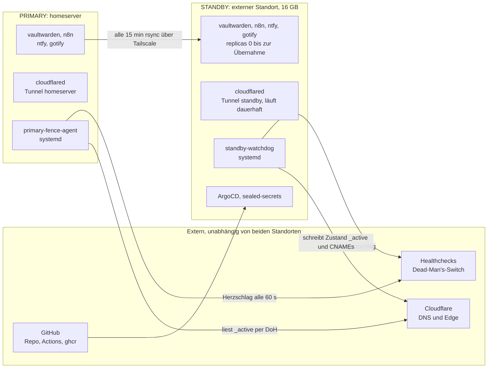
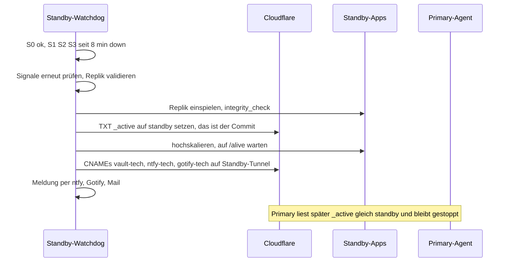

# Standby-Cluster (HA-Paar) — automatische Ausfallübernahme und Token-Management

Architektur- und Rollout-Plan für einen zweiten, **externen** k3s-Cluster (Standby),
der bei einem Ausfall des Hauptstandorts **automatisch** Vaultwarden, n8n, ntfy und
Gotify samt Cloudflare-Tunnel und Tailscale übernimmt — plus ein Token-Management, das
Ablaufdaten erfasst, überwacht und die Rotation anstößt. Der Standby-Cluster selbst
(Phasen 2–6) ist noch **nicht umgesetzt**. Das **Token-Management (Phase 1) ist seit
2026-09-27 umgesetzt** — Register, tägliche Ablaufüberwachung und CI-Check, unabhängig
vom Standby nutzbar; Ist-Zustand siehe [d0060](../d-sicherheit/d0060-secrets-rotation.md).
Dieses Doc hält weiterhin den mit dem Nutzer abgestimmten Gesamtplan fest (Stand
2026-09-26). Nach der Umsetzung des Standby-Clusters wandert dessen Ist-Zustand als
eigene Docs in die fachlichen Kategorien, dieses Doc bleibt als Kontext bestehen
(Konvention wie [40070](40070-authentik-sso-iac.md)).

Bezug: [40080](40080-multi-cluster-entw-prod-tech.md) (Cluster-Aufteilung, Sealed-Secrets
pro Cluster), [b0050](../b-kubernetes-gitops/b0050-entw-argocd.md) (eigenständige
ArgoCD-Instanz als Vorbild), [d0060](../d-sicherheit/d0060-secrets-rotation.md)
(bisherige Rotationsliste, wird durch das Token-Register erweitert).

---

## Festgelegte Rahmenbedingungen

| Thema | Entscheidung | Folge für den Plan |
|---|---|---|
| Standort | extern, eigenes Netz, **kein** LAN-Zugriff auf den Homeserver | Verbindungen zum Primary nur über Tailscale, Cloudflare und GitHub. Kein Subnet-Routing, keine gemeinsame VIP. |
| Hardware | 16 GB RAM | reicht für alles inklusive eigener ArgoCD-Instanz (siehe [Ressourcen](#ressourcen-16-gb)) |
| Cloudflare-Umschaltung | API-Token, DNS-Umschaltung (kein Load Balancer) | Token liegt auf dem Standby-Host und steht im [Token-Register](#token-management) |
| Datenabgleich | Cron alle 15 Minuten | RPO ≤ 15 Minuten plus Laufzeit des Jobs |
| n8n | nur Workflows **ohne** Abhängigkeit zu Primary-Diensten (z. B. Zammad) | Aktivierung per Whitelist, heute erfüllt 1 von 10 Workflows das Kriterium |
| Umfang | Vaultwarden, n8n, ntfy, Gotify, cloudflared, Tailscale | ntfy und Gotify kommen zur ursprünglichen Liste dazu und werden ebenfalls im Token-Register geführt |
| Umschaltung | **vollautomatisch**, ohne Zutun | erfordert Lease und Fencing, sonst droht Split-Brain (siehe [Erkennen und Umschalten](#erkennen-und-umschalten)) |

---

## Ausgangslage (Repo-Stand)

| Dienst | Heute (TECH) | Daten | Externer Host |
|---|---|---|---|
| Vaultwarden | [values.yaml](../../argocd/apps/tech/vaultwarden/values.yaml) | SQLite auf `local-path` (2 Gi). Nachtbackup 01:30 per [CronJob](../../argocd/apps/tech/vaultwarden/templates/backup-cronjob.yaml) auf eine NAS-PVC. | `vault-tech.pke-lab.de` |
| n8n | [values.yaml](../../argocd/apps/tech/n8n/values.yaml), Custom-Image | SQLite auf **NFS** (`nas`, 5 Gi). `N8N_ENCRYPTION_KEY` ist nicht gesetzt, der Schlüssel liegt zufällig generiert in `/home/node/.n8n/config`. Zwei NFS-Volumes für Xibo. | keiner (nur `n8n.prod.homeserver`) |
| ntfy | [values.yaml](../../argocd/apps/tech/ntfy/values.yaml) | SQLite (`cache.db`, `auth.db`) auf `local-path` (1 Gi). `upstream-base-url: https://ntfy.sh` für iOS-Push. | `ntfy-tech.pke-lab.de` |
| Gotify | [values.yaml](../../argocd/apps/tech/gotify/values.yaml) | SQLite auf `local-path` (1 Gi) | keiner (nur `gotify.tech.homeserver`, `gotify-api.tech.homeserver`) |
| cloudflared | [values.yaml](../../argocd/apps/tech/cloudflared/values.yaml), zwei Tunnel: `homeserver` (TECH), `homeserver-prod` (PROD). Wildcard `*.pke-lab.de` → Traefik. | Credentials als SealedSecret | — |
| Tailscale | Host-Ebene per [Ansible-Rolle](../../ansible/roles/tailscale/tasks/main.yml), Tags `tag:tech-node`, `tag:prod-node`, `tag:entw-node`. Split-DNS nur für `*.homeserver`. | Auth-Key als Ansible-Vault-Wert | — |

Weitere Randbedingungen, die den Plan prägen:

- **Die Alarmkette hängt komplett am Primary:** Alertmanager, gotify-/ntfy-Bridge,
  Uptime Kuma, Zammad. Fällt der Primary aus, schweigt alles. Der Standby braucht einen
  eigenen Alarmweg.
- **Interne Namen (`*.homeserver`) löst Pi-hole/dnsmasq auf dem Primary auf** und sind im
  Ausfall nicht verfügbar. Für eine Übernahme taugen nur Hostnamen unter `pke-lab.de`
  (Cloudflare).
- **SealedSecrets sind pro Cluster verschlüsselt** (aktuell 25 Dateien, 18 TECH und 7
  PROD). Der Standby braucht eigene Ciphertexte, Vorbild ist
  [reseal-for-prod.sh](../../scripts/reseal-for-prod.sh).
- **Zirkel im Root of Trust:** [50010](../5-incidents/50010-prod-vm-basis-image-ersetzt.md)
  legt die Sealed-Secrets-Schlüssel „in den Passwort-Manager“, also in Vaultwarden. Genau
  der Dienst, den man nach einem Ausfall wieder hochbringen will. Siehe
  [Root of Trust](#root-of-trust).
- **Beide dokumentierten Ausfälle** ([50000](../5-incidents/50000-nas-disk-red-homeserver-unreachable.md),
  [50010](../5-incidents/50010-prod-vm-basis-image-ersetzt.md)) betrafen den Homeserver als
  Single Point of Failure. Der externe Standort deckt zusätzlich Strom- und Internetausfall ab.

---

## Zielbild



Grundsätze:

1. **Active/Passive.** Pro Dienst gibt es genau einen aktiven Schreiber. SQLite erlaubt
   nur einen, und n8n-Schedule-Trigger dürfen nicht doppelt feuern.
2. **Der Standby ist autark.** Er hängt nur von GitHub (Repo, ghcr), Cloudflare, Tailscale
   und Healthchecks ab, nie vom Primary: eigenes ArgoCD, eigene Sealed-Secrets-Schlüssel,
   eigener Alarmweg, eigene DNS-Auflösung.
3. **Der Zustand ist ein DNS-Eintrag.** Der TXT-Record `_active.pke-lab.de` (`primary` oder
   `standby`) ist Lease und einzige Wahrheit. Jede Seite startet die zustandsbehafteten
   Dienste nur, wenn dort ihr eigener Name steht.
4. **Fencing vor Übernahme.** Der Primary stoppt sich selbst, wenn er die Lease nicht
   bestätigen kann. Der Standby wartet länger, als der Primary zum Stoppen braucht.
5. **Chart-Parität.** Der Standby nutzt dieselben Charts wie TECH (ArgoCD Multi-Source)
   und ergänzt nur ein Overlay, siehe [Aktuell halten](#aktuell-halten).
6. **Cloudflare und Tailscale laufen auf dem Standby dauerhaft.** Das beweist täglich, dass
   Tunnel-Credentials, Tailnet-Zugang und API-Token gültig sind. Nur Vaultwarden, n8n,
   ntfy und Gotify stehen auf `replicas: 0`.

### Ressourcen (16 GB)

| Komponente | RAM |
|---|---|
| k3s + Betriebssystem | ca. 1,5 GB (Schätzwert) |
| ArgoCD (eigene Instanz) | ca. 1 GB (Schätzwert) |
| sealed-secrets, cloudflared | < 0,2 GB |
| Vaultwarden (Limit 256 Mi), ntfy (128 Mi), Gotify (128 Mi) | ca. 0,5 GB nach der Übernahme |
| n8n (Limit 2 Gi laut values.yaml) | 0,3 bis 2 GB, nur nach der Übernahme und im nächtlichen Restore-Verify |
| Restore-Verify (Wegwerf-Pods) | bis ca. 2,5 GB kurzzeitig |

Normalbetrieb ca. 3 GB, Spitze nach der Übernahme ca. 6 GB, der Rest ist Reserve. Für
die Replik-Generationen (4 × 15 Minuten plus 7 Tagesstände je App) genügen bei den
heutigen PVC-Größen (höchstens 5 Gi) 100 GB SSD. Die tatsächlichen DB-Größen vor der
Umsetzung messen.

---

## Datenabgleich (alle 15 Minuten)

Grundlage ist das vorhandene Muster aus dem
[Vaultwarden-Backup-CronJob](../../argocd/apps/tech/vaultwarden/templates/backup-cronjob.yaml):
konsistente Kopie per `sqlite3 .backup`, Restdateien per `rsync`.

1. Pro App läuft ein CronJob (`*/15`) im aktiven Cluster: `sqlite3 -readonly … .backup`
   nach `*.new`, Restdateien spiegeln (Vaultwarden: `rsa_key.pem`, Attachments, Sends).
2. `rsync` über SSH zum jeweils anderen Standort, Ziel `/srv/replica/<app>/`. Die
   Verbindung läuft über Tailscale, der Schlüssel darf nur schreiben (`rrsync -wo` mit
   Forced Command), Host-Key ist gepinnt.
3. Beim Ziel wird **atomar** umbenannt und ein `replica.json` geschrieben: Zeitstempel,
   SHA-256, Größe, Zeilenzahl der Nutzertabelle. Es bleiben 4 Generationen à 15 Minuten
   und 7 Tagesstände erhalten.
4. **Der Job läuft nur beim aktiven Standort** (Gate auf `_active`, siehe unten). Ist der
   Standby aktiv, dreht sich die Richtung um. So hat der Primary beim Failback eine frische
   Kopie.
5. Der bestehende Nachtbackup auf die NAS-PVC und die restic-Kette
   ([20010](../2-betrieb-hardware/20010-nas-backup.md)) bleiben unverändert als dritte
   Linie.

| Größe | Wert |
|---|---|
| RPO | ≤ 15 Minuten plus Laufzeit des Jobs |
| Alarm „Replik veraltet“ | älter als 30 Minuten, gemessen am Zeitstempel in `replica.json` |
| Übernahme mit alter Replik | wird trotzdem durchgeführt (besser alter Stand als keiner), mit Warnung |

**Bekannte Grenze zu Vaultwarden:** Einträge, die in den letzten bis zu 15 Minuten vor dem
Ausfall gespeichert wurden, können nach der Übernahme fehlen. Die Bitwarden-Clients
übernehmen beim nächsten Sync den Serverstand. Falls das nicht tragbar ist, lässt sich der
Takt auf 5 Minuten verkürzen (die Last ist gering, die DB klein).

**Vorarbeiten je App:**

- **n8n:** `N8N_ENCRYPTION_KEY` explizit setzen. Den Wert vorher aus
  `/home/node/.n8n/config` übernehmen, sonst startet n8n mit „Mismatching encryption keys“
  nicht. Als SealedSecret für beide Cluster ablegen. Außerdem die PVC von `nas` auf
  `local-path` umziehen: SQLite auf NFS ist fragil, und ein `.backup` aus einem zweiten Pod
  ist dort nicht garantiert konsistent. Vorgehen wie in
  [migrations/README.md](../../argocd/bootstrap-prod/migrations/README.md).
- **Standby-Overlay für n8n:** `xibosignage.enabled: false`, denn die NFS-Volumes sind vom
  externen Standort aus nicht erreichbar.
- **NetworkPolicy:** Egress `100.64.0.0/10` auf Port 22 für die Replikations-Jobs. Falls
  Pod-Egress ins Tailnet in der Praxis nicht sauber läuft, bekommt der Push-Job
  `hostNetwork: true` (in Phase 3 prüfen).

---

## Erkennen und Umschalten

### Zustand und Lease

`_active.pke-lab.de` (TXT, TTL 60 s) enthält `primary` oder `standby`. Gelesen wird es
öffentlich per DNS-over-HTTPS (zwei unabhängige Resolver), **geschrieben nur vom
Standby-Watchdog** mit dem Cloudflare-Token. Startwert ist `primary`.

Zusätzlich bekommen Vaultwarden, n8n, ntfy und Gotify einen `initContainer` als Gate: Der Pod
startet nur, wenn `_active` dem eigenen Standort entspricht (Chart-Wert `activeGate`,
Primary `primary`, Standby `standby`). Das verhindert auch bei einem Neuaufbau des
Primary aus Git oder einem versehentlichen Hochskalieren ein zweites aktives System.

### Signale des Standby

| # | Signal | „down“, wenn … |
|---|---|---|
| S0 | Selbsttest des Standby | Cloudflare-API (`tokens/verify`), Tailscale `Running` oder die Healthchecks-API nicht erreichbar sind. Dann gibt es **kein Urteil**. |
| S1 | Tailnet-Pfad | `GET https://<primary-tailnet>/alive` mit Host-Header `vault.tech.homeserver` scheitert (Node oder App weg) |
| S2 | Öffentlicher Pfad | `https://vault-tech.pke-lab.de/alive` liefert nicht 200. Das ist der Weg der Nutzer: Tunnel, Cloudflare, Traefik, App. Nur gültig solange `_active=primary`. |
| S3 | Herzschlag des Primary | letzter Ping bei Healthchecks älter als 300 s. Der Primary pingt nur, wenn Vaultwarden `/alive` liefert **und** `_active=primary` bestätigt ist. |

**Übernahme-Regel:** S0 in Ordnung **und** S1, S2 und S3 gleichzeitig „down“ für
zusammenhängend mindestens 8 Minuten. Bewusst „alle drei“ statt „zwei von drei“: Eine zu
späte Übernahme kostet Minuten, eine falsche kostet Daten (Split-Brain).

### Parameter

| Parameter | Wert | Sitzt in |
|---|---|---|
| Prüfintervall | 30 s | beide Agenten |
| `fence_after_seconds` (Primary kann Lease nicht bestätigen) | 180 s | Primary |
| `promote_after_seconds` (Signale zusammenhängend „down“) | 480 s | Standby |
| Herzschlag-Intervall | 60 s | Primary |
| Sperre nach einer Übernahme (kein erneutes Umschalten, kein automatischer Failback) | 24 h | Standby |
| Replik-Generationen | 4 × 15 min, 7 × täglich | beide |

Sicherheitsabstand: 480 s liegen deutlich über 180 s Selbst-Fencing plus DNS-Cache (60 s)
plus Schleifenintervall. Erwartete Übernahmezeit (RTO): ca. 10 bis 12 Minuten.

### Primary-Fence-Agent (systemd auf dem homeserver)

Neue Ansible-Rolle nach dem Muster der vorhandenen Watchdogs, z. B.
[resource_watchdog](../../ansible/roles/resource_watchdog/). Alle 30 s:

1. Lokale Gesundheit prüfen (Vaultwarden `/alive`) und `_active` per DoH lesen.
2. Ist beides in Ordnung, Herzschlag an Healthchecks senden.
3. **Vaultwarden (harter Schutz):** Kann `_active=primary` 180 s lang nicht bestätigt werden
   (isoliert, kein Internet, DoH nicht erreichbar), `kubectl scale` auf 0. Das ist die
   Lease-Regel. Sobald `primary` wieder bestätigt ist und der Standby nicht übernommen hat,
   startet er automatisch wieder.
4. **Alle vier Dienste:** Liest der Agent **positiv** `_active=standby`, werden Vaultwarden,
   n8n, ntfy und Gotify auf 0 gestellt und bleiben es (Fencing nach erfolgter Übernahme).
5. n8n, ntfy und Gotify stoppen bei bloßer Isolation **nicht**. Dort ist Divergenz wenig
   kritisch, und ein Internetausfall soll die rein internen Workflows nicht anhalten. Im
   Isolationsfall können Workflows mit Standby-Freigabe kurzzeitig doppelt feuern.
6. ArgoCD bekommt für diese vier Deployments ein `ignoreDifferences` auf `/spec/replicas`
   (Muster wie bei `ollama` im
   [ApplicationSet-Template](../../ansible/roles/argocd/templates/bootstrap-applicationset.yaml.j2),
   danach `make render-bootstrap`). Sonst setzt `selfHeal` das Fencing zurück.

### Standby-Watchdog (systemd auf dem Standby-Host)

Der Watchdog läuft bewusst auf dem Host und nicht als Pod, damit er von der k8s-Gesundheit
unabhängig ist. Er wertet die Signale aus, führt die Übernahme durch und meldet über den
eigenen Alarmweg: ntfy und Gotify auf dem Standby, dazu SMTP (netcup) und Healthchecks als
unabhängige Ebenen. Er pingt außerdem selbst einen eigenen Healthchecks-Check, damit ein
stiller Ausfall des Standby auffällt (sonst gäbe es HA nur auf dem Papier).

### Übernahme-Ablauf



1. **Vorprüfung:** Signale unmittelbar vor dem Schritt erneut auswerten. Ein einziges
   „up“ verwirft die Übernahme.
2. **Replik einspielen:** neueste gültige Generation in die Standby-PVCs, `PRAGMA
   integrity_check`, bei Fehler die nächstältere Generation.
3. **Commit:** `_active=standby`. Ab hier verweigern beim Primary Gate und Agent den Start.
4. **n8n:** vor dem Start läuft ein Job, der per n8n-CLI alle Workflows deaktiviert und nur
   die mit Tag `standby-ok` aktiviert (Befehlsname je nach n8n-Version prüfen).
5. **Dienste starten** und auf `/alive` warten.
6. **DNS-Umschaltung:** für `vault-tech`, `ntfy-tech` und `gotify-tech` werden explizite
   CNAME-Records auf `<standby-tunnel-id>.cfargotunnel.com` (proxied) angelegt. Sie
   übersteuern den Wildcard-Record. Proxied Records wirken in Sekunden, es gibt keinen
   DNS-Cache bei den Clients.
7. **Meldung** über alle Kanäle, Sperre von 24 h setzt ein.

Die Schritte sind idempotent und wiederholbar. Bricht der Watchdog mittendrin ab, setzt er
beim nächsten Lauf anhand von `_active` und dem Gesundheitszustand fort.

### Failback

Der Failback ist bewusst **nicht** Teil des automatischen Schwenks: Er braucht einen
Datenfluss vom Standby zum Primary und eine kurze Unterbrechung. Standard ist ein
Kommando `standby-ctl failback` (nach Bestätigung, in einem ruhigen Zeitfenster):

1. Voraussetzung: Primary seit ≥ 30 Minuten gesund (S1 und S3), Sperre abgelaufen.
2. Standby-Dienste auf 0, letzte Replik zum Primary schieben.
3. Primary spielt ein, `_active=primary`, Primary startet.
4. Die Standby-CNAMEs werden gelöscht, der Wildcard-Record zeigt wieder auf den Primary.
5. Standby kehrt in die Replik-Rolle zurück.

Ein automatischer Failback mit Stabilitätskriterium (z. B. Primary ≥ 6 h gesund, Umschaltung
um 03:00 Uhr) ist als [Phase 6](#phasen-und-abnahme) vorgesehen.

---

## Erreichbarkeit auf dem Standby

| Dienst | Host beim Primary | Beim Standby |
|---|---|---|
| Vaultwarden | `vault-tech.pke-lab.de` | DNS-Umschaltung, identische `DOMAIN` (WebAuthn-Origin), Clients merken nichts |
| ntfy | `ntfy-tech.pke-lab.de` | DNS-Umschaltung, identische `base-url`, damit der iOS-Push über `ntfy.sh` weiter passt |
| Gotify | nur intern | **neuer externer Host `gotify-tech.pke-lab.de`**, sonst kein nahtloser Wechsel möglich (`*.tech.homeserver` löst nur der Primary-Pi-hole auf). Gotify hat eine eigene Anmeldung, die Cloudflare-Access-Option aus [e0000](../e-externe-erreichbarkeit/e0000-cloudflare-tunnel.md) bleibt möglich. |
| n8n | nur intern | kein externer Host nötig. Im Ausfall per Tailscale erreichbar (NodePort auf dem Standby, nur für Admin-Geräte per ACL). |

Der Tunnel `standby` bekommt nur diese Hostnamen als Ingress-Regeln, alles andere liefert
404. Als Ziel dient `http://traefik.kube-system.svc.cluster.local:80` (kein ForwardAuth-Layer
davor, deshalb kein TLS-Hop nötig).

**Tailscale auf dem Standby:** Tag `tag:standby-node`, `--accept-dns=false` (die Rolle
setzt bisher fest `--accept-dns=true`, dafür kommt eine Variable
`tailscale_accept_dns`), keine Subnet-Routen. Der Standby löst über eigene Resolver auf.
Grants in der ACL (Format wie in [40080](40080-multi-cluster-entw-prod-tech.md)):

```json
{ "src": ["tag:standby-node"], "dst": ["tag:tech-node"], "ip": ["tcp:22", "tcp:443"] },
{ "src": ["tag:tech-node"],    "dst": ["tag:standby-node"], "ip": ["tcp:22"] },
{ "src": ["autogroup:admin"],  "dst": ["tag:standby-node"], "ip": ["*"] }
```

`tagOwners` bekommt `tag:standby-node`. Die Familien-/Vereinsgeräte (`autogroup:member`)
erhalten **keinen** Zugriff auf den Standby, denn dort erreicht sie nichts, was sie nicht
ohnehin über Cloudflare bekommen.

---

## n8n auf dem Standby

Regel: Ein Workflow bekommt den n8n-Tag `standby-ok`, wenn er **keinen** Dienst braucht, der
nur im Primary existiert (Zammad, VictoriaMetrics, Ollama, Kubernetes-API des Primary,
NFS-Ordner, SSH auf den homeserver, `*.svc.cluster.local`, `*.homeserver`). Nur diese
Workflows werden bei der Übernahme aktiviert.

Bewertung des Repo-Stands (`argocd/apps/tech/n8n/workflows/`, live in der n8n-DB gegenprüfen):

| Workflow | Abhängigkeit | Standby |
|---|---|---|
| PaperlessWorkflow | nur externes IMAP-Postfach | **ja** |
| alamos-einsatz-to-zammad | Zammad | nein |
| banana-pi-down-to-zammad | VictoriaMetrics, Zammad | nein |
| nightly-worker-update-to-zammad | Zammad | nein |
| nightly-worker-wake-trigger | SSH auf den homeserver | nein |
| xibosignage-inbox-to-display, xibosignage-playlist-sync | Xibo-CMS (PROD), NFS | nein |
| yearly-secrets-rotation-reminder | Zammad (wird durch `token-watch` ersetzt) | nein |
| zammad-externer-ki-lauf-taeglich, zammad-tickets-verarbeiten | Zammad, Ollama, Kubernetes-API, carplay-api | nein |

**Ehrliche Einordnung:** Auf dem Standby läuft heute nur 1 von 10 Workflows. Der Nutzen von
n8n dort liegt vor allem darin, dass Workflows, Credentials und Verschlüsselungsschlüssel
gesichert und startbereit sind und künftige, eigenständige Workflows sofort mit übernommen
werden. Ein CI-Check über die im Repo abgelegten Workflow-Exporte lehnt einen Tag `standby-ok`
ab, sobald der Workflow einen der oben genannten Marker enthält.

---

## Aktuell halten

- **Version (Chart-Parität):** Auf dem Standby läuft ein ArgoCD, das `main` folgt. Jede App
  ist ein **Overlay** unter `argocd/apps/standby/<app>/values.yaml`, das per Multi-Source
  das Chart aus `argocd/apps/tech/<app>` zieht (`ref: values`). Das Overlay enthält nur
  Standort-Unterschiede: `replicaCount`, Storage, `activeGate`, die Ciphertexte der
  Standby-SealedSecrets, beim cloudflared Tunnel-ID und Ingress-Regeln. **Kein** Image-Tag.
  Damit driftet nichts, anders als bei einer Ordnerkopie wie in PROD. Renovate braucht dafür
  keine Änderung, denn es bumpt nur die Charts unter `tech/`.
- **Warum das bei Vaultwarden zählt:** Vaultwarden unterstützt keine Downgrades. Ein
  Standby-Image, das älter ist als das des Primary, kann eine bereits migrierte DB nicht
  mehr öffnen. Gleicher Commit auf beiden Seiten schließt das aus. Zusätzlich gibt es einen
  Alarm bei abweichender Version und die ArgoCD-Alarme aus
  [20050](../2-betrieb-hardware/20050-gitops-und-backup-alerts.md) auch für den Standby.
- **Restore-Verify (nachts, auf dem Standby):** Die neueste Replik wird in ein
  Wegwerf-Volume gespielt, das **auf dem Standby ausgerollte Image** läuft dagegen, geprüft
  werden `PRAGMA integrity_check`, `/alive` und eine Nutzerzahl, die nicht unter dem Vortag
  liegt. Ergebnis ist ein Healthchecks-Ping, bei Ausbleiben gibt es Alarm. Das fängt genau
  die bekannte Fehlerklasse „erfolgreicher Lauf mit leerem Dump“
  ([20050](../2-betrieb-hardware/20050-gitops-und-backup-alerts.md), Abschnitt „Grenze“) und
  prüft nebenbei, ob die neue Version zu den echten Daten passt.
- **Secrets:** Jeder SealedSecret existiert zweimal (Primary- und Standby-Schlüssel). Das
  Skript `scripts/reseal-for-standby.sh` (nach dem Vorbild von
  [reseal-for-prod.sh](../../scripts/reseal-for-prod.sh)) schreibt die Standby-Ciphertexte
  in das Overlay. Der wahrscheinlichste Grund für eine gescheiterte Übernahme wäre ein nur
  auf dem Primary rotiertes Token. Dagegen helfen das Register und die dauerhaft laufenden
  Standby-Komponenten (cloudflared, Tailscale), die ihre Credentials täglich beweisen.
- **Grenze:** Ein fehlerhaftes Update trifft beide Seiten gleichzeitig. Ein
  Standby-Image bietet gegen Softwarefehler keinen Schutz. Als spätere Ausbaustufe kann der
  Standby als eigene Stufe **vor** TECH in die Promotionskette
  ([f00b0](../f-cicd-automatisierung/f00b0-promotion-chain.md)) wandern, weil der
  Restore-Verify dort neue Versionen gegen echte Daten prüft.

---

## Token-Management

Ziel: jederzeit wissen, **welches Token wann abläuft**, rechtzeitig gewarnt werden und die
Rotation ohne Ausfall durchführen. Anlass war unter anderem der stille Ablauf des
Tailscale-Logins auf worker-0 ([20030](../2-betrieb-hardware/20030-nightly-worker-update.md)).

### Register

Eine Datei `ops/token-register.yaml` im Repo, **ohne Werte**. Ein Eintrag je Token:

```yaml
- id: cloudflare-dns-failover
  service: cloudflare
  kind: api-token            # api-token | auth-key | password | encryption-key | ssh-key | tunnel-credential | certificate
  stored_in:
    - ansible/host_vars/standby/vault.yml   # Ansible-Vault, nur Standby-Host
  issued: 2026-10-01
  expires: 2027-03-30        # oder null plus max_age_days
  max_age_days: 180
  rotation:
    mode: scripted           # auto | scripted | manual
    runbook: docs/d-sicherheit/d0060-secrets-rotation.md
    overlap: true
  owner: peter
  blast_radius: "DNS-Umschaltung, TXT _active, CNAMEs in pke-lab.de"
```

Ein CI-Check `scripts/check-token-register.py` (läuft im vorhandenen
[`ci.yml`](../f-cicd-automatisierung/f0070-ci-lint.md)) prüft Pflichtfelder und Datumsformat.
Er verlangt außerdem, dass **jede** `SealedSecret`-Datei im Repo im Register auftaucht, damit
kein Token vergessen wird.

### Ablaufüberwachung (`token-watch`)

Ein täglicher GitHub-Actions-Workflow `token-watch.yml`. Er läuft auf GitHub und damit
unabhängig von beiden Clustern, also auch dann, wenn der Primary ausgefallen ist.

- **Live-Abfrage, wo die API es hergibt** (Quelle der Wahrheit ist der Anbieter): Tailscale
  (Auth-Keys, Geräteablauf), Cloudflare (`tokens/verify` mit `expires_on`), GitHub-PATs
  (Ablauf-Header der API). Sonst gilt das Datum aus dem Register. Die genauen Endpunkte vor
  der Umsetzung gegen die aktuelle API-Dokumentation prüfen.
- **Schwellen** 60, 30, 14, 7 und 1 Tag: GitHub-Issue mit Label `token-expiry`, bei jeder
  Stufe kommentiert, schließt sich nach der Rotation. Benachrichtigung über GitHub
  (Mail/Push), also ohne Abhängigkeit vom eigenen Alarmsystem. Der Workflow-Lauf wird rot,
  sobald ein Token unter 7 Tagen liegt.
- **Nur auf dem Standby liegende Token** (Cloudflare-DNS-Token) prüft der Watchdog selbst:
  `tokens/verify` im Selbsttest S0, Warnung ab 30 Tagen über ntfy, Gotify und Mail.
- Das jährliche n8n-Ticket
  ([yearly-secrets-rotation-reminder](../../argocd/apps/tech/n8n/workflows/yearly-secrets-rotation-reminder.json))
  bleibt als grobe Rückfallebene und verweist dann auf das Register.

### Rotation

Vier Regeln:

1. **Lebensdauer abschaffen, wo möglich.** Tailscale: statt langlebiger Auth-Keys ein
   OAuth-Client mit Tag, der beim Beitritt kurzlebige Keys erzeugt; getaggte Server haben
   keinen Node-Key-Ablauf (mit `tailscale status --json` und im Admin-Panel prüfen).
   GitHub: langfristig App-Tokens (1 Stunde) statt PATs.
2. **Überlappung:** neu anlegen, beide gültig lassen, Verbraucher umstellen, prüfen, das
   alte widerrufen.
3. **Ein PR pro Rotation**, der beide Cluster und das Registerdatum gemeinsam ändert.
4. **Danach Nachweis:** die dauerhaft laufenden Standby-Komponenten und der nächtliche
   Restore-Verify zeigen, dass alles noch funktioniert.

### Inventar

| Token | Ablage | Ablauf | Strategie |
|---|---|---|---|
| Cloudflare-API-Token `dns-failover` | Standby-Host (Ansible-Vault) | frei wählbar, **180 Tage setzen** | nur `Zone:DNS:Edit` auf `pke-lab.de`, optional IP-Filter auf den Standby. Rotation über „Roll“ im Dashboard oder per API, dann `make standby`. |
| Cloudflare-Tunnel-Credentials (3×: `homeserver`, `homeserver-prod`, `standby`) | SealedSecret je Cluster | keiner | jährlich oder bei Verdacht nach [e0010](../e-externe-erreichbarkeit/e0010-cloudflare-deploy.md#credentials-rotieren). Beim `standby`-Tunnel wird der neue Tunnel parallel aufgebaut. |
| Tailscale-Auth-Key / OAuth-Client (Ansible, GitHub `TAILSCALE_AUTHKEY`) | Ansible-Vault, GitHub-Secret | Auth-Key max. 90 Tage | auf OAuth-Client mit Tags umstellen, Kurzzeit-Key nur beim Beitritt |
| Tailscale-Node-Keys | im Tailnet | 180 Tage bei Nutzergeräten, getaggt: aus | alle Server getaggt und Expiry deaktiviert, wird von `token-watch` geprüft |
| Healthchecks: Ping-URL, read-only API-Key | Primary-Agent, Standby-Watchdog | keiner | jährlich neu erzeugen. Ping-URL gilt als Secret, denn wer sie kennt, kann Herzschläge fälschen. |
| Replikations-SSH-Schlüssel (2 Richtungen) | SealedSecret bzw. Host | keiner | jährlich, mit `rrsync`-Beschränkung und Host-Key-Pinning |
| ntfy-Zugriffstoken, Publisher-Konten | in der `auth.db` (repliziert) | ntfy-Token unterstützen ein Ablaufdatum (`--expires`) | bei Aktivierung der Authentifizierung ([10010](../1-benachrichtigungen/10010-ntfy.md)) Token mit Ablauf anlegen und ins Register eintragen. Heute steht `auth-default-access: read-write`. |
| Gotify: Admin-Passwort, App-Token (z. B. `gotify-bridge-token`), Client-Token | SealedSecret, `gotify.db` (repliziert) | keiner | jährlich, Vorgehen in [10000](../1-benachrichtigungen/10000-gotify.md). Die Token stehen in der replizierten DB und bleiben nach der Übernahme gültig. |
| Vaultwarden `ADMIN_TOKEN`, SMTP-Passwort | SealedSecret je Cluster | keiner | jährlich nach [300a0](../3-apps-workloads/300a0-vaultwarden.md), `max_age_days: 365` |
| `N8N_ENCRYPTION_KEY` | SealedSecret je Cluster | keiner | **nicht rotieren** (analog restic-Passwort: eine Rotation verschlüsselt alle Credentials neu). Einmal setzen, identisch auf beiden Seiten, Kopie im Notfallkit. |
| n8n-interne Credentials (Zammad, carplay-api, IMAP …) | n8n-DB (repliziert) | je Anbieter | im Register als `n8n-credential:<name>`, Rotation in der n8n-UI |
| ArgoCD-CI-Token (Hub, ENTW, Standby) | GitHub-Secret | 365 Tage (Skript-TTL) | jährlich per [create-argocd-ci-token.sh](../../scripts/create-argocd-ci-token.sh), die alten laufen aus |
| GitHub-PATs (github-release-watcher, wiki-docs-sync) | SealedSecret | ca. 1 Jahr | Ablauf per API-Header, Erzeugung wie in [seal-github-token.sh](../../scripts/seal-github-token.sh) |
| Sealed-Secrets-Schlüssel (TECH, PROD, ENTW, Standby) | im Cluster | Controller rotiert alle 30 Tage | **Backup jedes Clusters außerhalb des Clusters**, siehe unten |
| SMTP-Zugang des Watchdogs (netcup) | Standby-Host (Ansible-Vault) | keiner | eigenes Postfach-Passwort, nicht dasselbe wie bei Vaultwarden |

### Root of Trust

Alles, was den Standby wieder hochbringt, darf **nicht nur in Vaultwarden** liegen. Sonst
liegt der Schlüssel im ausgefallenen Dienst selbst. Notfallkit auf Papier oder in einem
zweiten Passwort-Manager, getrennt vom Homeserver:

1. Ansible-Vault-Passwort (schließt alle `!vault`-Werte im Repo auf).
2. Sealed-Secrets-Schlüssel aller Cluster (`kubectl -n sealed-secrets get secret -l
   sealedsecrets.bitnami.com/sealed-secrets-key -o yaml`).
3. `N8N_ENCRYPTION_KEY` und die Vaultwarden-Notfallkits der Konten.
4. Notfallcodes für Tailscale-, Cloudflare-, GitHub- und Healthchecks-Anmeldung.

Die Aussage in [d0060](../d-sicherheit/d0060-secrets-rotation.md) und
[50010](../5-incidents/50010-prod-vm-basis-image-ersetzt.md), die Schlüssel gehörten in den
Passwort-Manager, wird bei der Umsetzung entsprechend korrigiert.

---

## Änderungen im Repo

| Bereich | Änderung |
|---|---|
| `ansible/` | Inventargruppe `standby` (Host `standby-node`, `ansible_host` = Tailscale-IP), Playbook `standby.yml` nach dem Muster von [entw.yml](../../ansible/entw.yml) mit den Rollen `common`, `k3s`, `tailscale`, `argocd`, dazu neue Rollen `standby_watchdog` (Standby) und `primary_fence_agent` (homeserver). Makefile-Ziele `standby` und `standby-check`. Variable `tailscale_accept_dns`. |
| Ansible-Ausführung | vom Arbeitsplatz aus über Tailscale, **nicht** über Semaphore. Semaphore liegt im Primary und fiele mit ihm aus. |
| `argocd/` | Layout-Schalter `argocd_standby_layout` in der argocd-Rolle. Ordner `argocd/apps/standby/{vaultwarden,n8n,ntfy,gotify,cloudflared}/values.yaml` als Overlays. `ignoreDifferences` auf `/spec/replicas` für die vier Deployments im TECH-ApplicationSet. |
| Charts unter `tech/` | Wert `replication` (CronJob-Push, Gate auf `_active`), Wert `activeGate` (initContainer), NetworkPolicy für den Push-Egress, neuer externer Host für Gotify, n8n: `N8N_ENCRYPTION_KEY` aus SealedSecret. |
| Skripte | `scripts/reseal-for-standby.sh`, `scripts/check-token-register.py`, `standby-ctl` (Failback, Status, Dry-Run). |
| GitHub | `.github/workflows/token-watch.yml`, `ops/token-register.yaml`, Anpassung des CI-Checks. |
| Cloudflare / Tailscale | Tunnel `standby`, TXT `_active.pke-lab.de`, API-Token, ACL-Grants und `tag:standby-node`. |
| Doku | nach Umsetzung: Ist-Zustand-Docs, [d0060](../d-sicherheit/d0060-secrets-rotation.md) auf das Register umstellen, [c0010](../c-netzwerk-dns/c0010-tailscale.md) und [e0000](../e-externe-erreichbarkeit/e0000-cloudflare-tunnel.md) ergänzen. |

---

## Phasen und Abnahme

| Phase | Inhalt | Abnahme |
|---|---|---|
| 1 | **Token-Register und `token-watch`** (unabhängig vom Standby, sofort nützlich) — **umgesetzt seit 2026-09-27**. Tailscale auf OAuth-Client umstellen, Tag-/Expiry-Prüfung — **offen**, siehe [Offene Punkte](#offene-punkte). | Alle 25 SealedSecrets stehen im Register ✅, ein künstlich nahes Ablaufdatum erzeugt ein Issue (manuell zu testen: `expires` eines Eintrags auf ein nahes Datum setzen, `token-watch.yml` per `workflow_dispatch` starten) |
| 2 | **Vorarbeiten n8n:** `N8N_ENCRYPTION_KEY` setzen, PVC auf `local-path`. Notfallkit anlegen. | n8n startet mit gesetztem Schlüssel und allen Credentials, Kopie des Schlüssels im Notfallkit |
| 3 | **Standby aufbauen:** Host mit Tailscale, k3s, eigenem ArgoCD, sealed-secrets, Tunnel `standby`, Overlays, ACL. Replikations-Jobs, Restore-Verify, Alarme. | Tunnel und Tailnet dauerhaft verbunden, Replik ≤ 15 Minuten alt, nächtlicher Restore-Verify grün |
| 4 | **Alarmweg und Agenten im Beobachtungsmodus:** Watchdog und Fence-Agent laufen mit `--dry-run` („würde übernehmen“), ntfy, Gotify, Mail, Healthchecks eingerichtet. | 14 Tage ohne falsche „würde übernehmen“-Meldung, Standby-Heartbeat und Primary-Herzschlag stabil |
| 5 | **Scharfschalten und Game-Day:** siehe Testmatrix unten. | alle Zeilen der Matrix bestanden |
| 6 | Optional: automatischer Failback mit Stabilitätskriterium, Standby als Stufe vor TECH in der Promotionskette, Replikationstakt auf 5 Minuten. | nach Bedarf |

### Testmatrix (Game-Day)

| Szenario | Erwartetes Verhalten |
|---|---|
| Vaultwarden-Pod auf dem Primary beenden | Kubernetes startet ihn neu, **keine** Übernahme (S1/S2 wieder grün vor 8 Minuten) |
| Primary-Tunnel trennen (nur S2 down) | keine Übernahme, Alarm |
| Standby verliert Internet | **keine** Übernahme (S0 schlägt fehl), Alarm über Healthchecks |
| Primary verliert Internet, läuft weiter | nach 3 Minuten stoppt Vaultwarden dort selbst, nach 8 Minuten übernimmt der Standby, nach Rückkehr bleibt der Primary gestoppt |
| Homeserver ausschalten | Übernahme nach ca. 8 Minuten, RTO ≤ 12 Minuten, Vaultwarden-Login über `vault-tech.pke-lab.de` möglich, Daten ≤ 15 Minuten alt |
| Primary kommt nach Übernahme zurück | bleibt gestoppt (Gate), Standby bleibt aktiv, Failback nur über `standby-ctl` |
| Kaputte oder fehlende neueste Replik | Rückfall auf die nächstältere Generation, Warnung |
| Cloudflare-Token abgelaufen (simuliert) | Selbsttest S0 schlägt an, Warnung schon Wochen vorher, **keine** Übernahme mit ungültigem Token |
| Failback | Dienste wieder auf dem Primary, CNAMEs entfernt, Replikationsrichtung zurück |

---

## Risiken und bewusste Grenzen

- **RPO 15 Minuten:** letzte Änderungen können fehlen (siehe
  [Datenabgleich](#datenabgleich-alle-15-minuten)).
- **Externe Abhängigkeiten:** Cloudflare (DNS und Tunnel), Tailscale, GitHub und Healthchecks.
  Fällt Cloudflare aus, ist auch die Umschaltung unmöglich. Das lässt sich mit diesem
  Aufbau nicht vermeiden.
- **Split-Brain-Restrisiko:** Das Fencing verlässt sich darauf, dass der Fence-Agent läuft.
  Ist der Primary-Host eingefroren, schreibt Vaultwarden dort ohnehin nicht. Ein gestörter
  Agent bei laufendem Vaultwarden und gleichzeitig ausgefallenem Internet wäre der
  einzige kritische Fall, er wird über den Herzschlag sichtbar.
- **Softwarefehler** treffen beide Seiten gleichzeitig (siehe
  [Aktuell halten](#aktuell-halten)).
- **Neues Wartungsobjekt:** Der Standby-Host braucht Updates und Überwachung (`common`-Rolle,
  automatische Updates). Ein stiller Ausfall wird über den eigenen Healthchecks-Check
  gemeldet.
- **Internetausfall am Primary:** Vaultwarden dort stoppt nach 3 Minuten (Lease), auch wenn
  der Standby aktiv wird. Bitwarden-Clients lesen offline aus ihrem lokalen Cache weiter.
- **n8n-Nutzen klein:** 1 von 10 Workflows, siehe [n8n auf dem Standby](#n8n-auf-dem-standby).
- **Gotify öffentlich:** Der neue externe Host vergrößert die Angriffsfläche geringfügig.

---

## Offene Punkte

1. **Gotify extern:** Bestätigung, dass `gotify-tech.pke-lab.de` angelegt werden darf (Alternative:
   Gotify nur über Tailscale-IP des Standby erreichbar, dann ohne nahtlose Übernahme).
2. **Failback:** manuell per `standby-ctl` (Standard) oder in Phase 6 automatisch.
3. **Herzschlag-Dienst:** Healthchecks.io (gehostet) ist der Vorschlag. Ersetzbar durch
   jeden externen Dead-Man's-Switch mit lesbarer API.
4. **Standby-Hardware:** Mini-PC oder VPS, dazu Betriebssystem (Ubuntu Server wie bei den
   anderen Hosts) und öffentliche Erreichbarkeit nur ausgehend (keine offenen Ports).
5. **Replikationstakt:** bei Bedarf von 15 auf 5 Minuten verkürzen.
6. **Tailscale-OAuth-Client fürs Hostjoin:** Umstellung von `tailscale_auth_key` auf einen
   getaggten OAuth-Client (Rotation-Regel 1) braucht zuerst einen echten OAuth-Client im
   Tailscale-Adminpanel (Scope `devices:core:write`, Tag `tag:tech-node` o. ä.) — eine
   Live-Aktion am echten Tailnet, die der Nutzer selbst anlegt. Bis dahin bleibt
   `tailscale_auth_key` in Betrieb und wird über das Register (`tailscale-auth-key`) mit
   Live-Check am Knoten `worker-0` beobachtet.
