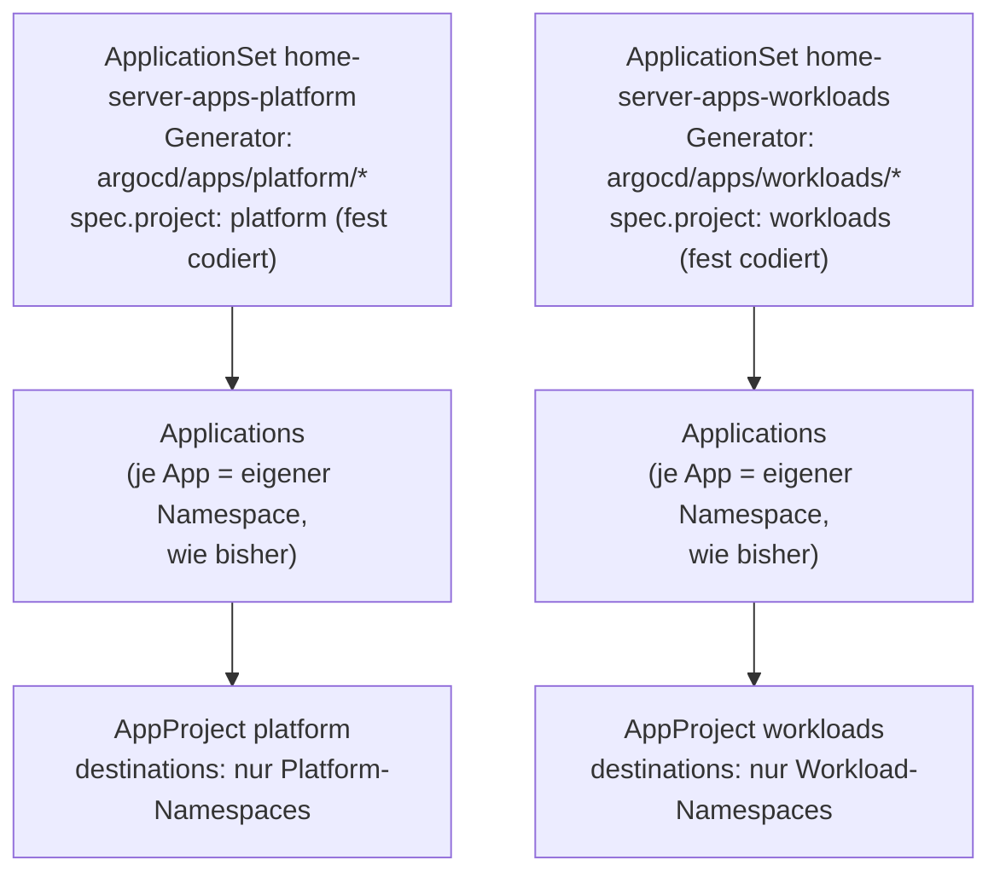

# ArgoCD-Projects — Platform/Workloads-Trennung

Apps liegen seit diesem Schnitt nicht mehr flach unter `argocd/apps/<app>/`,
sondern unter `argocd/apps/platform/<app>/` oder `argocd/apps/workloads/<app>/`.
Jede App bekommt zusätzlich ein passendes ArgoCD-`AppProject` zugewiesen
(`platform` bzw. `workloads`), statt wie bisher pauschal im `default`-Project
zu laufen.

---

## Warum

Vorher liefen alle 36 Apps im ArgoCD-`default`-Project — das erlaubt
uneingeschränkt jede Kombination aus Quell-Repo, Ziel-Namespace und
Ressourcentyp. Ein Tippfehler oder ein kompromittierter Commit hätte z. B.
eine Workload-App (Mealie, n8n, …) theoretisch in den `authentik`- oder
`pihole`-Namespace deployen können. Die Trennung in zwei Projects grenzt das
ein: Apps aus `argocd/apps/workloads/*` dürfen nur in Workload-Namespaces
deployen, Apps aus `argocd/apps/platform/*` nur in Platform-Namespaces.

Wichtig: **Jede App behält ihren eigenen Kubernetes-Namespace wie bisher**
(`destination.namespace` ist weiterhin nur der App-Ordnername, z. B.
`vaultwarden` oder `authentik`) — es gibt keinen gemeinsamen gequetschten
Namespace pro Tier. Die Tier-Trennung wirkt ausschließlich auf ArgoCD-Ebene
(welches Project, welche erlaubten `destinations`) und als zusätzliches
Namespace-Label (`security-tier=platform`/`security-tier=workload`), das
[docs/46-crowdsec.md](46-crowdsec.md)-artige oder künftige NetworkPolicy-Regeln
grob nach Tier gruppieren kann, ohne die bestehende Pod-Isolation pro App zu
verringern.

---

## Die zwei Tiers

| Tier | Ordner | AppProject | Charakter |
|---|---|---|---|
| **Platform** (Schicht 3) | `argocd/apps/platform/<app>/` | `platform` | Identity, Secrets, Netzwerk, Monitoring — Infrastruktur, auf der andere Apps aufbauen |
| **Workloads** (Schicht 4) | `argocd/apps/workloads/<app>/` | `workloads` | Apps mit echtem Nutzerkreis (Familie, Vereinsmitglieder, Kunden) |

Die Zuordnung folgt exakt der bereits bestehenden Schicht-3/Schicht-4-Tabelle
in [docs/01-overview.md](01-overview.md#5-app-matrix-schicht-3-und-4) — hier
nur als flache Liste:

**Platform:** `authentik`, `sealed-secrets`, `kubeseal-webgui`, `monitoring`,
`logging`, `gotify`, `gotify-bridge`, `ntfy`, `ntfy-bridge`, `cloudflared`,
`pihole`, `coredns-custom`, `nas-storage`, `immich-storage`, `minio`,
`argo-workflows`, `semaphore`, `headlamp`, `traefik-config`

**Workloads:** `alamos-apager`, `carplay-api`, `example-whoami`,
`github-release-watcher`, `immich`, `mealie`, `mediamtx`, `n8n`, `nextcloud`,
`paperless-ngx`, `tinyteller`, `uptime-kuma`, `vaultwarden`,
`wiki-docs-sync`, `wikijs`, `xibosignage`, `zammad`

Quelle der Wahrheit für diese Liste:
[`ansible/roles/argocd/defaults/main.yml`](../ansible/roles/argocd/defaults/main.yml)
(`argocd_platform_apps` / `argocd_workloads_apps`) — von dort generiert die
AppProject-Vorlage die `destinations`-Liste, und dieselbe Liste labelt auch
die Namespaces.

---

## Wie es technisch funktioniert

**Zwei komplett getrennte `ApplicationSet`-Ressourcen** (`home-server-apps-platform`,
`home-server-apps-workloads`) statt einer einzigen mit zwei Generatoren.
Jede ist strukturell identisch zur ursprünglichen, einzelnen
`home-server-apps` — nur der Directory-Glob und der literale `project:`-Wert
unterscheiden sich.

> **Zwei verworfene Ansätze, damit niemand sie nochmal versucht:**
> 1. *Eine* ApplicationSet mit zwei Git-Generatoren, die je einen
>    `template.spec.project`-Override tragen. `spec.generators[].template`
>    existiert auf der installierten ApplicationSet-CRD schlicht nicht
>    außerhalb von `matrix`/`merge`-Generatoren — `kubectl apply` wurde mit
>    `unknown field spec.generators[0].template` abgelehnt (strict decoding,
>    kein Teil-Apply, der Cluster blieb unverändert).
> 2. *Eine* ApplicationSet, die `spec.project` per Go-Template aus dem Pfad
>    ableitet (`{{(splitList "/" .path.path) | index 2}}`, Sprig-Funktionen).
>    Syntaktisch gültig, aber nie gegen den echten ApplicationSet-Controller
>    verifiziert — nicht das Risiko wert, wenn zwei unabhängige, strukturell
>    bereits bewiesene ApplicationSets (dieser Ansatz) ganz ohne unsichere
>    Templating-Features auskommen.

Quelle:
[`ansible/roles/argocd/templates/bootstrap-applicationset.yaml.j2`](../ansible/roles/argocd/templates/bootstrap-applicationset.yaml.j2)

### AppProjects

[`ansible/roles/argocd/templates/bootstrap-appprojects.yaml.j2`](../ansible/roles/argocd/templates/bootstrap-appprojects.yaml.j2)
definiert beide `AppProject`-Ressourcen:

- `sourceRepos`: nur dieses Repo — verhindert, dass eine Application (egal
  welchen Tiers) auf ein fremdes Git-Repo zeigt.
- `destinations`: nur die Namespaces des jeweiligen Tiers (aus
  `argocd_platform_apps`/`argocd_workloads_apps`).
- `clusterResourceWhitelist` / `namespaceResourceWhitelist`: **bewusst nicht
  eingeschränkt** (bleiben so permissiv wie ArgoCD's eingebautes
  `default`-Project) — mehrere Platform-Apps installieren eigene CRDs
  (victoria-metrics-operator, sealed-secrets), und Ressourcentypen ohne
  vorherige Beobachtung der echten Nutzung einzuschränken riskiert,
  bestehende funktionierende Syncs zu brechen. Das ist eine spätere,
  separate Verschärfung, kein Versehen.

Beide `AppProject`s werden vom `argocd`-Ansible-Role **vor** dem
`ApplicationSet` angewendet (`kubectl apply`) — eine Application, deren
referenziertes Project noch nicht existiert, schlägt beim Sync fehl.

### Namespace-Label

Nach dem ApplicationSet-Apply labelt die Rolle jeden bekannten Namespace mit
`security-tier=platform` bzw. `security-tier=workload`
(`kubectl label namespace <ns> security-tier=... --overwrite`). Das ist reine
Vorbereitung für künftige NetworkPolicies (Phase 3 der laufenden
Security-Härtung) — aktuell hat das Label selbst noch keine Wirkung.

---

## Eine neue App hinzufügen

Wie bisher (siehe [docs/05-argocd.md](05-argocd.md)), nur mit einem
zusätzlichen Entscheidungsschritt:

1. Gehört die neue App zu **Platform** (Infrastruktur, Admin-Charakter) oder
   **Workloads** (echter Nutzerkreis)? Im Zweifel: reiner Infrastruktur-/
   Betriebsdienst ohne eigenen "Endnutzer" → Platform.
2. Verzeichnis anlegen: `argocd/apps/platform/<name>/` oder
   `argocd/apps/workloads/<name>/`.
3. `<name>` in `argocd_platform_apps` bzw. `argocd_workloads_apps` in
   `ansible/roles/argocd/defaults/main.yml` ergänzen (sonst fehlt der
   AppProject-`destinations`-Eintrag und der Sync schlägt fehl).
4. `make render-bootstrap` laufen lassen, committen, pushen.

Fehlt Schritt 3, meldet ArgoCD beim Sync einen Fehler wie
`application destination namespace X is not permitted in project Y` — das
ist das AppProject, das wie vorgesehen einen nicht vorgesehenen Namespace
blockiert.

---

## Rollout-Hinweis

Diese Umstrukturierung ändert **keine** Kubernetes-Ressourcen (keine PVCs,
keine Secrets, keine Pods bewegen sich) — `destination.namespace` bleibt für
jede App exakt wie vorher. Trotzdem ist die Reihenfolge beim Umschalten
wichtig, weil beide Git-Generatoren (alt wie neu) fest gegen
`revision: main` scannen — **nicht** gegen den gerade lokal ausgecheckten
Branch:

1. **Erst `feat-update-security` nach `main` mergen.** Vor dem Merge findet
   der neue Generator-Pfad (`argocd/apps/platform/*` /
   `argocd/apps/workloads/*`) auf `main` noch nichts — ein `make argocd` vor
   dem Merge legt zwar gefahrlos zwei neue, aber leere ApplicationSets an
   (0 Apps gefunden), während die alte `home-server-apps` unangetastet
   weiterläuft und alle 36 Apps von der alten Struktur auf `main` sync.
2. **Danach `make argocd` laufen lassen** — legt `home-server-apps-platform`
   und `home-server-apps-workloads` an bzw. aktualisiert sie, wendet beide
   AppProjects an, labelt die Namespaces.
3. **Verifizieren:** `kubectl get applications -n argocd` — alle 36 Apps
   sollten `Synced`/`Healthy` sein, jetzt im jeweils richtigen AppProject
   (`kubectl get applications -n argocd -o jsonpath='{range .items[*]}{.metadata.name}{"\t"}{.spec.project}{"\n"}{end}'`).
4. **Erst danach die alte ApplicationSet manuell löschen:**
   `kubectl -n argocd delete applicationset home-server-apps`. Nicht vorher
   — sie ist bis Schritt 3 die einzige Quelle, die die 36 Applications aktiv
   hält.
5. Wurde bei Schritt 1 die Reihenfolge vertauscht (Merge vor Anwenden der
   AppProjects) und die alte ApplicationSet ist bereits weg, bevor die neuen
   etwas gefunden haben: nicht in Panik geraten — die von ArgoCD verwalteten
   Kubernetes-Ressourcen (Deployments, Services, PVCs, …) hängen nicht per
   `ownerReference` an der Application-Ressource, ein kurzzeitig fehlendes
   Application-Objekt löscht keine laufenden Pods. `make argocd` erneut
   laufen lassen stellt die Applications wieder her.
