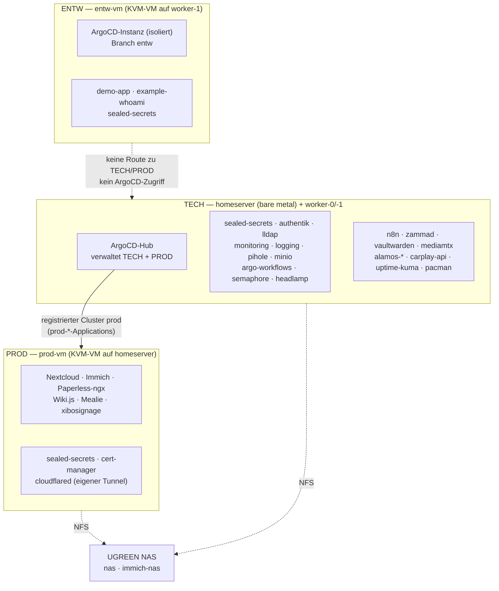
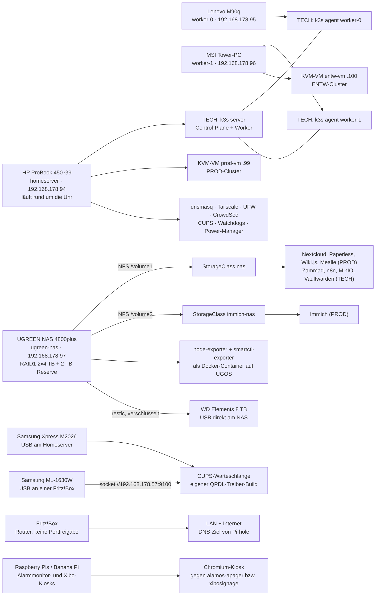
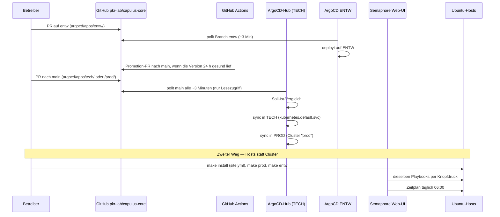
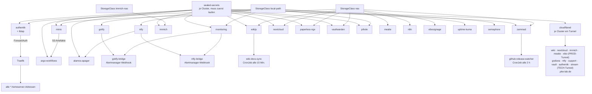
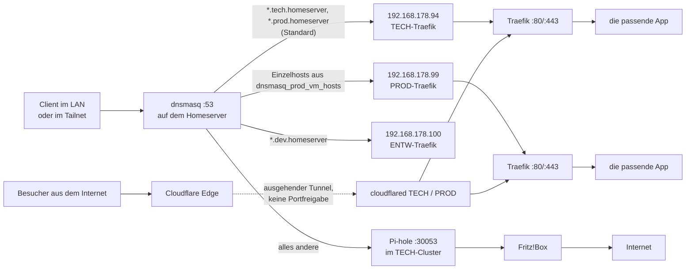

# capulus-core — Home-Server-Architektur

**Von der Hardware bis zur App: was auf was aufbaut.**
GitOps-gesteuert, ein Ansible-Lauf pro Host, keine offenen Ports ins Internet.

Repo: `pkr-lab/capulus-core` · drei k3s-Cluster (TECH, PROD, ENTW) auf drei Rechnern + NAS · 51 GitOps-Apps (32 TECH, 16 PROD, 3 ENTW) · Stand September 2026

---

## Lesehilfe

| Kürzel | Bedeutung |
|---|---|
| **S** | braucht ein Sealed Secret aus Git |
| **N** | Daten auf dem NAS, StorageClass `nas` (`/volume1`, NFS) |
| **I** | Daten auf dem NAS, StorageClass `immich-nas` (`/volume2`, NFS) |
| **L** | Daten lokal auf der Knoten-SSD bzw. VM-Disk, StorageClass `local-path` |
| **C** | öffentlich erreichbar über den Cloudflare Tunnel |
| **D** | bringt eine eigene Datenbank mit (PostgreSQL / Redis / Elasticsearch) |
| **SSO** | Login über Authentik (Traefik-ForwardAuth), siehe [d0073](../d-sicherheit/d0073-authentik-sso.md) |

Pfeile bedeuten durchgehend **„baut auf / braucht"**: Jede Schicht funktioniert nur,
wenn die Schicht darunter läuft. Schicht 0 ist echte Hardware, Schicht 1–4 ist Software.
Namen in `Schreibmaschinenschrift` sind Verzeichnisse bzw. Ansible-Rollen im Repo.

---

## 1. Drei Cluster im Überblick

Aus dem früheren **einen** 3-Node-Cluster sind im September 2026 **drei getrennte k3s-Cluster**
geworden ([40080](../4-planung/40080-multi-cluster-entw-prod-tech.md)). Der Grund ist Blast-Radius:
PROD trägt die Familien-/Vereinsdaten und ist am stärksten dem Internet ausgesetzt, TECH hält
Identität, Secrets und Deploy-Kontrolle, ENTW ist eine absichtlich verwundbare Trainings- und
Testumgebung.

| Cluster | Läuft auf | IP | Ressourcen | Pod-/Service-Netz | ArgoCD | Ordner im Repo |
|---|---|---|---|---|---|---|
| **TECH** | `homeserver` (bare metal, 24/7) + Agents `worker-0`, `worker-1` (WoL) | `.94` (+ `.95`, `.96`) | 12 vCPU / ~61 GiB auf dem homeserver | `10.42.0.0/16` / `10.43.0.0/16` | **Hub**: verwaltet TECH und PROD | `argocd/apps/tech/` |
| **PROD** | KVM/libvirt-VM `prod-vm` auf dem homeserver | `.99` | 6 vCPU / 24 GiB / 100 GiB | `10.46.0.0/16` / `10.47.0.0/16` | keine eigene, vom TECH-Hub verwaltet | `argocd/apps/prod/` |
| **ENTW** | KVM/libvirt-VM `entw-vm` auf `worker-1` | `.100` | 3 vCPU / 12 GiB / 20 GiB | `10.44.0.0/16` / `10.45.0.0/16` | **eigene, isolierte Instanz**, Branch `entw` | `argocd/apps/entw/` |

Alle IPs liegen im LAN `192.168.178.0/24`. Die VMs hängen über eine Bridge (`br0`) direkt im LAN. Von
den Servern sind nur `homeserver`, `worker-0` und `worker-1` Tailscale-Mitglieder (dazu kommen einzelne Kiosk-Geräte);
`prod-vm` und `entw-vm` sind bewusst **nicht** im Tailnet und aus der Ferne nur über den Subnet-Router `homeserver` (`192.168.178.0/24`) erreichbar.



Gemeinsam genutzt werden das **NAS** (NFS, `nas` / `immich-nas`), die **interne Root-CA** (PROD hat eine eigene
Intermediate-CA), **dnsmasq** auf dem homeserver als Namensauflösung für alle drei und **Authentik/lldap**
als zentrales Login. Bei einem NAS-Ausfall trifft das alle drei Cluster.

**Welcher Cluster hinter einem Namen steckt**, entscheidet das DNS, nicht das Tier-Label im Hostnamen,
siehe [c0040](../c-netzwerk-dns/c0040-domain-tiers.md#dns-tier-und-cluster-sind-zwei-verschiedene-dinge).

### kubectl-Zugriff je Cluster

| Cluster | Zugriff |
|---|---|
| TECH | `kubectl` auf dem homeserver bzw. mit der kubeconfig vom homeserver ([a0030](a0030-installation.md#kubectl-von-der-control-machine)) |
| PROD | `ssh ubuntu@192.168.178.99` und dort `sudo k3s kubectl …` (bzw. eine eigene kubeconfig von der prod-vm). Die Applications siehst du im **TECH**-Hub: `kubectl -n argocd get applications \| grep '^prod-'` |
| ENTW | `ssh ubuntu@192.168.178.100 'sudo k3s kubectl …'`; eigene ArgoCD-UI auf `http://192.168.178.100:30080` |

Alle `kubectl -n <app> …`-Befehle in den App-Docs gelten für den Cluster, in dem die App läuft
(siehe [Abschnitt 5](#5-app-matrix)).

---

## 2. Gesamtbild: die fünf Schichten

```mermaid
flowchart TB
    subgraph ACC["WER GREIFT ZU"]
        direction LR
        A1["Gerät im Heim-LAN<br/>192.168.178.0/24"]
        A2["Tailscale-VPN<br/>unterwegs, 100.x"]
        A3["Öffentliches Internet<br/>über Cloudflare Tunnel"]
        A4["Git-Push / PR<br/>Betreiber"]
    end

    subgraph ENT["EINTRITTSPUNKTE AUF DEM HOMESERVER"]
        direction LR
        E1["dnsmasq :53<br/>Split-DNS *.homeserver"]
        E2["Traefik :80/:443<br/>Ingress (je Cluster)"]
        E3["k3s-API :6443"]
        E4["ArgoCD :30080"]
        E5["CUPS :631<br/>IPP / AirPrint"]
    end

    subgraph L4["SCHICHT 4 — ANWENDUNGEN"]
        direction LR
        P1["PROD: Nextcloud · Immich · Paperless-ngx<br/>Wiki.js · Mealie · xibosignage"]
        P2["TECH: Zammad · Vaultwarden · n8n · Uptime Kuma<br/>MediaMTX · alamos-apager · carplay-api · pacman"]
    end

    subgraph L3["SCHICHT 3 — PLATTFORMDIENSTE (TECH)"]
        direction LR
        S1["authentik · lldap<br/>sealed-secrets · kubeseal-webgui"]
        S3["monitoring · logging<br/>VictoriaMetrics/-Logs + Grafana"]
        S4["gotify · ntfy<br/>+ Alert-Brücken"]
        S5["cloudflared · pihole<br/>coredns-custom · cert-manager"]
        S6["nas-storage<br/>immich-storage"]
        S7["minio · argo-workflows<br/>semaphore · headlamp"]
    end

    subgraph L2["SCHICHT 2 — CLUSTER-PLATTFORM"]
        direction LR
        K1["TECH: k3s server @ homeserver<br/>+ Agents worker-0 / worker-1<br/>Traefik · CoreDNS · Flannel"]
        K2["PROD: k3s @ prod-vm<br/>ENTW: k3s @ entw-vm<br/>je eigenes Traefik/CoreDNS"]
        K3["ArgoCD-Hub (TECH + PROD)<br/>+ ArgoCD ENTW<br/>ein Ordner = eine App"]
        K4["StorageClasses<br/>local-path · nas · immich-nas"]
    end

    subgraph L1["SCHICHT 1 — BETRIEBSSYSTEM, VIRTUALISIERUNG & ANSIBLE"]
        direction LR
        O1["Ubuntu Server 26.04 LTS<br/>UFW · chrony · Swap aus · CrowdSec"]
        O2["KVM/libvirt + Bridge br0<br/>hostet prod-vm und entw-vm"]
        O3["UGOS auf dem NAS<br/>bewusst kein Ansible"]
        O4["Raspberry Pi OS / Armbian<br/>Chromium-Kiosk"]
        O5["Ansible-Rollen<br/>make install / worker-* / prod / entw"]
    end

    subgraph L0["SCHICHT 0 — HARDWARE"]
        direction LR
        H1["HP ProBook 450 G9<br/>homeserver · .94 · 24/7"]
        H2["Lenovo M90q<br/>worker-0 · .95 · WoL"]
        H3["MSI Tower-PC<br/>worker-1 · .96 · WoL"]
        H4["UGREEN NAS 4800plus<br/>ugreen-nas · .97 · RAID1"]
        H5["WD Elements 8 TB<br/>USB am NAS · restic"]
        H6["Samsung Xpress M2026<br/>USB am Homeserver"]
        H7["Samsung ML-1630W<br/>USB an Fritz!Box · :9100"]
    end

    ACC -->|"nutzt"| ENT
    ENT -->|"erreicht"| L4
    L4 -->|"läuft auf / benötigt"| L3
    L3 -->|"läuft in"| L2
    L2 -->|"installiert durch"| L1
    L1 -->|"läuft auf"| L0
```



---

## 3. Hardware → Software: welches Gerät trägt was



**Kernpunkt:** Der Homeserver ist der einzige Dauerläufer und Hypervisor für PROD. Die Worker sind
austauschbare Rechenknoten für TECH ohne eigene Datenhaltung, `worker-1` trägt zusätzlich die
ENTW-VM. Der persistente Speicher liegt zentral auf dem NAS, deshalb darf der Scheduler Pods frei
verteilen, und deshalb hängt bei einem NAS-Ausfall ein Großteil der Apps in allen Clustern.

---

## 4. GitOps-Kreislauf und der zweite Weg über Ansible



**Zwei getrennte Auslieferungswege, die sich nicht überschneiden:**

| Weg | Was er verändert | Auslöser |
|---|---|---|
| ArgoCD | alles *im* Cluster (Apps, Plattformdienste) | Merge auf `main` (TECH/PROD) bzw. `entw` (ENTW), dann automatisch |
| Ansible | alles *unter* dem Cluster (OS, k3s, KVM-VMs, dnsmasq, Tailscale, Drucker, Watchdogs) | `make install` / `make prod` / `make entw`, Semaphore-Knopf, täglich 06:00 |

**Promotion:** Neue Versionen (Image-Tags, Chart-Abhängigkeiten) laufen zuerst auf ENTW und werden von der
[Promotion-Kette](../f-cicd-automatisierung/f00b0-promotion-chain.md) nach 24 h Gesundheit als PR nach TECH,
nach weiteren 2 h als PR nach PROD übernommen. `main` ist geschützt (PR-Pflicht, grüne CI, siehe
[f0090](../f-cicd-automatisierung/f0090-branch-schutz-main.md)).

---

## 5. App-Matrix

Die Zuordnung Cluster ↔ Ordner ↔ AppProject steht in
[b0020](../b-kubernetes-gitops/b0020-argocd-projects.md). Die folgenden Tabellen zeigen die
Aufgaben und die Adressen.

### TECH-Cluster — Plattformdienste (`argocd/apps/tech/…`)

| App | Aufgabe | Kürzel |
|---|---|---|
| `sealed-secrets` | entschlüsselt SealedSecrets im Cluster | — |
| `kubeseal-webgui` | Weboberfläche zum Verschlüsseln von Secrets | — |
| `authentik` | zentrales SSO/2FA, Traefik-ForwardAuth | L · S · D · C |
| `lldap` | Nutzer-/Gruppenverzeichnis (LDAP) für Authentik | L · S |
| `monitoring` | VictoriaMetrics, vmagent, vmalert, Alertmanager, Grafana | L · S · C |
| `logging` | zentrale Log-Aggregation (VictoriaLogs) | L · S |
| `gotify` / `gotify-bridge` | Push an Android, Brücke von Alertmanager | L · S |
| `ntfy` / `ntfy-bridge` | Push an iOS + Android, Brücke von Alertmanager | L · C |
| `cloudflared` | Cloudflare Tunnel `homeserver`, ausgehende Verbindung nach außen | S |
| `pihole` | Werbe- und Trackerfilter im DNS, NodePort 30053 | L · S |
| `coredns-custom` | zusätzliche DNS-Zonen im Cluster | — |
| `nas-storage` | NFS-Provisioner → StorageClass `nas` | — |
| `immich-storage` | NFS-Provisioner → StorageClass `immich-nas` | — |
| `minio` | S3-Speicher für Build-Artefakte | N · S |
| `argo-workflows` | interne CI/CD-Pipelines, braucht MinIO | S |
| `semaphore` | Weboberfläche, die Ansible-Playbooks startet | L |
| `headlamp` | Kubernetes-Dashboard im Browser | S |
| `traefik-config` | Traefik-Zusatzkonfiguration (HelmChartConfig, Metrics-Scrape, TLSStore) | — |
| `cert-manager` | interne CA → Zertifikate für `*.tech.homeserver` | — |

### TECH-Cluster — Betriebs- und Anwendungsdienste (`argocd/apps/tech/…`)

| App | Aufgabe | Kürzel | Adresse |
|---|---|---|---|
| `zammad` | Ticketsystem / Helpdesk | N · L · S · D · C | `zammad.tech.homeserver` |
| `vaultwarden` | Passwort-Manager (Bitwarden-kompatibel) | N · L · S · C | `vault.tech.homeserver` |
| `n8n` | Automatisierungen ohne Code | N · S | `n8n.prod.homeserver` |
| `ollama` | lokales LLM, nur bei Bedarf hochgefahren (`replicas: 0`) | — | — (intern) |
| `uptime-kuma` | Erreichbarkeits-Überwachung + Status-Seite | L · C · SSO | `uptime-kuma.prod.homeserver` |
| `mediamtx` | Live-Video: RTSP / RTMP / WebRTC / HLS | C | `stream.prod.homeserver` |
| `alamos-apager` | Alarmmonitor-Steuerung (ALAMOS AMweb) | S | `alamos-apager.prod.homeserver` |
| `alamos-relay` | öffentlicher Proxy vor n8n für den Einsatzalarm-Webhook | C | `alamos-relay.prod.homeserver` |
| `carplay-api` | Homeserver-Dashboard-API für die iOS-App | S | `carplay-api.prod.homeserver` |
| `pacman` | Besucher-Tracking-Demo für die IT-Schulung | C | `pacman.prod.homeserver` |
| `github-release-watcher` | neue Releases → Ticket in Zammad | S | — (CronJob) |

### PROD-Cluster (`argocd/apps/prod/…`)

| App | Aufgabe | Kürzel | Adresse |
|---|---|---|---|
| `nextcloud` | Dateien, Kalender, Kontakte | N · L · S · D · C | `nextcloud.prod.homeserver` |
| `immich` | Fotoarchiv mit KI-Suche | I · S · D · C | `immich.prod.homeserver` |
| `paperless-ngx` | papierlose Dokumentenverwaltung | N · S · D | `paperless.prod.homeserver` |
| `wikijs` | Wiki, auch öffentlich | N · S · D · C | `wiki.prod.homeserver` |
| `wiki-docs-sync` | `docs/` aus Git → Wiki.js, alle 15 Min. | S | — (CronJob) |
| `mealie` | Rezepte und Essensplanung | N · C | `mealie.prod.homeserver` |
| `xibosignage` | Xibo CMS: Medien-/Asset-Verwaltung für die Raspberry-Pi-Bilder-Slideshow | N · S · D · C | `xibo.prod.homeserver` |
| `tinyteller` | kleine Diktier- und Story-App | — | `tinyteller.prod.homeserver` |
| `example-whoami` / `demo-app` | Referenz-Apps, belegen, dass GitOps und Routing laufen | — | `whoami.prod.homeserver` / `demo.prod.homeserver` |
| `sealed-secrets`, `cert-manager`, `cloudflared` | eigene Plattform-Grundzutaten des Clusters (eigene SealedSecrets-Schlüssel, Intermediate-CA, Tunnel `homeserver-prod`) | S | — |
| `nas-storage`, `immich-storage`, `traefik-config` | StorageClasses `nas` / `immich-nas` und Traefik-Konfiguration/TLSStore in PROD | — | — |

### ENTW-Cluster (`argocd/apps/entw/…`)

`sealed-secrets`, `demo-app` (`demo.dev.homeserver`), `example-whoami` (`whoami.dev.homeserver`). Neue Apps
starten hier, bevor sie über die Promotion-Kette nach TECH/PROD wandern.

---

## 6. App-Abhängigkeiten quer durch den Stack



---

## 7. Hardware im Detail

| Gerät | Rolle | Adresse | Trägt / liefert |
|---|---|---|---|
| HP ProBook 450 G9 | TECH-Control-Plane + Worker, 24/7, Hypervisor für PROD | `192.168.178.94` | k3s server, Traefik, ArgoCD-Hub, dnsmasq, Tailscale (Subnet-Router), CUPS, CrowdSec, Watchdogs, Power-Manager, KVM/libvirt mit `prod-vm` |
| Lenovo M90q | reiner Rechenknoten (TECH) | `192.168.178.95` | k3s agent, per Wake-on-LAN geweckt (MAC `98:fa:9b:28:b0:22`) |
| MSI Tower-PC | Rechenknoten (TECH), Hypervisor für ENTW | `192.168.178.96` | k3s agent, KVM/libvirt mit `entw-vm`, per Wake-on-LAN geweckt (MAC `b8:97:5a:ea:a4:fa`) |
| KVM-VM `prod-vm` | PROD-Cluster | `192.168.178.99` | 6 vCPU / 24 GiB / 100 GiB, eigener k3s-Server, kein Tailscale |
| KVM-VM `entw-vm` | ENTW-Cluster | `192.168.178.100` | 3 vCPU / 12 GiB / 20 GiB, eigener k3s-Server + ArgoCD, kein Tailscale |
| UGREEN NAS 4800plus | zentraler Speicher (alle Cluster) | `192.168.178.97` | 10 TB roh: 2×4 TB als RAID1 (≈ 4 TB nutzbar, eine Platte darf ausfallen) + 2 TB Reserve; NFS `/volume1` → `nas`, `/volume2` → `immich-nas`; node- und smartctl-Exporter als Docker-Container |
| WD Elements 8 TB | Sicherung | USB am NAS | restic-Backup von `/volume1` + `/volume2`, inkrementell, dedupliziert, verschlüsselt, per UGOS-Aufgabenplaner |
| Samsung Xpress M2026 | Drucker | USB am Homeserver | CUPS-Freigabe per IPP/AirPrint; braucht einen eigenen QPDL-Treiber-Build, weil splix und hplip die M2020-Serie nicht abdecken |
| Samsung ML-1630W | Drucker | `192.168.178.57:9100` | hängt per USB an einer Fritz!Box, spricht SPL2 → `printer-driver-splix` genügt; zweite Warteschlange in CUPS |
| Fritz!Box | Router | `192.168.178.1` | LAN und Internet, DNS-Ziel von Pi-hole, keine Portfreigabe nach außen |
| Raspberry Pis / Banana Pi | Alarmmonitor-Kiosks | frei / Tailscale | Chromium im Vollbild gegen `alamos-apager`, per Ansible verwaltet, mit Lebenszeichen-Meldung (siehe [30010](../3-apps-workloads/30010-alamos-apager.md), [30020](../3-apps-workloads/30020-vereinsheim-alarmmonitor.md)) |
| Raspberry Pi 3 B+ (`infotafel`) | xibosignage-Bilder-Slideshow | `192.168.178.98` | Chromium im Vollbild gegen einen NFS-gemounteten Bilder-Ordner, kein offizieller Xibo-Player (siehe [300e0](../3-apps-workloads/300e0-xibosignage.md)) |

---

## 8. Ansible-Rollen und ihr Wirkungsbereich

| Rolle | Läuft gegen | Zweck |
|---|---|---|
| `common` | homeserver, prod-vm, entw-vm | Basis-OS, UFW, Pakete, sysctl, chrony, Swap aus, optional statische IP |
| `crowdsec` | homeserver | Brute-Force-Schutz für SSH und Traefik-Logs |
| `dnsmasq` | homeserver | Split-DNS `*.homeserver` (inkl. `*.dev.homeserver` → ENTW und PROD-Einzelhosts), Weiterleitung an Pi-hole |
| `tailscale` | homeserver, worker-0/-1, xibosignage-Displays, Banana Pi | WireGuard-Mesh-VPN, Auth-Key aus Ansible Vault; nur der homeserver ist Subnet-Router |
| `wireguard_backup` | homeserver | Notfall-Tunnel, falls die Tailscale-Control-Plane ausfällt ([c0011](../c-netzwerk-dns/c0011-wireguard-backup.md)) |
| `k3s` | homeserver, prod-vm, entw-vm | Kubernetes-Server + Helm, je Cluster eigene CIDRs |
| `k3s_agent` | worker-0, worker-1 | Cluster-Beitritt (TECH) per Join-Token vom Control-Plane |
| `libvirt_host` | homeserver, worker-1 | KVM/libvirt, Bridge `br0`, legt `prod-vm` bzw. `entw-vm` an |
| `argocd` | homeserver (Hub), entw-vm | ArgoCD per Helm + Bootstrap-ApplicationSet/-Projects, Namespace-Labels, NetworkPolicies |
| `semaphore_secrets` | homeserver | Bootstrap-Secret für den Semaphore-Pod |
| `semaphore_targets` | alle verwalteten Hosts | SSH-Pubkey von Semaphore in `authorized_keys` |
| `semaphore_bootstrap` | homeserver | Projekte, Inventories, Templates, Zeitpläne per REST-API |
| `disable_eee` | homeserver, worker-0, worker-1 | Energy Efficient Ethernet dauerhaft deaktivieren (Realtek-NIC-Link-Drops) |
| `thermal_watchdog` | alle Knoten + Kiosks | Selbst-Abschaltung bei Übertemperatur |
| `resource_watchdog` | alle Knoten + Kiosks | Selbst-Abschaltung bei Dauerlast |
| `cluster_power_manager` | homeserver | weckt Worker per WoL, fährt sie per SSH wieder herunter |
| `cluster_power_manager_target` | worker-0, worker-1 | autorisiert den Shutdown-Schlüssel, beschränkt auf `poweroff` |
| `wake_on_lan` | worker-0, worker-1 | `ethtool wol g` bei jedem Boot |
| `nightly_worker_wake` | homeserver | 01:00-Timer: Worker wecken, Update anstoßen, wieder herunterfahren |
| `worker_apt_update` | worker-0, worker-1 | apt-Update der Worker (haben keine `common`-Rolle) |
| `power_agent` | homeserver | HTTP-API für Helligkeit/Wake/Shutdown aus der iOS-App |
| `node_exporter` | prod-vm, entw-vm, Banana Pi | Host-Metriken für Nicht-k3s-Hosts bzw. VMs |
| `smartctl_exporter` | homeserver, worker-0/-1 | S.M.A.R.T.-Werte der physischen Platten |
| `journal_upload` | alle Ansible-Hosts | journald → VictoriaLogs ([300j0](../3-apps-workloads/300j0-logging.md)) |
| `vmagent` | Tailscale-only-Hosts (Banana Pi) | Metriken-Push per remote-write |
| `cups_print_server` | homeserver | Druckserver, QPDL-Treiber-Build, zweite Warteschlange |
| `alamos_kiosk` / `banana_pi_kiosk` | Raspberry Pis / Banana Pi | Chromium-Kiosk + Heartbeat-Timer |
| `xibo_kiosk` | xibosignage-Displays | NFS-Mount, Manifest-Timer, Chromium-Slideshow-Kiosk |
| `vaultwarden_restore` | homeserver | Wiederherstellung der Vaultwarden-Daten aus dem NAS-Backup |

**Reihenfolge beim ersten Rollout:**

```
make install        # site.yml gegen homeserver  →  erzeugt Join-Token + Shutdown-Key, TECH-Cluster + ArgoCD-Hub
make worker-0       # erst danach möglich
make worker-1
make libvirt-host   # auf dem homeserver: Bridge + prod-vm (braucht libvirt_host_enabled)
make worker-1-libvirt-host   # auf worker-1: Bridge + entw-vm
make prod           # k3s in der prod-vm; danach Cluster im Hub registrieren (argocd/bootstrap-prod/README.md)
make entw           # k3s + ArgoCD in der entw-vm
make alarm-kiosks   # optional, nur manuell
make xibo-kiosks    # optional, nur manuell
```

---

## 9. Netz, Ports, Namen



| Port | Protokoll | Komponente | Bereich |
|---|---|---|---|
| 22 | TCP | SSH | LAN + Tailnet |
| 53 | UDP/TCP | dnsmasq Split-DNS | LAN + Tailnet |
| 80 / 443 | TCP | Traefik Ingress | LAN + Tailnet |
| 631 | TCP | CUPS (IPP/AirPrint) | LAN + Tailnet |
| 6443 | TCP | k3s-API, Agent-Join | LAN + Tailnet |
| 8472 | UDP | Flannel VXLAN | nur zwischen den TECH-Knoten |
| 10250 | TCP | kubelet-API | nur zwischen den TECH-Knoten |
| 30053 | TCP/UDP | Pi-hole NodePort | LAN |
| 30080 | TCP | ArgoCD-Hub-API/CLI/CI (Klartext-HTTP; die Web-UI läuft per HTTPS über Traefik: `argocd.tech.homeserver`) | LAN + Tailnet |
| 41641 | UDP | Tailscale/WireGuard | **ausgehend** ins Internet |

Die Ports 80/443/6443 gelten je Cluster für dessen eigene IP (`.94`, `.99`, `.100`); ENTW bietet
zusätzlich die ArgoCD-UI auf `:30080` (HTTP). Details je App: [c0030](../c-netzwerk-dns/c0030-port-uebersicht.md).

| Netz | CIDR |
|---|---|
| Heim-LAN | `192.168.178.0/24` |
| Tailscale-Overlay | `100.64.0.0/10` |
| TECH Pod-/Service-Netz | `10.42.0.0/16` / `10.43.0.0/16` |
| ENTW Pod-/Service-Netz | `10.44.0.0/16` / `10.45.0.0/16` |
| PROD Pod-/Service-Netz | `10.46.0.0/16` / `10.47.0.0/16` |

---

## 10. Abhängigkeitsketten im Klartext

**Speicher**
- UGREEN NAS (RAID1) → NFS `/volume1` → `nas-storage` (in TECH **und** PROD) → StorageClass `nas` → Nextcloud, Paperless, Wiki.js, Mealie (PROD); Zammad, n8n, MinIO, Vaultwarden (TECH)
- UGREEN NAS → `/volume2` → `immich-storage` → `immich-nas` → Immich, bewusst getrennt vom übrigen Cluster-Speicher
- Steht das NAS, starten diese Apps nicht mehr. Apps auf `local-path` (Grafana, Gotify, ntfy, Pi-hole, Uptime Kuma, Semaphore, Authentik) laufen weiter.
- Sicherung: NAS → restic → WD Elements 8 TB. Ohne diese Platte existiert keine Kopie der Nutzdaten. Das restic-Passwort ist der einzige Schlüssel — ohne es ist auch das Backup wertlos.

**Anmeldung und Geheimnisse**
- **Authentik** (mit lldap als Nutzerquelle) ist der zentrale Identity-Provider (`authentik.tech.homeserver`) und schützt ausgewählte Apps per Traefik-ForwardAuth, siehe [d0073](../d-sicherheit/d0073-authentik-sso.md). Aktuell geschützt ist Uptime Kuma; bei Mealie ist die Middleware nach dem Umzug nach PROD zurückgestellt, weil PROD noch keinen Authentik-Outpost hat (`argocd/bootstrap-prod/migrations/README.md`). Jede geschützte App behält einen ungeschützten `-native`-Host als Fallback. Alle anderen Apps (Immich, Nextcloud, Grafana, Zammad, Vaultwarden, …) nutzen ihren eigenen Login.
- `sealed-secrets` muss **je Cluster** vor allen Apps laufen, die ein SealedSecret mitbringen — sonst bleiben deren Pods ohne Zugangsdaten. Jeder Cluster hat eigene Schlüssel; ein Secret muss für den Ziel-Cluster versiegelt sein (`scripts/reseal-for-prod.sh`).
- Ansible Vault schützt die Host-Geheimnisse (Tailscale-Key, sudo-Passwörter, SMB-Passwort); Sealed Secrets schützt die Cluster-Geheimnisse. Zwei getrennte Mechanismen, beide im Git-Repo.

**Netz und Namen**
- Anfrage → dnsmasq: `*.homeserver` löst dnsmasq selbst auf (Standard TECH `.94`, `*.dev` → ENTW, PROD-Einzelhosts → `.99`), alles andere geht gefiltert über Pi-hole an die Fritz!Box.
- Danach übernimmt der Traefik des jeweiligen Clusters das Routing zur App. Ohne Traefik ist keine `*.homeserver`-Adresse dieses Clusters erreichbar.
- Pi-hole läuft im TECH-Cluster, dnsmasq auf dem Host: fällt der Cluster aus, fällt auch die Namensauflösung für Nicht-`*.homeserver`-Namen für alle Geräte aus, die dnsmasq als DNS nutzen. Deshalb ist der Homeserver bewusst **nicht** als LAN-weiter DNS-Server gesetzt.
- Die PROD-VM nutzt ausschließlich den dnsmasq des homeservers als Resolver: fällt dnsmasq/Pi-hole aus, verliert PROD sein DNS.
- Von außen: `cloudflared` (je Cluster ein Tunnel) → Traefik → App. Ohne cloudflared bleiben nur LAN und Tailscale.

**Rechenleistung und Reihenfolge**
- Erst `make install` auf dem Homeserver (erzeugt Join-Token und Shutdown-Schlüssel), dann `make worker-0` / `make worker-1` — sonst können die Worker nicht beitreten.
- Die VMs brauchen zuerst die Bridge (`libvirt_host` mit `libvirt_host_configure_bridge`); ein falsch gepinntes Interface hat schon einmal den Homeserver vom LAN getrennt, die Rolle prüft das jetzt per `assert`. Nach jeder Netzwerkumstellung einen Reboot-Test machen.
- Wake-on-LAN braucht zusätzlich die BIOS-Einstellung auf den Workern und die richtige MAC-Adresse in `ansible/host_vars/`.
- Argo Workflows braucht MinIO als Artefaktspeicher; die Alarm-Brücken brauchen Gotify bzw. ntfy; `wiki-docs-sync` (PROD) braucht Wiki.js; `github-release-watcher` braucht Zammad.
- `cluster_power_manager` misst absichtlich ohne Prometheus: er liest `/proc/stat` und `/proc/meminfo` direkt, damit die Entscheidung auch dann funktioniert, wenn der Monitoring-Stack selbst unter Last steht.

---

## 11. Sicherheitsmodell in einem Absatz

Kein eingehender Port aus dem Internet. Fernzugriff läuft über Tailscale, öffentliche Dienste
ausschließlich über ausgehende Cloudflare-Verbindungen. UFW erlaubt 22, 53, 80, 443, 631, 6443
und 30080 nur im LAN und im Tailnet, nach außen nur 41641/UDP. Die drei Cluster sind getrennt:
eigene Pod-/Service-Netze, eigene SealedSecrets-Schlüssel, PROD und ENTW als KVM-VMs mit
Hypervisor-Grenze zum jeweiligen Host, und ENTW bekommt bewusst keine Route zu TECH/PROD und keinen
ArgoCD-Zugriff vom Hub. ArgoCD hat ausschließlich Leserechte auf das Git-Repo. Innerhalb von ArgoCD
begrenzt je Cluster ein AppProject (`tech` / `prod` / `entw`, siehe
[b0020](../b-kubernetes-gitops/b0020-argocd-projects.md)) Quelle und Ziel-Namespaces; im TECH-Cluster
kommen Default-Deny-NetworkPolicies je Namespace dazu ([d0030](../d-sicherheit/d0030-network-policies.md)).
Der Shutdown-SSH-Key des Power-Managers ist per `command=`-Option fest auf `poweroff` beschränkt.
Secrets liegen verschlüsselt in Git — Host-Werte per Ansible Vault, Cluster-Werte als SealedSecret,
das nur der Controller des jeweiligen Clusters öffnen kann; k3s verschlüsselt Secrets zusätzlich at
rest ([d0050](../d-sicherheit/d0050-secrets-encryption-audit-log.md)). Internes HTTPS läuft über cert-manager
mit einer eigenen Root-CA ([d0040](../d-sicherheit/d0040-internal-tls.md)). CrowdSec beobachtet SSH-
und Traefik-Logs und sperrt auffällige IPs per Firewall-Bouncer
([d0020](../d-sicherheit/d0020-crowdsec.md)).

---

## ASCII-Kurzfassung (für Text-Umgebungen ohne Mermaid)

```
ZUGRIFF     LAN-Gerät      Tailscale-VPN      Internet (Cloudflare)      git push / PR
               |                 |                     |                    |
               v                 v                     v                    v
EINTRITT   dnsmasq:53      Traefik:80/443      k3s-API:6443      ArgoCD:30080   CUPS:631
                                   |
                                   v
SCHICHT 4  PROD:  Nextcloud  Immich  Paperless  Wiki.js  Mealie  xibosignage  + wiki-docs-sync
           TECH:  Zammad  Vaultwarden  n8n  Uptime-Kuma  MediaMTX  alamos-*  carplay-api  pacman
           ENTW:  demo-app  example-whoami
                                   |  braucht
                                   v
SCHICHT 3  authentik  lldap  sealed-secrets  monitoring  logging  gotify/ntfy  cloudflared
           pihole  nas-storage  immich-storage  minio  argo-workflows  semaphore  headlamp  cert-manager
                                   |  läuft in
                                   v
SCHICHT 2  TECH: k3s server (homeserver) + 2x k3s agent   PROD: k3s (prod-vm)   ENTW: k3s (entw-vm)
           ArgoCD-Hub (TECH + PROD)  |  ArgoCD ENTW (eigene Instanz)
           StorageClasses: local-path (SSD)  nas (NFS /volume1)  immich-nas (NFS /volume2)
                                   |  eingerichtet durch
                                   v
SCHICHT 1  Ubuntu 26.04 LTS (3 Hosts + 2 VMs)   KVM/libvirt (homeserver, worker-1)
           UGOS (NAS, manuell)   Raspberry Pi OS / Armbian (Kiosks)
           Ansible: common crowdsec dnsmasq tailscale k3s k3s_agent libvirt_host argocd semaphore_*
                    thermal/resource_watchdog cluster_power_manager wake_on_lan
                    cups_print_server alamos_kiosk xibo_kiosk
                                   |  läuft auf
                                   v
SCHICHT 0  HP ProBook 450 G9 (.94, 24/7)   Lenovo M90q (.95, WoL)   MSI Tower (.96, WoL)
           UGREEN NAS 4800plus (.97, RAID1 2x4TB + 2TB Reserve)
              +-- NFS --> StorageClasses nas / immich-nas
              +-- restic --> WD Elements 8 TB (USB am NAS)
           Samsung Xpress M2026 (USB am Homeserver, CUPS)
           Samsung ML-1630W (USB an Fritz!Box, socket://192.168.178.57:9100)
```

---

*Erzeugt aus dem Repo-Stand `main`, September 2026. capulus-core · Ubuntu 26.04 LTS · k3s ·
ArgoCD · Tailscale · Ansible · MIT-Lizenz.*
