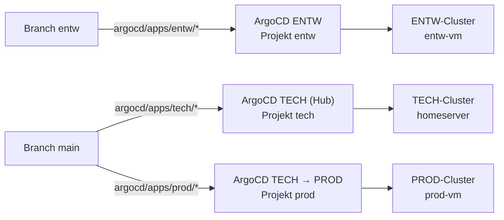

# ENTW-ArgoCD — eigener Ordner `argocd/apps/entw/`

Der ENTW-Cluster (KVM-VM `entw-vm` auf worker-1, 192.168.178.100) hat eine
**eigene, eigenständige ArgoCD-Instanz** (siehe
[40080, Baustein 1](../4-planung/40080-multi-cluster-entw-prod-tech.md#1-argocd-modell-ein-hub-für-tech--prod-entw-bekommt-eine-eigene-instanz)).
Sie liest ausschließlich den Ordner `argocd/apps/entw/` auf dem **Branch
`entw`**. Wer dort einen Unterordner anlegt, deployt auf ENTW und nirgends sonst.

---

## Architektur



Die Trennung hat drei voneinander unabhängige Ebenen:

| Ebene | Wodurch | Wirkung |
|---|---|---|
| Branch | ENTW liest `entw`, TECH und PROD lesen `main` | Ein Commit auf `entw` wird von TECH und PROD nie gesehen. |
| Ordner | Die ApplicationSets von TECH (`argocd/apps/tech/*`) und PROD (`argocd/bootstrap-prod/applicationset.yaml`, nur `argocd/apps/prod/…`) nennen den Pfad `entw/` nirgends | Landet der Ordner (etwa durch die Promotion) doch auf `main`, erzeugt er in TECH und PROD keine Application. |
| Cluster | ENTW-ArgoCD kennt nur `https://kubernetes.default.svc` (den eigenen Cluster), es gibt kein `cluster`-Secret zu TECH oder PROD | Selbst ein Fehler im ENTW-Ordner kann TECH und PROD nicht erreichen. |

Auf `entw` gelten die Rulesets `entw-1` (kein Löschen, kein Force-Push), `entw-2` (nur per PR, Admin-Bypass)
und `Protect MAIN` (PR-Pflicht ohne Bypass): Änderungen kommen daher immer per PR, siehe
[f0080](../f-cicd-automatisierung/f0080-entw-promotion.md#die-rulesets-auf-entw).
Die CI (`helm template | kubeconform`) prüft den Ordner erst beim Promotion-Lauf
gegen `ref=entw`, nicht schon im PR auf `entw`. Vor dem Push also lokal
`helm template argocd/apps/entw/<app>` ausführen.

---

## Neue App auf ENTW deployen

1. Ordner `argocd/apps/entw/<app>/` anlegen, z. B. als Helm-Chart mit
   `Chart.yaml`, `values.yaml` und `templates/`. Der Ordnername ist Application-
   und Namespace-Name.
2. Ingress-Host unter `*.dev.homeserver` wählen (dnsmasq leitet die Domain auf
   die ENTW-VM, siehe [c0000](../c-netzwerk-dns/c0000-dns-architecture.md)),
   z. B. `whoami.dev.homeserver`.
3. Per PR auf den Branch `entw` bringen (`Protect MAIN` verlangt PRs auch für Admins).
4. Nach ca. 3 Minuten (Git-Polling) erscheint die Application in ArgoCD, der
   Namespace wird angelegt (`CreateNamespace=true`).

Es gibt bewusst keine Namespace-Liste: das Projekt `entw` erlaubt jeden
Namespace und alle Ressourcentypen. ENTW ist die absichtlich verwundbare
Trainings-/Experimentierumgebung, Schutz kommt aus der Isolation des Clusters
(siehe [`host_vars/entw-vm/vars.yml`](../../ansible/host_vars/entw-vm/vars.yml)),
nicht aus Einschränkungen im Projekt.

Ein Ordner wieder entfernen = Application wird pruned, die Ressourcen werden mit
gelöscht (`prune: true`).

---

## ArgoCD-Oberfläche

| | |
|---|---|
| URL | `http://192.168.178.100:30080` (NodePort, HTTP — `server.insecure: true`) |
| Benutzer | `admin` |
| Passwort | `kubectl -n argocd get secret argocd-initial-admin-secret -o jsonpath='{.data.password}' \| base64 -d` auf der ENTW-VM (`ssh ubuntu@192.168.178.100 'sudo k3s kubectl …'`) |

---

## Wie es konfiguriert ist

| Was | Wo |
|---|---|
| Schalter `argocd_entw_layout: true` und Revision `argocd_repo_revision: entw` | [`ansible/host_vars/entw-vm/vars.yml`](../../ansible/host_vars/entw-vm/vars.yml), Default `false` in [`ansible/roles/argocd/defaults/main.yml`](../../ansible/roles/argocd/defaults/main.yml) |
| ApplicationSet `home-server-apps-entw` (Generator `argocd/apps/entw/*`, Revision `entw`) | [`bootstrap-applicationset.yaml.j2`](../../ansible/roles/argocd/templates/bootstrap-applicationset.yaml.j2), gerendert und angewendet von der `argocd`-Rolle |
| AppProject `entw` (jeder Namespace, nur dieses Repo als Quelle) | [`bootstrap-appprojects.yaml.j2`](../../ansible/roles/argocd/templates/bootstrap-appprojects.yaml.j2) |

Die committeten TECH-Dateien `argocd/bootstrap/*` bleiben vom ENTW-Layout
unberührt (`make render-bootstrap` rendert weiter mit `argocd_tech_layout`).
`argocd_platform_apps`/`argocd_workloads_apps` in den ENTW-Host-Vars steuern nur
noch `security-tier`-Label und Tier-NetworkPolicy der drei Bestands-Namespaces
(`sealed-secrets`, `demo-app`, `example-whoami`), nicht mehr, was deployt wird.
Neue Apps bekommen keine NetworkPolicy.

---

## Rollout (einmalig, Umstellung vom Alt-Layout)

Reihenfolge ist wichtig, der Ordner muss auf `entw` liegen, **bevor** das
Playbook läuft. Sonst findet der neue Generator nichts, und die drei
Bestands-Apps (`sealed-secrets`, `demo-app`, `example-whoami`) laufen ohne
Application weiter, ohne dass ArgoCD sie noch verwaltet.

1. Rollen-Änderung (Templates, Host-Vars, Doku) per PR nach `main`.
2. Ordner `argocd/apps/entw/` mit den drei Bestands-Apps auf den Branch `entw`
   bringen (per PR, siehe Rulesets oben).
3. Playbook aus einem Checkout ausführen, der die Rollen-Änderung enthält:

```bash
ansible-playbook -i ansible/inventory/hosts.yml ansible/entw.yml --tags argocd --vault-password-file ~/.vault_pass
```

Die `argocd`-Rolle löscht dabei zuerst die alten ApplicationSets
`home-server-apps-platform` und `home-server-apps-workloads` (Alt-Layout
`platform/`/`workloads/` auf `entw`), wendet dann Projekt und ApplicationSet für
`entw` an und räumt die alten AppProjects `platform`/`workloads` weg. Die
Workloads laufen dabei weiter: das Template setzt keinen `resources-finalizer`,
die neuen gleichnamigen Applications übernehmen die vorhandenen Ressourcen. Die
alten Ordner `argocd/apps/platform/` und `workloads/` auf `entw` sind danach
ohne Funktion und können später entfernt werden.

Prüfen:

```bash
ssh ubuntu@192.168.178.100 'sudo k3s kubectl -n argocd get applicationsets,applications,appprojects'
```

Erwartet: ein ApplicationSet `home-server-apps-entw`, Applications `demo-app`,
`example-whoami`, `sealed-secrets` (Synced/Healthy), Projekte `default` und `entw`.

---

## Auswirkung auf die Promotion-Pipeline

[`promote-entw.yml`](../f-cicd-automatisierung/f0080-entw-promotion.md)
cherry-pickt neue Commits vom Branch `entw` als PR nach `main`, **überspringt aber Commits, die
ausschließlich `argocd/apps/entw/` ändern**: ein ENTW-Experiment erzeugt keinen PR mehr. (Der Ordner selbst liegt
seit dem Einführungs-Commit auch auf `main`, dort ist er harmlos, TECH und PROD lesen `entw/` nie.) Andere
ENTW-spezifische Commits bekommen weiterhin **`[entw-only]`** in die Commit-Nachricht.

Die **Version** einer getesteten App wandert über die
[Promotion-Kette](../f-cicd-automatisierung/f00b0-promotion-chain.md) nach `argocd/apps/tech/` bzw. `prod/`:
`image.tag` und Chart-Abhängigkeiten, nach 24 h Gesundheit auf ENTW und mit optionalen Smoke-Checks
(`argocd/promotion.yaml`), Hosts und Templates bleiben unberührt. Renovate aktualisiert auf dem Branch `entw`
ausschließlich `argocd/apps/entw/`.

---

## Troubleshooting

| Symptom | Hinweis |
|---|---|
| Neuer Ordner erscheint nicht | Nicht auf dem Branch `entw` (auf `main` allein reicht es nicht), oder Git-Polling (bis ca. 3 min). Sofort: `kubectl -n argocd annotate applicationset home-server-apps-entw argocd.argoproj.io/application-set-refresh=true`. |
| Application `Unknown`/`ComparisonError` | `helm template argocd/apps/entw/<app>` lokal ausführen; die CI macht dasselbe. |
| `namespace … is not permitted in project` | Läuft noch der alte Stand mit den Projekten `platform`/`workloads`? Rollout oben ausführen. |
| Alte Applications tauchen doppelt auf | Die alten ApplicationSets (`home-server-apps-platform`/`-workloads`) existieren noch: `kubectl -n argocd delete applicationset home-server-apps-platform home-server-apps-workloads`. |
| ArgoCD nicht erreichbar | VM läuft? `ssh ubuntu@192.168.178.96 'sudo virsh list --all'`; `entw-vm` muss `running` sein. |
