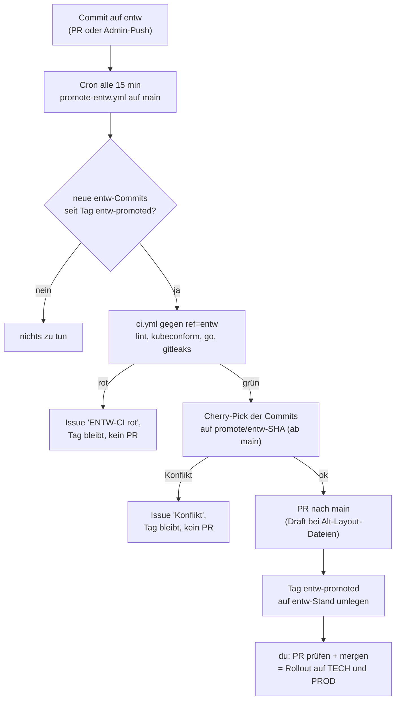

# ENTW → main — automatischer PR nach grüner CI

[`.github/workflows/promote-entw.yml`](../../.github/workflows/promote-entw.yml)
übergibt Änderungen, die auf dem Branch `entw` gelandet sind, als **Pull
Request an `main`** — aber erst, wenn die CI auf `entw` grün ist. `entw` ist
die Git-Quelle des ENTW-Clusters (`argocd_repo_revision: entw` in
`ansible/host_vars/entw-vm/vars.yml`); `main` ist die Quelle von TECH und PROD.
Was auf ENTW getestet wurde, kommt so ohne Handarbeit als fertiger PR nach
`main`, wo [das Ruleset](f0090-branch-schutz-main.md) die Pflicht-Checks prüft und
du den Merge bestätigst.

Das ist die erste, bewusst schlanke Stufe der Promotion-Pipeline aus
[40080, Baustein 6](../4-planung/40080-multi-cluster-entw-prod-tech.md#6-cicd-pipeline-automatisierte-promotion-entw--tech--prod)
(Phase 4). Die dortige Kette ENTW → TECH → PROD mit 24-Stunden-Health-Gate
setzt den eigenen Pfad `argocd/apps/entw/` voraus (existiert seit 2026-09-20 auf dem
Branch `entw`, siehe [b0050](../b-kubernetes-gitops/b0050-entw-argocd.md)); hier reicht die CI als
Freigabe.

---

## Ablauf

| Job | Was |
|---|---|
| `detect` | Vergleicht `origin/entw` mit dem Tag `entw-promoted`; gibt es neue Commits, die `main` noch nicht hat? Überspringt Stände, für die schon ein offenes Issue existiert. |
| `ci` | Ruft [`ci.yml`](../../.github/workflows/ci.yml) als wiederverwendbaren Workflow mit `ref: entw` auf — exakt dieselben vier Jobs wie auf einem PR. |
| `ci-failed` | Bei rotem CI: Issue mit Link zum Lauf. Der Cron prüft diesen Stand danach nicht mehr alle 15 Minuten neu. |
| `promote` | Cherry-Pick, PR, Tag umlegen (Logik in [`scripts/promote-entw.sh`](../../scripts/promote-entw.sh)). |

## Der Tag `entw-promoted`

Der Tag ist die Marke „bis hierhin wurde `entw` an `main` übergeben“ und
wird **nur nach erfolgreich geöffnetem PR** (oder nach „nichts zu übergeben“)
auf den neuen `entw`-Stand gesetzt. Die Commits eines PR sind genau die
zwischen altem Tag und neuer `entw`-Spitze, abzüglich allem, was `main` schon
enthält. Ohne Tag (erster Lauf) gilt der Merge-Base von `main` und `entw`.
Der Tag bleibt auch stehen, wenn der PR noch offen ist — dieselben Commits
kommen nicht ein zweites Mal.

## Welche Commits übernommen werden

- **Alle neuen Commits**, außer solchen mit **`[entw-only]`** in der
  Commit-Nachricht. Damit bleiben ENTW-spezifische Änderungen (z. B. Hosts
  `*.dev.homeserver` statt `*.prod.homeserver`) auf `entw`.
- Merge-Commits werden nicht übernommen, nur die einzelnen Commits.
- Übernommen wird per `git cherry-pick -x`; die Commit-Nachricht verweist
  dadurch auf das Original. Was `main` schon enthält (gleicher Patch), wird
  verworfen.
- **Layout-Unterschied:** `entw` hat noch das alte Layout (`argocd/apps/platform/`,
  `workloads/`), `main` das neue (`tech/`, `prod/`). Änderungen an
  **bestehenden** Dateien landen dank der Rename-Erkennung von Git automatisch am
  neuen Ort (`workloads/foo/…` → `tech/foo/…`). **Neu angelegte** Dateien im
  alten Layout kann Git nicht zuordnen: der PR wird dann als **Draft** geöffnet
  und nennt die Dateien, die von Hand nach `tech/`/`prod/` verschoben werden
  müssen.

## Fehlerfälle

| Fall | Verhalten | Was du tust |
|---|---|---|
| CI auf `entw` rot | Issue `ENTW-CI rot bei <sha>`, kein PR, Tag bleibt | Fehler auf `entw` beheben. Der neue Stand wird automatisch neu geprüft. |
| Cherry-Pick-Konflikt | Issue `ENTW -> main: Konflikt bei <sha>` mit Konfliktdateien, Lauf rot, Tag bleibt | Änderung von Hand per PR nach `main` bringen, danach Tag setzen (Befehl steht im Issue) — oder auf `entw` den Commit mit `[entw-only]` versehen. |
| Nichts Übertragbares (alles `[entw-only]` oder schon in `main`) | Kein PR, Tag wird trotzdem umgelegt | — |
| PAT fehlt | `promote` bricht mit Hinweis ab | Secret anlegen (siehe unten). |

Jede erfolgreiche Promotion schließt alle offenen `entw-promotion`-Issues.

## Voraussetzung: Personal Access Token

`promote` braucht ein PAT, weil **PRs und Pushes mit dem Standard-`GITHUB_TOKEN`
keine weiteren Workflows auslösen** — die CI auf dem PR bliebe aus, und der
Pflicht-Check würde ewig auf „pending“ stehen. Der Workflow nimmt das Repo-Secret
`PROMOTE_TOKEN`, ersatzweise `RENOVATE_TOKEN` (fine-grained PAT nur für dieses
Repo, `Contents`, `Pull requests`, `Issues`, `Workflows` = Read and write —
das ist die Rechteliste, die [`renovate.yml`](../../.github/workflows/renovate.yml)
ohnehin nutzt). Ein eigenes Secret ist sauberer, weil sich die Rechte dann
getrennt widerrufen lassen.

## Bedienung

| Ziel | Wie |
|---|---|
| Sofort prüfen statt 15 min warten | GitHub → Actions → „Promote ENTW to main“ → *Run workflow* |
| Einen `entw`-Commit von der Promotion ausnehmen | `[entw-only]` in die Commit-Nachricht |
| Alles bis zu einem Stand als „erledigt“ markieren | `git tag -f entw-promoted <sha> && git push --force origin refs/tags/entw-promoted` |
| Neu beginnen | Tag löschen (`git push origin :refs/tags/entw-promoted`); dann gilt wieder der Merge-Base |

## Bewusst nicht enthalten

- **Kein Auto-Merge.** `main` speist TECH *und* PROD, der ArgoCD-Sync nach dem
  Merge ist der Rollout. Ein Mensch bestätigt (wie in 40080 für PROD vorgesehen).
- **Kein ArgoCD-Health-Gate.** „Pipeline durch“ heißt hier: CI grün auf `entw`,
  nicht „läuft seit 24 h gesund auf ENTW“. Der Tailscale-Runner dafür ist erst als
  [PoC](f00a0-tailscale-runner-poc.md) vorbereitet; Health- und Smoke-Gate sind
  Phase 4.4 in 40080.
- **Kein Rollback** bei einem später rot werdenden ENTW.
- **Kein Auto-Rebase**: liegen zwei Promotion-PRs offen, die dieselben Dateien
  ändern, muss der zweite nach dem Merge des ersten aktualisiert werden.

## Warum Cron und nicht `on: push: entw`

Ein `push`-Workflow läuft mit der Workflow-Datei **des gepushten Branches**.
`entw` hat ein eigenes, älteres Layout und eine eigene `ci.yml`, die nur für
`main` triggert. Der Cron auf `main` ist davon unabhängig und nutzt immer die
aktuellen Workflows. Kosten: bis zu 15 Minuten Verzögerung (GitHub verzögert
Cron-Läufe zudem unter Last).

## Die Rulesets auf `entw`

Für `entw` gelten schon zwei aktive Rulesets (`entw-1`: kein Löschen, kein
Force-Push; `entw-2`: nur per PR, Admin-Bypass). Die Pipeline pusht nie auf
`entw`, sie liest nur. Force-Push betrifft ausschließlich den Tag
`entw-promoted` und die Branches `promote/entw-*`, die von keinem Ruleset
erfasst sind.

## Was getestet wurde

Lokal an einem Wegwerf-Repo (bare `origin` + Arbeitskopie, `gh`-Aufrufe im
Trockenlauf): Erkennen neuer Commits, Cherry-Pick über den Layout-Umzug
`workloads/` → `tech/`, Überspringen von `[entw-only]`, Umlegen des Tags,
„nichts Neues“ im zweiten Lauf, Draft-Warnung bei Neuanlage im alten Layout,
Konfliktfall (Issue, Tag unverändert, Exit 1). `actionlint` und `shellcheck`
sind sauber. **Noch nicht gelaufen** ist der Workflow auf GitHub selbst (PAT,
`gh pr create`, der `workflow_call` von `ci.yml`): der erste Lauf sollte per
*Run workflow* beobachtet werden.
