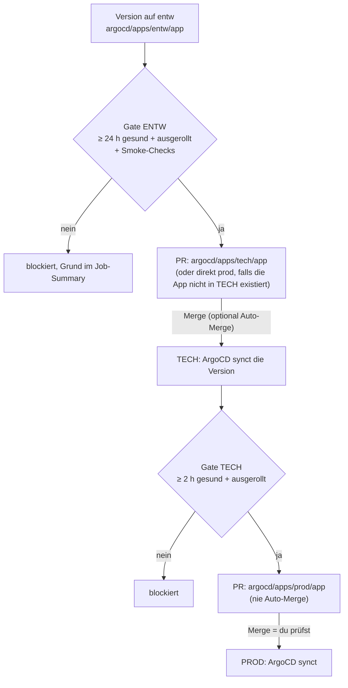

# Promotion-Kette ENTW → TECH → PROD

[`promote-chain.yml`](../../.github/workflows/promote-chain.yml) bringt eine neue
**Version** (Image-Tag, Chart-Abhängigkeit) Schritt für Schritt in die produktiven
Cluster: zuerst läuft sie auf ENTW, und erst wenn sie dort **24 Stunden gesund** war,
entsteht ein PR nach TECH. Ist sie danach **2 Stunden gesund** auf TECH, entsteht der
PR nach PROD. Ein Mensch bestätigt den PROD-PR. Umgesetzt ist damit die
Kette aus [40080, Baustein 6](../4-planung/40080-multi-cluster-entw-prod-tech.md#6-cicd-pipeline-automatisierte-promotion-entw--tech--prod).

Zwei Pipelines ergänzen sich, sie ersetzen sich nicht:

| Pipeline | Was sie überträgt | Wann |
|---|---|---|
| [ENTW → main](f0080-entw-promotion.md) (`promote-entw.yml`) | Commits, die **nicht** nur `argocd/apps/entw/` ändern (z. B. Doku, Skripte, Playbooks), per Cherry-Pick | nach grüner CI auf `entw` |
| **Promotion-Kette** (`promote-chain.yml`) | **Versionsfelder** der Apps unter `argocd/apps/entw/`, nach `tech/` bzw. `prod/` | nach bestandenem Gesundheits-Gate |

---

## Ablauf



Der Workflow läuft **stündlich** (`17 * * * *`) und auf Knopfdruck (*Actions → Promote chain
→ Run workflow*, wahlweise nur eine Stufe oder nur planen). Jeder Lauf schreibt eine Tabelle in
die Job-Zusammenfassung: welche App, welche Stufe, welche Änderung, und bei „blockiert“ der genaue Grund.

## Was übertragen wird — und was nicht

Es gibt bewusst nur **Versionsfelder**, nie den ganzen Ordner:

| Datei | Feld |
|---|---|
| `values.yaml` | jedes `tag` unter einem Schlüssel `image` (`image.tag`, `sealed-secrets.image.tag`, `server.image.tag`, …) |
| `Chart.yaml` | `dependencies[*].version`, sofern eine exakte Version (kein `*`, `^`, `~`, `>=`) |

Hosts (`*.dev.homeserver` ↔ `*.prod.homeserver`), Replicas, Ressourcen, Secrets und Templates
unterscheiden sich je Cluster und wandern nie automatisch. Weitere Regeln:

- **Kein Downgrade.** Eine Version wird nur übertragen, wenn sie in der Quelle **jünger** ist als der
  aktuelle Wert im Ziel (Vergleich der Commit-Zeiten, in denen die Werte entstanden sind). Bumpt z. B.
  Renovate TECH direkt, überschreibt die Kette das nicht mit einem älteren ENTW-Stand.
- **Vendorisierte Charts** (getracktes `Chart.lock`/`charts/*.tgz`, heute nur reine TECH-Apps wie
  `monitoring`, `zammad`, `logging`) bekommen keine Dependency-Änderung: dort ist ein
  `helm dependency update` nötig. Das steht als Hinweis im Job-Summary. `image.tag` wird trotzdem
  übertragen.
- **Erstes Ziel je App:** existiert die App in `tech/`, geht die ENTW-Version dorthin, sonst direkt nach
  `prod/` (z. B. `demo-app`, `example-whoami`). Apps, die nur unter `entw/` liegen, werden ignoriert.
- **TECH → PROD** gilt für **alle** Apps, die in beiden Ordnern liegen (`cert-manager`, `cloudflared`,
  `sealed-secrets`, …), nicht nur für solche mit ENTW-Ursprung: auch ein Renovate-Bump in TECH läuft so erst
  nach 2 Stunden Gesundheit nach PROD.

## Das Gate

Alle Bedingungen müssen stimmen, sonst ist die App „blockiert“ (Grund im Summary):

| # | Bedingung | Quelle |
|---|---|---|
| 1 | Application ist `Healthy` **und** `Synced` | ArgoCD-API (`status.health`, `status.sync`) |
| 2 | seit mindestens 24 h (ENTW) bzw. 2 h (TECH) gesund | `status.health.lastTransitionTime`: springt bei jedem Rollout und jeder Störung zurück |
| 3 | Die neue Version liegt seit mindestens so lange in der Quell-Umgebung | Commit-Zeit (`git log -S`, erster Elternpfad = Merge-Zeitpunkt) |
| 4 | Die neue Version ist **ausgerollt**: die von ArgoCD synchronisierte Revision enthält den Commit | `status.sync.revision`, `git merge-base --is-ancestor` |
| 5 | Optionale **Smoke-Checks** bestehen (nur ENTW-Stufe konfiguriert) | `curl` gegen die App, siehe unten |

Bedingung 2 und 4 zusammen sind der Kern: „24 Stunden gesund“ heißt *diese* Version, nicht irgendeine.
Ist ArgoCD nicht erreichbar oder liefert keinen Status, ist **alles blockiert** (fail closed) und ein
Issue `Promotion-Kette: ArgoCD nicht erreichbar` (Label `promotion-gate`) meldet es einmal; es schließt sich,
sobald ArgoCD wieder antwortet.

### Smoke-Checks

Ein Pod, der `Running` ist, beweist nicht, dass die App antwortet. Pro App und Umgebung lassen sich in
[`argocd/promotion.yaml`](../../argocd/promotion.yaml) HTTP-Prüfungen hinterlegen:

```yaml
smoke:
  example-whoami:
    entw:
      - url: http://whoami.dev.homeserver/
        contains: "Hostname:"      # optional: Text im Body
        status: 200                # optional, Standard 200
```

Der Runner hat kein Heim-DNS, daher setzt die Engine `curl --resolve` auf die IP der Umgebung
(`SMOKE_IP_ENTW`, Standard `192.168.178.100`; `SMOKE_IP_TECH`, Standard `192.168.178.94`). Die beiden
Beispiele oben wurden gegen die laufende ENTW-VM geprüft (HTTP 200, erwarteter Inhalt).

## Konfiguration: `argocd/promotion.yaml`

| Schlüssel | Bedeutung |
|---|---|
| `gates.entw_hours` | Gesundheitsdauer auf ENTW (Standard 24) |
| `gates.tech_hours` | Gesundheitsdauer auf TECH (Standard 2) |
| `exclude` | Apps (Ordnernamen), die nie automatisch promotet werden |
| `smoke` | HTTP-Prüfungen, siehe oben |

Die Datei liegt außerhalb von `argocd/apps/`, kein ApplicationSet liest sie.

## Die PRs

| Ziel | Branch | Merge |
|---|---|---|
| TECH | `promote/tech-<app>` | von Hand; **Auto-Merge** nach grüner CI, wenn die Repo-Variable `PROMOTE_AUTOMERGE_TECH` auf `true` steht (Entscheidung aus 40080: TECH automatisch, PROD manuell; empfohlen erst nach einigen beobachteten Zyklen) |
| PROD | `promote/prod-<app>` | **immer von Hand**: der Merge rollt auf echte Nutzer aus |

Pro App und Ziel gibt es einen **rollenden** Branch. Ändert sich die Übernahme, wird er per Force-Push
aktualisiert und der offene PR bleibt derselbe. Ein **abgelehnter** (geschlossener) PR wird für dieselbe Änderung
nicht erneut vorgeschlagen. Die PRs tragen die Labels `promotion` und `promote-tech`/`promote-prod`; der PR-Text
enthält die Tabelle der Änderungen und die Belege des Gates.

---

## Netzweg und Zugriff

GitHub-Runner erreichen ArgoCD nur über Tailscale. Der Workflow tritt dem Tailnet bei (die Action nimmt
Subnet-Routen selbst an, ein Schritt prüft die Verbindung) und nutzt die **Subnet-Route** `192.168.178.0/24`, die der Homeserver bereits ins
Tailnet bewirbt. Damit kommen beide ArgoCD-Instanzen über ihre LAN-Adresse, ohne Änderung an worker-1:

| Ziel | Adresse | Zweck |
|---|---|---|
| Hub-ArgoCD (TECH + PROD) | `http://192.168.178.94:30080` | Gate der TECH-Stufe; PROD-Applications heißen `prod-<app>` |
| ENTW-ArgoCD (`entw-vm`) | `http://192.168.178.100:30080` | Gate der ENTW-Stufe |
| ENTW-Ingress | `192.168.178.100:80` (Host-Header) | Smoke-Checks |

ArgoCD lauscht per NodePort im **Klartext** (`server.insecure`): `https://…:30443` wird zurückgesetzt. Der
erste PoC-Lauf zeigte genau deshalb `HTTP 000` (siehe [f00a0](f00a0-tailscale-runner-poc.md)).

Die Tailscale-ACL (`grants`) verbietet standardmäßig alles, was nicht erlaubt ist. Der Runner braucht einen
Grant. Empfehlung: ein eigenes Tag für den Runner, damit die Rechte nicht an einem Benutzer hängen:

```json
"tagOwners": { "tag:ci": ["autogroup:admin"] },
"grants": [
  {
    "src": ["tag:ci"],
    "dst": ["192.168.178.94", "192.168.178.100"],
    "ip":  ["tcp:30080", "tcp:80"]
  }
]
```

Der Workflow meldet sich mit einem **OAuth-Client** an (Secrets `TS_OAUTH_CLIENT_ID` und `TS_OAUTH_SECRET`) und
tritt mit dem Tag `tag:ci` bei. Die Action erzeugt dabei pro Lauf einen frischen, kurzlebigen Key: nichts läuft
ab, nichts wird verbraucht. Der Runner ist ein getaggtes, kurzlebiges Gerät und sieht nichts außer diesen Zielen.
Der OAuth-Client entsteht im Tailscale-Admin-Panel unter *Settings → OAuth clients → Generate*, mit Scope
`auth_keys` (Write) und Tag `tag:ci`; das Secret wird nur einmal angezeigt. Die Subnet-Route des
Homeservers muss im Admin-Panel freigegeben sein (sie ist es: der Homeserver zeigt `PrimaryRoutes: 192.168.178.0/24`).

## Einrichtung

Reihenfolge (nach dem Merge der Änderungen, die diese Pipeline einführen):

1. **CI-Pflicht-Check erweitern:** `scripts/setup-main-ruleset.sh` erneut ausführen (kommt der Check `docs links` dazu).
2. **ArgoCD-Konto `ci` ausrollen** (Nur-Lese-Rolle, nur API-Token): Ansible-Rolle `argocd`, Schalter
   `argocd_ci_account_enabled` (Standard `true`).
   - Hub: `make argocd`
   - ENTW: `ansible-playbook -i ansible/inventory/hosts.yml ansible/entw.yml --tags argocd --vault-password-file ~/.vault_pass`
3. **Tokens erzeugen und als Secret hinterlegen** (nichts wird ausgegeben):
   `scripts/create-argocd-ci-token.sh hub` und `scripts/create-argocd-ci-token.sh entw`
   → Secrets `ARGOCD_HUB_TOKEN`, `ARGOCD_ENTW_TOKEN` (365 Tage gültig).
4. **Tailscale:** ACL-Grant (oben) speichern, OAuth-Client mit Scope `auth_keys` (Write) und Tag `tag:ci` erzeugen und
   als `TS_OAUTH_CLIENT_ID` und `TS_OAUTH_SECRET` ablegen. Ein Auth-Key als Secret taugt nicht (einmalig oder nach
   höchstens 90 Tagen abgelaufen): der Beitritt scheitert dann dauerhaft mit `BackendState=NeedsLogin`.
   Fehlen die beiden Secrets, läuft die Kette als „inaktiv“ (Hinweis statt Fehler).
5. **PoC ausführen** (*Actions → Tailscale Runner PoC*): muss `OK` melden.
6. **Trockenlauf:** *Promote chain → Run workflow*, `plan_only` aktivieren, Summary prüfen.
7. **Beobachten:** einige echte Zyklen begleiten. Danach optional Repo-Variable `PROMOTE_AUTOMERGE_TECH=true`.
8. **Renovate für die Pilot-Apps in TECH/PROD abschalten**, damit es genau einen Update-Weg gibt
   (`argocd/apps/entw/` → Kette). Diese Regel bewusst erst jetzt in [`renovate.json`](../../renovate.json) ergänzen,
   sonst fehlte solange die Kette nicht läuft die Update-Quelle:

```json
{
  "description": "Pilot-Apps: Updates laufen ueber ENTW und die Promotion-Kette.",
  "matchBaseBranches": ["main"],
  "matchFileNames": [
    "argocd/apps/tech/sealed-secrets/**", "argocd/apps/prod/sealed-secrets/**",
    "argocd/apps/prod/demo-app/**", "argocd/apps/prod/example-whoami/**"
  ],
  "enabled": false
}
```

Solange `ARGOCD_ENTW_TOKEN`, `ARGOCD_HUB_TOKEN` oder das PAT fehlen, läuft der Workflow durch, meldet
„Promotion-Kette inaktiv“ und tut nichts.

## Bedienung

| Ziel | Wie |
|---|---|
| Sofort prüfen | *Actions → Promote chain → Run workflow* (`plan_only` = nur planen) |
| App ausschließen | Ordnername unter `exclude:` in `argocd/promotion.yaml` |
| Gate anpassen | `gates.entw_hours` / `gates.tech_hours` |
| Warum wird nichts promotet? | Job-Summary des letzten Laufs: pro App steht der Grund |
| Lokal planen | `python3 scripts/promote-chain.py --plan-only --status entw=entw.json --status hub=hub.json` mit `kubectl -n argocd get applications -o json` als Eingabe (auf der ENTW-VM per `ssh ubuntu@192.168.178.100 'sudo k3s kubectl …'`) |
| Token erneuern | `scripts/create-argocd-ci-token.sh …` erneut; alte Token laufen nach 365 Tagen ab |

## Bewusst nicht enthalten

- **Kein Auto-Rollback.** Wird eine promotete Version später `Degraded`, meldet das die
  [Cluster-Überwachung](../2-betrieb-hardware/20050-gitops-und-backup-alerts.md) (`ArgoAppDegraded`); die Kette macht nichts rückgängig.
- **Keine Semver-Bewertung.** „Neuer“ heißt „später eingecheckt“, nicht „höhere Nummer“.
- **Keine Übertragung von Konfiguration.** Ändert eine App auf ENTW ihre Values oder Templates, ist das ein
  normaler PR nach `tech/`/`prod/`.
- **ENTW wird nicht überwacht** (eigener Cluster, Trainingsumgebung); das Gate ist die einzige Prüfung dort.
- **Kein Nutzertest.** Das Gate belegt „läuft und antwortet“, nicht „funktioniert für die Nutzer“.

## Was getestet wurde

Vollständig lokal getestet: ein synthetisches Repo (bare `origin`, Branches `main`/`entw`, datierte Commits,
Status-JSON) deckt ab: Gate bestanden (PR-Branch mit genau der einen Tag-Zeile, Kommentare erhalten), `Progressing`,
zu junge Version, kein Downgrade, vendorisierter Chart, Direktziel PROD, Stufe TECH → PROD, Idempotenz (zweiter Lauf
pusht nichts). Die Engine lief außerdem live gegen die echten ArgoCD-APIs (ENTW: 3 Apps, Hub: 48 Apps, falscher Token
und nicht erreichbarer Server enden sauber in „blockiert“) und plant gegen das echte Repo: aktuell sind alle Versionen
gleich, es ist nichts zu übertragen. Dabei fiel auf, dass die ArgoCD-API `status.sync` nur liefert, wenn die
Unterfelder einzeln in `fields=` genannt werden; das ist berücksichtigt.

**Noch nicht getestet:** der Lauf auf GitHub selbst (Tailscale-Verbindung des Runners, `gh pr create`, Auto-Merge),
die Token-Erzeugung per API (das Konto `ci` existiert erst nach dem Rollout) und der Netzweg des Runners. Der erste
Lauf sollte per *Run workflow* mit `plan_only` beobachtet werden.
